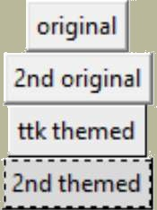

.. _01basics:

========
Basics
========

Requirements
============

.. sidebar:: Is your Python upto date?

   If you are using Python 2.7 or later or any of the Python 3 versions then 
   the tkinter version will be 8.5 or later, if we import the ttk module 
   in an active Python session there will be no warning message.

In order to use the scripts developed here, a modern version of Python and 
Tkinter (>= v 8.5) will be necessary, it is advisable to use version 8.6 or 
greater so that png files can be used directly. 

============================= =============================
 Python3                      Python2
============================= =============================
 ``import tkinter.ttk``        ``import Tkinter.ttk``
============================= =============================

* Tkinter reference
   download the pdf version of 
   `"Tkinter 8.5 reference a GUI for Python" <https://www.hsg-kl.de/faecher/inf/python/tkinter/tkinter.pdf>`_, 
* Themed widgets
   See what has already been done with widgets, view and install the external 
   module ttkthemes::

      pip install ttkthemes 

   found at `"ttkthemes at github" <https://github.com/RedFantom/ttkthemes>`_. 
* Encoding and decoding images
   Using the base64 module. 
* Graphics editor
   Check and edit images.

.. sidebar:: Pillow and PIL

   Ensure that the older version of PIL has been uninstalled, 
   ``pip uninstall PIL``

* PIL (Pillow)
   Used extensively for drawing:: 

      pip install Pillow

* Pretty Print. 
   Better display for some of the output::

      pip install pprint

* colorsys
   Colour conversion between RGB, HLV, etc::

      pip install colorsys

* These words of wisdom
   Go to github `Putting on the Style! <https://github.com/Edgar-Donk/tkinter.ttk.style/tree/master>`_
   clone and unzip in your python playground, make sure that ``examples``, 
   ``tables`` and ``images`` stay at the same level in the directory 
   structure, the other files and images are not relevant if you are viewing
   readthedocs.
   
   If you want to run it as a sphinx example unzip to your sphinx playground,
   then install sphinx and sphinx-rtd-theme.::

      pip install sphinx

      pip install sphinx-rtd-theme

   All the necessary files should be present, so from your os system switch
   to the ``docs`` directory of the unzipped files and run the command
   ``make html``, which should make a new subdirectory ``_build/html``, 
   where you can load ``index.html``.

Widgets - General
=================

All the widgets previously found in tkinter remain, ttk has many of the 
original widgets and the class Style(). Two of the widgets in ttk, Combobox 
and Treeview are new, whereas some widgets only exist in tkinter. 

.. note:: Spinbox has been added to ttk - see the latest documentation.
   If your Python is 3.7 or later then everything should work, if you have 
   an earlier release then change the import statements and import Spinbox 
   from tkinter. 

Where widgets are duplicated be aware that between tkinter and ttk their 
property options do not correspond . For instance ttk Button has a 
single option ``style`` instead of 24 additional property options in tkinter, 
the remaining 10 property options are common to both Button widgets. Use
`"Tkinter 8.5 reference a GUI for Python" <https://www.hsg-kl.de/faecher/inf/python/tkinter/tkinter.pdf>`_
to find out which property options are used on all the widgets. 

:alternative: There is an alternative site
   https://anzeljg.github.io/rin2/book2/2405/docs/tkinter/index.html

.. topic:: Property Options

   For example in Label the option ``text`` is one of its property options 
   ``w = Label(root, text="Hello, world!")`` .

.. sidebar:: File Referencing

   Code examples, tables and figures will be prefixed by their chapter number.

The example 01Label_config.py shows the differences in property 
configurations found in the older tkinter and newer ttk Label.

Script 01Label_config.py
------------------------

To view or hide the code just click on the arrow.

.. container:: toggle

   .. container:: header

       *Show/Hide Code* 01Label_config.py

   .. code-block:: python

      """ Compares the configuration options of Label and themed Label"""
      import pprint
      from tkinter import Tk,Label
      from tkinter.ttk import Label as ttklab

      root = Tk()
      w = Label(root, text="Hello, world!")
      w.pack()
      print('TKINTER')
      print()
      pprint.pprint(w.config()) # displays the configuration options of the widget
      print()
      print('##################################################')
      print()
      print('TTK')
      print()
      w2 = ttklab(root, text="Hello, world!")
      w2.pack()
      pprint.pprint(w2.config())
      root.mainloop()

Widget Composition
==================

We can think of a widget in terms of a collection of components, which in 
turn are made up of elements. Each of the widgets has one or more components 
and elements that can be referenced directly using the Style class. Remember 
- every ttk widget has a ``style`` property option where we put a 
cross-reference to the Style() command which can modify a widget's appearance 
(colour, size, relief and font).

Take a look at the button widget it is a rectangular shape divided into 4 
components, starting from the outside - border, focus, spacing and label. 

Button Components
-----------------

   Components of a Button

While we are thinking of components look at the vertical scrollbar. 

Scrollbar Components
--------------------

   Components of a Scrollbar

.. sidebar:: Scrollbar

   Scrollbar has components that move in relation to each other, whereas 
   Button is static and might be thought of as a simple widget.

The vertical scrollbar has up and down arrows as well as a thumb component 
all contained in a trough (yet another component). Within the Style class 
there is a method to find out the component names and their relative 
positions, so there is no real reason to worry or fret about trying to 
remember everything in detail.

Style Commands
==============

To manipulate the appearance of a widget - changing its style - we use the 
class Style() and one or more of its commands. Using common style
changes on several widgets we can produce a theme.

The table 01style_commands.csv has a summary of all the Style() commands, 

Table 01style_commands.csv
--------------------------

.. csv-table::
   :file: tables/01style_commands.csv
   :header-rows: 1
   :widths: 55, 80

.. Note:: 

   the variables quoted here are local variables, so style may be a reference 
   to a widget class or cross-reference

.. topic:: Viewing Tables

   Most tables have been created as csv tables and can be independantly 
   viewed using a spreadsheet or loading into the ttk Treeview script 
   01view_csv.py (found in the examples directory), select the csv file
   from the dropdown list.

Buttons in tkinter and ttk
--------------------------

.. warning:: Image Quality

    Some IDEs will not show the images created in tkinter / ttk at the same
    resolution or quality if you are using an ultra high definition monitor.
    Standard monitors should be the same no matter which IDE is used. If 
    there is a difference run the Python script from the command line, Idle
    or use PyScripter.

Using buttons compare the two different types of widgets, use the script 
01two_buttons.py - found in the examples directory. You should see 4 buttons, 
the upper two buttons are standard tkinter, whilst the lower two are ttk 
buttons. 

..
    .. |t2| image:: figures/01two_buttons_thonny.jpg
    :width: 299px
    :height: 188px

    .. |p2| image:: figures/01two_buttons_pyscripter.jpg
    :width: 388px
    :height: 195px

.. table:: Comparing Client Interaction on Buttons

   ==================== ====================
   Default ttk Buttons   Windows ttk Buttons
   ==================== ====================
    |d2|                  |v2|
   ==================== ====================

..
    .. table:: Comparing UHD output on 2 different IDEs

    =================================== =========================
    PyScripter or Idle                  Thonny or many other IDEs
    =================================== =========================
    |p2|                                |t2|
    =================================== =========================

|c2|

.. sidebar:: User Interaction

   In order to fully appreciate the effects being discussed make sure to run
   the relevant script. Widgets are not wholly static so images alone cannot 
   give the full flavour.

All four buttons are grey but the tkinter buttons are paler. Move the cursor 
over all four buttons. The two ttk buttons lighten but the tkinter buttons 
do not react. Click on all four buttons, all four appear to be depressed, 
but the two ttk buttons will have a broken line showing which one of the two 
buttons was last activated. 

Buttons, in common with several other widgets, have what we call states, 
for example when a cursor passes over the widget its state changes to active, 
so we have just seen how the ttk button's state together with the theme used
affects its appearance.

Script 01two_buttons.py
^^^^^^^^^^^^^^^^^^^^^^^^

To view or hide the code just click on the arrow.

.. container:: toggle

   .. container:: header

       *Show/Hide Code* 01two_buttons.py

   .. literalinclude:: examples/01two_buttons.py
      :linenos:
      :emphasize-lines: 13
   
If we had left out the line::

   13 s.theme_use('default')

and we were running either a Windows or Mac system then we would have seen 
blue ttk buttons because both operating systems have their own OS specific 
themes. 

By using a theme many ttk widgets react by default without any special input. 
This is in contrast to the original tkinter widgets which have to be 
individually programmed.