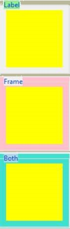
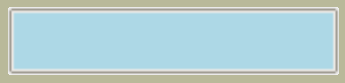

.. _02 Simple Style Changes:

=======================
Simple Style Changes
=======================

.. sidebar:: Query

   Each enquiry relies on the information gained from the previous enquiry. 
   Once the queries are set up with an interactive session using 
   Style() you may be able to short circuit one or more steps.

.. topic:: Finding out the Element

   Using named elements we can change the colours, width, font and relief of 
   our widget. Instead of using property options on each widget, we use the 
   Style module together with relevant component and element names. The first 
   task is to determine the relevant component and element names of our widget.

The sequence of the queries to find out the elements and their properties 
is as follows::

   --> 1 Widget name
   --> 2 class name (widget.winfo_class)
   --> 3 component name (Style.layout)
   --> 4 element name (Style.element_options) 
   --> 5 element value (Style.lookup)

Button - Style
==============

Use the button widget as our first example and run the following queries 
interactively in Python. 

Find the class name::

   >>>import ttk
   >>>St = ttk.Style()  
   # Style is used to call the classic theme
   >>>St.theme_use('classic')
   # step 1 using the widget name of *Button*
   >>>but = ttk.Button(None, text='Righto') 
 
   # step 2 
   >>>butClass = but.winfo_class() 
   # find the class name using the Button handle "but"
   >>>butClass
      TButton

The class name is 'TButton'. Using layout find the component name(s), 
the components are preceded by the widget name, in this case **'Button.**::

	# step 3
	>>> layout = St.layout('TButton')
   # find the Button component names as used by the classic theme
	>>> layout 
	[('Button.highlight', {'children': [('Button.border', {'border':
	'1', 'children': [('Button.padding', {'children': [('Button.label',
	{'sticky': 'nswe'})], 'sticky': 'nswe'})], 'sticky': 'nswe'})],
	'sticky': 'nswe'})]

It creates quite an output, but don't be put off. We have found 4 component 
names - highlight, border, padding and label. Compare to :ref:`Button Components`.

Be careful to use the correct component name with right theme. That's just 
completed the third step. As a help in determining the component names for 
every widget check out the table 02components.csv. See how the names change 
not only with the widgets, but may change with the theme. 

Table Theme Components
----------------------

.. table:: 02components.csv

   ================== ======================================== ======================================== ============================================ ========================================
   Widget             alt                                      clam                                     classic                                      default
   ================== ======================================== ======================================== ============================================ ========================================
   Button             border, focus, padding, label            border, focus, padding, label            highlight, border, padding, label            button, border, focus, padding, label
   Checkbutton        padding, indicator, focus, label         padding, indicator, focus, label         highlight, border, padding, indicator, label padding, indicator, focus, label
   Combobox           field, downarrow, padding, textarea      downarrow, field, padding, textarea      field, downarrow, padding, textarea          field, downarrow, padding, textarea
   Entry              field, padding, textarea                 field, padding, textarea                 highlight, field, padding, textarea          field, padding, textarea
   Frame              border                                   border                                   border                                       border
   LabelFrame         border                                   border                                   border                                       border
   LabelFrame - Label fill, text                               fill, text                               fill, text                                   fill, text
   Menubutton         border, focus, indicator, padding, label border, focus, indicator, padding, label highlight, border, indicator, padding, label border, focus, indicator, padding, label
   Notebook           client                                   client                                   client                                       client
   Notebook - Tab     tab, padding, focus, label               tab, padding, focus, label               tab, padding, label                          tab, padding, focus, label 
   PanedWindow        background                               background                               background                                   background 
   PanedWindow - Sash hsash                                    hsash, hgrip                             hsash                                        hsash
   Progressbar        trough, pbar                             trough, pbar                             trough, pbar                                 trough, pbar 
   Radiobutton        padding, indicator, focus, label         padding, indicator, focus, label         highlight, border, padding, indicator, label padding, indicator, focus, label
   Scale              trough, slider                           trough, slider                           trough, slider                               trough, slider 
   Scrollbar          trough, leftarrow, rightarrow, thumb     trough, leftarrow, rightarrow, thumb     trough, leftarrow, rightarrow, thumb         trough, leftarrow, rightarrow, thumb
   Separator          separator                                separator                                separator                                    separator 
   Sizegrip           sizegrip                                 sizegrip                                 sizegrip                                     sizegrip 
   Treeview           field, padding, treearea                 field, padding, treearea                 field, padding, treearea                     field, padding, treearea 
   Treeview - Heading cell, border, padding, image, text       cell, border, padding, image, text       cell, border, padding,image, text            cell, border, padding,image, text
   ================== ======================================== ======================================== ============================================ ========================================

.. note:: 

   Some Widgets may have more than one entry.

Now onto the element names::

	# step 4 
	>>>d = St.element_options('Button.highlight') # find the element names
	>>> d
	('-highlightcolor', '-highlightthickness') 
   # 2 elements in this component
   
	# step 5 
	>>>St.lookup('Button.highlight', 'highlightthickness')
	1 
   # the highlight is 1 pixel thick
   
	# step 5 repeated for the other element
	>>> St.lookup('Button.highlight', 'highlightcolor')
	'#d9d9d9' 
   # highlight has a default or normal colour #d9d9d9 which is grey

Button is a fairly straightforward widget, but some such as Progressbar, 
Scale and Scrollbar have an orientation, whereas LabelFrame, Notebook and 
Treeview have a main and auxiliary class name. Lastly PanedWindow has both 
orientation and an auxiliary part. 

Widget with Orientation
=======================

Scale - Style
-------------

When we have a widget with an orientation, such as Scale, let's see what 
changes::

	>>>b = ttk.Scale(None)
	>>>b.winfo_class()
	'TScale'    # class name
   >>> layout = St.layout('Vertical.TScale') 
   # It won't work if you use just TScale
   
	>>>layout
	[('Vertical.Scale.trough',
	{'children': [('Vertical.Scale.slider', {'side': 'top', 'sticky': ''})],
	'sticky': 'nswe'})] 
   # we found 2 components, trough and slider

Now try the Horizontal orientation::

	>>>layout = St.layout('Horizontal.TScale') 
	>>>layout
	[('Horizontal.Scale.trough',
	{'children': [('Horizontal.Scale.slider', {'side': 'left', 'sticky': ''})],
		'sticky': 'nswe'})]  
   # notice the changes that are specific to orientation
   
	>>>d = St.element_options('Horizontal.Scale.trough') 
   # using the component name
	>>>d
	('borderwidth', 'troughcolor', 'troughrelief')  
   # to find the element names
	>>>St.lookup('Horizontal.Scale.slider', 'troughcolor')
	'#c3c3c3'

That wasn't too bad, once we knew that the widget had orientation which had
a capitalised first letter. 

Widget with an Auxiliary Part
=============================

LabelFrame
----------

Let's try a widget with an auxiliary class such as LabelFrame::

	>>>b=ttk.LabelFrame(None) 
	>>>b.winfo_class()
	'TLabelframe' 
   # you noticed it's a small f didn't you, TLabelframe
   
	>>>St.layout('TLabelframe')
	[('Labelframe.border', {'sticky': 'nswe'})]  
	# where is the label part then!!!? OK I cheated, I knew the answer
   
	>>>s.layout('TLabelframe.Label')    
		[('Label.fill',
	{'children': [('Label.text', {'sticky': 'nswe'})], 'sticky': 'nswe'})]

How do we know the name of the auxiliary part? It took a bit of web searching 
to find the answer in `Changing Widget Colors <http://wiki.tcl.tk/37973>`_ . 
Strictly the information is for TCL so it may not be totally applicable to 
python ttk, otherwise great information. In order to access all the elements 
of Notebook use TNotebook and TNotebook.Tab, for Treeview use Treeview and 
Heading. (We can optionally use 'Treeview.Heading', it produces the same 
results as for 'Heading'). Be careful with the component names used in the 
Treeview and Heading layouts (yes the Treeview class is simply Treeview)::

	>>>St.layout('Treeview')
	[('Treeview.field',
	{'border': '1',
		'children': [('Treeview.padding',
		{'children': [('Treeview.treearea', {'sticky': 'nswe'})],
			'sticky': 'nswe'})],
		'sticky': 'nswe'})]
      
	>>>s.layout('Heading') # alternative s.layout('Treeview.Heading') 
	[('Treeheading.cell', {'sticky': 'nswe'}),
	('Treeheading.border',
	{'children': [('Treeheading.padding',
		{'children': [('Treeheading.image', {'side': 'right', 'sticky': ''}),
			('Treeheading.text', {'sticky': 'we'})],
			'sticky': 'nswe'})],
		'sticky': 'nswe'})]

This now only leaves PanedWindow, the main class is TPanedwindow, the 
auxiliary class is either Horiontal.Sash or Vertical.Sash.

Rather than find out the class names every time we can use the table 
02ClassNames.csv instead. 

Table Class Names
-----------------

.. csv-table:: 02ClassNames.csv
   :file: tables/02ClassNames.csv
   :header-rows: 1
   :widths: 20, 30, 25

The main class name is formed from the widget name 
where only the first letter is capitalised prefixed by a capital T, except 
for Treeview that retains its widget name. Remember that those widgets that 
have orientation need to be prefixed by either 'Horizontal.' or 'Vertical.'.

Style.configure
===============

After all that we now know the class and element names for all widgets for 
our chosen theme. Using this information we can use Style.configure() to
change the widgets. 

As a first example let's change the button widget, we want to alter the text 
properties, foreground, background and/or font. Foreground and background are 
both colours which can be expressed as names or a six figure hexadecimal hash.
Use 02colour_codes.py to show the colour and the alternative code style. 

.. sidebar:: Colour Names

   Colour names in tkinter are based on those used by TCL/TK `colors — 
   symbolic color names recognized by Tk <https://tcl.tk/man/tcl8.6/TkCmd/colors.htm>`_, 
   note TCL is using RGB tuples that must first be converted to hash values 
   to be valid in tkinter. 

Haven't we got all the element names for the button already? No, then we'll 
have to use the right component name in our query (and it wasn't highlight). 
Use your interactive session, and if you were on the right track you should 
get the answer together with 11 other elements. Now you are no longer limited 
to just foreground, background and font. 

When using Style.configure we require a reference to the style change using 
the format *newStyleName.oldStyleName*, where oldStyleName corresponds to 
our class name, in this case TButton. Normally we choose a descriptive name 
for the newStyleName, so for the button widget we can write ::

	s.configure('green.TButton', foreground='green')
   
	b = ttk.Button(self, text='Friday', style='green.TButton')

The `style` property of Button references the style name set up in 
Style.configure. The configuration name can be built on a previously 
named style, so if we wanted a red background we could do this using
red.green.TButton say. If we need to configure another element (background)
just list the extra element after the handle name.::

	s.configure('green.TButton', foreground='green')
	s.configure('red.green.TButton', background='red') # our compound style
   
	b = ttk.Button(self, text='Friday', style='red.green.TButton') 
	# now try changing both style and configure from red.green.TButton to 
   # mix.TButton

We can modify /examples/01two_buttons.py to incorporate the colour changes, 
we should see something like /examples/02two_coloured_buttons.py. 

Two Coloured Buttons
--------------------

.. topic:: Button Background Colour

   Did you notice that the background colour on the second ttk button changed 
   as the mouse moved over it, also when the button was pressed. The widget 
   inherits all expressly styled properties not overwritten by our style 
   changes, in our case shades of grey from the parent theme (default). 

.. container:: toggle

   .. container:: header

       *Show/Hide Code* 02two_coloured_buttons.py

   .. literalinclude:: examples/02two_coloured_buttons.py

.. _02scrollbar:

Horizontal Scrollbar - Style
----------------------------

That was easy wasn't it, feel like a challenge? Let's try modifying a 
horizontal scrollbar, use the layout and element_options to find all likely 
element candidates for the classic theme. We need to use place and set 
(instead of pack or grid) when displaying the widget or else the scrollbar 
remains squashed and you can't see your results. If we make the scrollbar 
green with a blue border the result should look like 02scrollbar.py. 

.. container:: toggle

   .. container:: header

       *Show/Hide Code* 02scrollbar.py

   .. literalinclude:: examples/02scrollbar.py

When querying the element_options you should see that both the arrows and 
thumb have background and borderwidth elements so the appearance is matched. I 
have created a second scrollbar where the borderwidth is not changed, look 
at the arrows. There was not a great deal of difference to the 
button example, just that we had to remember to add the orientation to the 
configuration name. If you try one of the other themes alt, clam or default 
we have the additional option of arrowcolor, try out this element with pink 
say. Classic has no arrowcolor element but if you forget to take away this 
element, then there is no reaction, not even a warning.

LabelFrame - Style
------------------

The last type of widget are those with auxiliary parts. Taking LabelFrame as 
an example, we would normally wish to modify the label part rather than the 
Frame. We can fill the frame with a tkinter coloured frame to show off the 
widget. A second labelframe, by contrast, has a coloured frame. It is 
important to emphasise that Style.configure calls either TLabelframe or
TLabelframe.Label, depending whether we wish to alter the label or the frame, 
but in both cases the `style` property only refers to TLabelframe with no 
suffix. This is illustrated in /examples/02labelframe.py.

.. container:: toggle

   .. container:: header

       *Show/Hide Code* 02labelframe.py

   .. literalinclude:: examples/02labelframe.py

Treeview - Style
----------------

.. sidebar:: Not a Pretty Blue?

   Remember to change the theme.

The next example 02treeview.py shows how to select a theme then apply some 
colour changes to the widget, this has two sets of colours so we can confirm 
which works best by first testing, then try uncommenting 'Heading' in line 
110 so that Treeview `style` reads 'Custom.Treeview.Heading '. The 
first part of the script displays the widget layout in a form that is easy 
to read - there probably is an easier way to do this! To view the colour 
changes we use 2 treeview widgets, the first has not been customised.

.. container:: toggle

   .. container:: header

       *Show/Hide Code* 02treeview.py

   .. literalinclude:: examples/02treeview.py
      :linenos:

To show the layout I scripted a function, this was then compared to 
Pretty Print::

   >>> import pprint
   >>> import ttk
   >>> s = ttk.Style()
   >>> s.theme_use('default')
   >>> lay = s.layout('Treeview')
   
   >>> pprint.pprint(lay)
   [('Treeview.field',
   {'border': '1',
   'children': [('Treeview.padding',
                 {'children': [('Treeview.treearea', {'sticky': 'nswe'})],
                  'sticky': 'nswe'})],
   'sticky': 'nswe'})]

:Well: 

   That was much easier!

Entry - Style
-------------

.. _02Entry.py:

   Entry style - using the clam theme

.. sidebar:: Load a ttk theme

	Load a common theme such as clam, remember that if working in a windows or 
	mac environment it will not work as straightforwardly if the theme is not 
	changed to a ttk theme.

Generally try to keep it simple, try looking for an element that looks as 
though it should work, test it and see. Look at 02Entry.py. 

.. container:: toggle

   .. container:: header

       *Show/Hide Code* 02Entry.py

   .. literalinclude:: examples/02Entry.py

.. sidebar:: Just an Exercise 

   There should normally no need to change widgets while they are operating
   with a windows or mac OS theme, so view this as an exercise, usually to 
   be avoided.

If we use the clam theme it should create a blue background, 
however if the clam theme is not used and you are running with windows or 
mac OS, then the Entry widget has to change by adding an element_create and 
adding the newly created element to layout. To find the correct element option, 
either check out `Changing Widget Colors <http://wiki.tcl.tk/37973>`_ or 
use queries on the layout and element_options, then we see that Entry.field has 
('bordercolor', 'lightcolor', 'darkcolor', 'fieldbackground') whereas 
Entry.textarea has ('font', 'width'). If you had used the element name 
background, as we did for Button, the Entry widget would not have reacted.

We are now in a position to change the element colour and size of any widget, 
but whenever the state changes, such as pressing the widget, it will revert 
to a style inherited from the parent theme, so the interaction of states and 
style will be our next topic.
