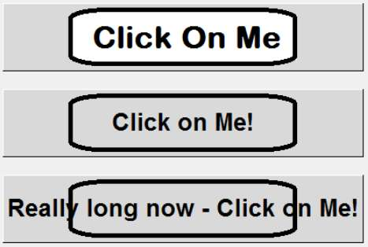
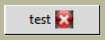

.. _04images:

=====================
Images First Steps
=====================

Working with Images
===================

.. sidebar:: tkinter version

	If your version of tkinter is 8.6 or higher then PhotoImage also works 
	with png files directly.

Using PhotoImage tkinter and ttk can work with gif, pgm or ppm images and xbm 
images if we use BitmapImage. (PhotoImage and BitmapImage are both imported
using tkinter). 

.. table:: Display Images in tkinter

   =============== ========== ===========
   tkinter version PhotoImage BitmapImage
   =============== ========== ===========
    all versions     gif         xbm
    all versions     pgm
    all versions     ppm
    8.6 or higher    png
   =============== ========== ===========

You can check out the tkinter version as follows::

   import tkinter
   print(tkinter.TkVersion)

Some widgets have a property option called image (it is shown in 
`Tkinter 8.5 reference: a GUI for Python <http://infohost.nmt.edu/tcc/help/pubs/tkinter/tkinter.pdf>`_) 
so once the image file is initiated in PhotoImage it can be loaded directly 
onto the widget. 

.. note:: All the images used with the examples will be found in the 
	directory "images". and the programs can be run using the same directory 
	structure on your computer.

Button Image
------------

First off we shall load just an image onto a button and see what happens when 
we pass the cursor over it, and press the button. Load up 04button_image.py 

Script 04button_image.py
^^^^^^^^^^^^^^^^^^^^^^^^

.. container:: toggle

   .. container:: header

       *Show/Hide Code* 04button_image.py

   .. literalinclude:: examples/04button_image.py 
      :emphasize-lines: 25-40

Using 04button_image.py you should see three buttons, the top one with just 
an image, the second uses the same image with the centre made transparent - 
this looks quite promising - until we see the third button and its text. 

As it stands it is obvious that the image property option is not always useful, 
since it does not change dynamically with the widget. Where a widget can work 
with a single sized widget, as in a pictogram, then this option is valid. 

Loading Images
--------------

.. sidebar:: Using tkinter 8.5

   If you are running tkinter 8.5 uncomment and comment out the lines as 
   indicated, this will load Image and Imagetk from PIL then use Image.open 
   and Imagetk.PhotoImage.

# with tkinter 8.6::

	self.buttonPhoto = PhotoImage(file='../images/butImage.png') 
	buttonPhotoTrans = PhotoImage(file='../images/butImageTrans.png')

# with tkinter 8.5::

   from PIL import Image, ImageTk
   im1 = Image.open('../images/butImage.png') 
   ^^^
   im2 = Image.open('../images/butImageTrans.png') 
   self.buttonPhoto = ImageTk.PhotoImage(im1) 
                                         ^^^
   buttonPhotoTrans = ImageTk.PhotoImage(im2)

The images butImage.png and butImageTrans.png are referenced to the images 
file. The image is loaded into PhotoImage, where a reference is required which 
will be used within the widget's property option "image". 

.. warning:: If images are used within a class there is always the problem 
   that garbage collection will dispose of the image and it will not show unless 
   special precautions are taken. 

When the image is a local variable, reload the image directly after 
referencing it with the widget, alternatively in class ensure that the image 
variable is prefixed by self, (compare how the two images self.buttonPhoto 
and buttonPhotoTrans are treated). 

Button Pictograms
-----------------

If multiple pictograms are available we can change these according to state. 
Check out the example 04button_pictograms.py.

Script 04button_pictograms.py
^^^^^^^^^^^^^^^^^^^^^^^^^^^^^^

.. container:: toggle

   .. container:: header

       *Show/Hide Code* 04button_pictograms.py

   .. literalinclude:: examples/04button_pictograms.py
      :emphasize-lines: 18-19
      :linenos:

Look at lines 18-19, this has three pictograms linked to 3 states which must 
have the active state listed last, just as we needed to do in the mapping 
situation. We can load the pictogram image and text simultaneously by using 
the "compound" property option. When using the image property always ensure 
that the first state remains anonymous, corresponding to the normal state.

.. Warning:: Be careful when referencing the image in the image property
	`im1 = PhotoImage("ref1", file='myimage.gif')`
	We can use `"ref1"` as our image reference or `im1` (unquoted).

