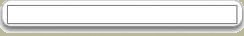
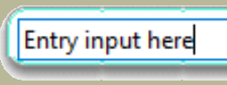
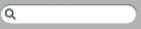

.. _05advanced_images:

=================================================================
Image - Create Widgets with Rounded Corners and Shadow Effects
=================================================================

Standard Themes in ttk
======================

The 4 themes common to tkinter can be found where your python program is 
installed under the directory python36/tcl/tk8.6/ttk. They are listed with 
their own name plus"Theme" suffixed with ".tcl", apart from default which is 
listed as defaults.tcl. 

* **altTheme.tcl**
* aquaTheme.tcl
* **clamTheme.tcl**
* **classicTheme.tcl**
* **defaults.tcl**
* vistaTheme.tcl
* winTheme.tcl
* xpTheme.tcl

.. topic:: Viewing the Theme files

   There are obvious differences between the tcl and python languages
   but we can recognise some commands such as map and configure, we can also 
   spot the element and state names. A new part of the mix is when we look at 
   the OS specific themes, such as aqua or vista, they have variables that are 
   system dependant. Even so we should be able to recognise how some of our 
   scripts will respond. 

It would seem that the common themes allow us to modify 
all the components and elements and are able to give the widest possible 
support to any style alterations we wish to make. Contrast what happened
when we tried to modify one of the OS dependant themes and we required a 
less straightforward approach in :ref:`02Entry.py<02Entry.py>`. On the 
other hand the OS specific themes look up-to-date and ready to use as is. 

.. |default| image:: figures/default_but.jpg
   :width: 170px
   :height: 71px

Buttons Created in Standard Themes
----------------------------------

.. table:: Using 03state_themes.py in ``selected`` State

   +-----------+-----------+-----------+-----------+----------+
   |    alt    |    clam   |  classic  |  default  |   vista  |
   +===========+===========+===========+===========+==========+
   |   |alt|   |   |clam|  | |classic| | |default| |  |vista| |
   +-----------+-----------+-----------+-----------+----------+

So far we have seen that the ttk themes achieve uniformity across all widgets, 
by using common changes on dynamic states, also by using the same element 
name within a widget or from widget to widget. A third aid to uniformity is 
by using using descriptive colour aliases rather than the colour names or 
hash values.

As stated at the beginning there are remarkably few instances of the more 
interesting style changes found when trawling the internet. Up until this 
point most of the examples could have been made referring `"Tkinter 8.5 
reference: a GUI for Python" <https://anzeljg.github.io/rin2/book2/2405/docs/tkinter/tkinter.pdf>`_.
The few instances I did find that displayed rounded corners and shadow 
effects I will reproduce here.

Rounded Frame
=============

The first example is based on that created by Bryan Oakley, a stalwart of 
StackOverflow. His original script created visible frames around entry and 
text widgets, example 05rounded_frame.py. 

05rounded_frame
---------------

.. literalinclude:: examples/05rounded_frame.py
   :lines: 10-16, 53-56, 91-117

.. note:: For sanity's sake about 74 lines of image data have been ommitted.
   Only the first and last lines of the data file are seen above.

Discussion - Rounded Frame
--------------------------

Since he is using encoded data there is no reference to a file, instead 
PhotoImage refers to this data directly. Normally we have no states in the 
frame widget so he introduces lambda functions tied into Entry *FocusIn* and 
*FocusOut* events. He is using 2 separate images, the first is where the 
frame's contents have focus, the second where it loses focus. Click within 
the upper and lower frames, see how the outer colour changes, also note that 
the frame has decidedly rounded corners and a shadow on the right hand and 
lower sides. 
 
Let's remind ourselves about the layout and elements for frame::

	>>>s.theme_use('default')
	>>>s.layout('TFrame')
	[('Frame.border', {'sticky': 'nswe'})]
   
	>>>s.element_options('Frame.border') # only one component to query
	('background', 'borderwidth', 'relief')

In our example script, Bryan created an extra state (focus) and changed the 
border, using the command style.element_create::

	style.element_create("RoundedFrame", "image", "frameBorder", 
   # he was working on "RoundedFrame" the style cross reference, 
   # then he added an image "frameBorder" our default or normal state
	("focus", "frameFocusBorder"), border=16, sticky="nsew") 
   # next he added the state "focus" and set this to the image "frameFocusBorder"
   # then changed the border to 16

The border size, 16, is important, it is the allowance needed to create the 
rounded corners and shadows, without this the resulting widget would look 
jagged. The single figure 16 is the equivalent of having (16,16,16,16), a 
border of 16 along all sides. The lower frame has obviously grown in comparison 
to the upper frame and looks pretty smart, both frames have the same style
"RoundedFrame". 

Now is a good time to have a look at the underlying image. To do this we will 
need to decode the coded image. Since the script is quite old it was assumed 
to be a gif image. (Use all the data lines of the coded image).::

	import base64
	with open ('frameFocusBorder.gif','wb') as f:
		decoded = base64.decodebytes(b"""
	R0lGODlhQABAAPcAAHx+fMTCxKSipOTi5JSSlNTS1LSytPTy9IyKjMzKzKyq
	.....  ## coninuation ##
	Ry/99NIz//oGrZpUUEAAOw==""")
		f.write(decoded)

.. |ff-focus| image:: figures/05frameFocusBorder.gif

.. table:: Rounded Frame Images

   ============================ ============================
    normal image                 focus image
   ============================ ============================
   |ff-normal|                   |ff-focus|
   ============================ ============================

Working with the code from img1 (frameFocusBorder) of 05rounded_frame.py, we 
should see that an image file frameFocusBorder.gif is created, that is 64 by 
64 pixels large. Load this on an image editor, zoom in so that the pixels 
are shown as squares and move your cursor to the centre of the corner, we 
then can see why we need to have a border of 16 all round. 

.. |ff16| image:: figures/05round16.png
   :width: 124
   :height: 49

.. |ff8| image:: figures/05round8.png
   :width: 124
   :height: 48

.. table:: Effects of Changing the Border Sizes

   ======================== ======================== ========================
    Border 16                 Border 12               Border 8
   ======================== ======================== ========================
   |ff16|                   |ff12|                    |ff8|
   ======================== ======================== ========================

Reducing this figure to 8 say we will see about 13 indentations on the 
long side. A border of 12 will still show indentations, although not as 
pronounced, by 16 the indentations have disappeared altogether. Also look 
closely at the corners, the shadow affects the lower corner. It would seem 
that when a widget image needs to extend only the inner part of the image 
between the border extremities is utilised for the extension, in this case 
the middle 32 pixels of each side are used during an image extension. 

   Top left hand corner showing 16 pixel distances from sides

Think about what you have just seen, it's pretty awesome isn't it? That small 
image was automagically enlarged to the required size with the barest of input, 
apart from telling the widget to change itself by creating an element and 
placing our image at the border we did not change a thing, the only sizing
command was the standard ``expand=1`` found in pack.

What happens when we adapt the above method for a labelframe? What about the 
top part of the frame where the text is written between a visible frame? Will 
we need a special method to create the gap? Ah well, fools rush in where 
angels fear to tread. Run 05rounded_labelframe.py. 

Rounded LabelFrame
==================

Only the element_create and layout parts have been shown.

.. literalinclude:: examples/05rounded_labelframe.py
   :lines: 60-62

.. sidebar:: Frame Colours

   You did notice the frame has a different colour - first obtain the decoded 
   image, make the changes to the colour then encode back once again. 

The labelframe reacts well, we see the label sitting in the frame break, and 
the colour changes as a result of the program logic. **The style.element_create 
and style.layout remain the same as for the frame example.** :: 

	import base64
	with open('borderGrey1.gif', 'rb') as f:
		encoded = base64.encodestring(f.read())
		print(encoded.decode('latin1')) 
      # 'latin1' contains all western characters but not the €

The grey image was modified to create a red widget which was then encoded.

Search Entry
============

The next example, was found by trawling the internet, 05search_entry.py 

Script 05search_entry.py
------------------------

Most of the image data is not shown.

.. literalinclude:: examples/05search_entry.py
   :lines: 14-15, 53-83

This will create a special entry, resembling the mac search element. Once 
again the image is loaded as encoded data, this time the programmer uses the gif 
property to make multiple images. Look at the PhotoImage lines of code at the 
format property. The programmer is altering the entry widget, using the 
PhotoImage alias names "search1" rather than the s1 variable. ::

   s1 = PhotoImage("search1", data=data, format="gif -index 0")
   #                .......
   style.element_create("Search.field", "image", "search1",
   #                     ^^^^^^^^^^^^             .......
      ("focus", "search2"), border=[22, 7, 14], sticky="ew")
   style.layout("Search.entry", [
      ("Search.field", {"sticky": "nswe", "border": 1, "children":
   #    ^^^^^^^^^^^^
         [("Entry.padding", {"sticky": "nswe", "children":
               [("Entry.textarea", {"sticky": "nswe"})]
         })]
      })]
   )

Compare its layout to that of a normal entry widget. ``Entry.field`` was
replaced by ``Search.field``.::

   St.layout('TEntry')
	[('Entry.field',
	{'border': '1',
		'children': [('Entry.padding',
		{'children': [('Entry.textarea', {'sticky': 'nswe'})],
			'sticky': 'nswe'})],
		'sticky': 'nswe'})]

The other item to note is how he deals with the border width. Originally it 
was 1 all round, now it is ``border=[22, 7, 14]``. This follows the same 
convention as used for padding found in `"Tkinter 8.5 reference: a GUI for Python" 
<https://anzeljg.github.io/rin2/book2/2405/docs/tkinter/tkinter.pdf>`_, the 
left side is 22 and the right side 7 meanwhile top and bottom sides are 14. 
Check out table 05padding_border_layout.csv.

Table 05padding_border_layout.csv
---------------------------------

.. csv-table:: Padding and Border Layout
   :file: tables/05padding_border_layout.csv
   :header-rows: 1
   :widths: 10, 10, 10,10,10

Since we are using the normal interactive states of the entry widget, no 
additional programming is required as was necessary for the label example. 
Using our newly acquired image decoding skills we can see how the border 
layout numbers are derived. 22 pixels clears the tail of the magnifiying glass, 
7 pixels clears the corner and the top clearance, whilst 14 pixels clears the 
right hand end. 

.. sidebar:: Entry has Width but no Height

   Entry has an option for width, but nothing for height, so the programmer 
   felt safe. Checking on the textarea elements we can only set font and 
   width, so he was justified.

On the face of it, this widget can be widened horizontally, but there is no 
way we can extend it vertically without creating a strange looking 
magnifiying glass. 

When substituting an image for a border ensure there is a section that can 
be repeated on complementary sides, that is normally repeated both left and 
right, also top and bottom. 

We should now be able to understand how to manage themes. When we use a simple 
style change the affected widgets must have that style property that is cross 
referenced to Style.configure. When a theme change is made affected widgets 
require no such reference, therefore the reference used in the style changes, 
such as "search1" in 05search_entry.py, is appropriate to a style change. 
Below we shall use class names, once a style has been tested and 
is ready to be part of the customised theme we will use just "TButton" rather 
than "new.TButton" say, then all buttons would be altered by the style change 
within that themed script. 

Ttkthemes
=========

Now would be a good a time as any to inspect what ttkthemes has to offer. 
Apart from the interface to python most is written in TCL scripting language. 
We can take stock of the themes on offer, most work with gif images, that are 
used as a substitute for the border part of the relevant widget. Almost all 
ttkthemes use one of the 4 common themes as a parent. It is interesting to 
note that Aquativo uses coded images, whereas the black theme has no images. 
Three themes use png images, but these are only usable with tkinter 8.6 and 
above. Finally most images are quite small, about 30 by 30 pixels, apparently 
with corners of one or three pixels radius - what apparent? Yep there is no 
actual curved line, though it looks like there are corners there.

.. |arc| image:: figures/arc.jpg
   :width: 118px
   :height: 38px

.. |black| image:: figures/black.jpg
   :width: 111px
   :height: 30px

.. |clearlooks| image:: figures/clearlooks.jpg
   :width: 128px
   :height: 36px

.. |elegance| image:: figures/elegance.jpg
   :width: 105px
   :height: 41px

.. |equilux| image:: figures/equilux.jpg
   :width: 121px
   :height: 41px

.. |keramik| image:: figures/keramik.jpg
   :width: 112px
   :height: 40px

.. |plastik| image:: figures/plastik.jpg
   :width: 105px
   :height: 35px

.. sidebar:: Buttons in selected state

   Look closely at the corners and the general appearance of the button, some
   have a flat look others look as though they have a curved look. (Radiance 
   and ubuntu are similar except that ubuntu uses png files).

============ ==============
 ttktheme     selected
============ ==============
 aquativo     |aquativo| 
 arc          |arc| 
 black        |black|
 clearlooks   |clearlooks|
 elegance     |elegance|
 equilux      |equilux|
 keramik      |keramik|
 keramik_alt  |keramik_alt|
 kroc         |kroc|
 plastik      |plastik|
 radiance     |radiance|
 ubuntu       |ubuntu|
 winxpblue    |winxpblue|
============ ==============

If you want to modify the gif images in an image editor there should be no 
great problem, provided you do not try converting to another format and back 
again. Use the image editor for small simple changes. When checking out or 
modifying an image pixel by pixel use PIL (Pillow), also remember that gif 
refers to its colours by a number 1 to 256, requiring special programming, 
it would probably be better to use png from the outset.

If you were to install ttkthemes it is easy to switch between the normal 
themes and ttkthemes. Running the standard ttk Style module excludes ttkthemes, 
however you can load up ttkthemes with the following part script::

   .....
      try:  
         import ttkthemes as ts 
         self.s = ts.themed_style.ThemedStyle()
      except (NameError, AttributeError):
         self.s = Style()
   .....

then any normal command used by Style can be used unchanged, providing we use 
the same prefix system, in our case ``self.s.``, so 
``list(sorted(self.s.theme_names()))`` would work for both the standard themes 
and the ttkthemes.

When comparing the script of a ttktheme with a standard theme the first 
obvious difference is that we are loading the image files and using photo 
(PhotoImage in tkinter) on all the images, which can then be 
referred to by their image name without the gif or png suffix. Secondly we
have a theme create clause::

   namespace eval ttk::theme::clearlooks {

      package provide ttk::theme::clearlooks 0.1

      proc LoadImages {imgdir {patterns {*.gif}}} {
         foreach pattern $patterns {
            foreach file [glob -directory $imgdir $pattern] {
                set img [file tail [file rootname $file]]
                if {![info exists images($img)]} {
                    set images($img) [image create photo -file $file]
                }
            }
         }
         return [array get images]
      }

      variable I
      array set I [LoadImages \
                     [file join [file dirname [info script]] clearlooks] *.gif]
   ....
       ttk::style theme create clearlooks -parent clam -settings {

.. seealso:: 

   We will be using a standalone theme in python in the next chapter -
   the general layout is very similar to the tcl version - just that the 
   grammar changes.
   
Thereafter the ttkthemes closely follow the standard themes by first loading 
up the colour aliases, then setting the general settings using configure, 
followed by mapping the general states. From thereon the themes configure and 
map out the individual widgets, often the simple widgets are left out in which 
case the parent theme's widgets are used. The images are loaded using ``image
$I(image_filename)`` as opposed to ``"image", 'image_filename'`` in python.::

   ttk::style element create Button.button image [list $I(button-n) \
   
   "Button.button": {"element create":
            ("image", 'button-n',

The padding and border sizes would be shown as::

	-padding {6 2 6 2} or -border {22 7 14} 

compared to python::

	padding = [6, 2, 6, 2] or border=[22, 7, 14]

After all that we see that ttkthemes show one or two major differences to the 
standard themes - all states require their own separate images for each widget, 
which if properly used allows a more striking effect. Check some of the images 
- you may notice that a pressed image is the same as a normal image except 
that it has been inverted (this is often the case where a button has a simple 
gradient). Some themes could be easily adopted as they stand, or used 
as examples for certain effects. 

One other point, some widgets are made from two or more assemblies of 
components and elements. Each assembly will therefore require its own separate
image. For instance Button is simple and needs only one image per state, 
whereas combobox requires both the main body "combo" and the arrow 
"comboarrow" assemblies as separate images per state.

So once you are aware of how the themes work you may decide to devise your own. 
It takes quite a bit of time but is relatively straighforward.
