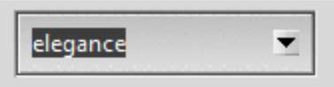
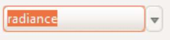
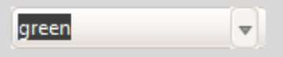
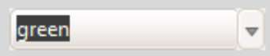
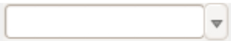

.. _06roll_your_own:

===============================
So you want to roll your own
===============================

Anything you do when making new or changed themes, should be separated from 
working directories, use copies of anything you want, in fact sandbox. Pretty 
obvious really.

Themed notebook
===============

.. image:: /figures/06themed_notebook.jpg
   :width: 496px
   :height: 318px
   :align: center

Let us refresh our memory of how a widget looks in the various themes, try 
06theme_notebook.py, which has most of the important widgets together with a 
theme selector. It has been set up to incorporate ttkthemes. The first tab 
contains most of the normally used widgets, the second tab has a treeview 
with scrollbars, in order to see the scroll bars work it may be necessary to 
adjust the height and width using the sizegrip, the third tab has the scale 
and progress bars. Try using the checkbutton *Enabled*, this will change the 
state to disabled and back again for most of the widgets.

There may be widgets that appeal in different themes, it should be 
possible to mix and match to your taste provided that you copy widget 
definitions together with any referenced images.

.. container:: toggle

   .. container:: header

       *Show/Hide Code* 06theme_notebook.py

   .. literalinclude:: examples/06theme_notebook.py

Create a Theme
==============

Once individual styles have been tested, we need to to incorporate these into 
a theme that can be called directly from the application with a single import 
and a single call. Obviously it would be foolish to work directly on the 
tkinter.ttk directory. One can concoct a complete standalone python theme 
together with the appropriate images, alternatively use the ttkthemes
module, adding your own theme name. 

Make a New Theme in ttktheme - green
====================================

   1. Create a new directory - give it an expressive name - say green
   2. Choose a ttktheme (*elegance*) and copy its main tcl file and image 
      subdirectory together with their contents to the green directory.  
      As with the original theme, we have a main theme directory now called
      *green*, a main theme file, *elegance.tcl* renamed *green.tcl*, and a 
      subdirectory renamed *green* containing the images.
   3. Edit green.tcl replacing the name of the original theme by the new name
      - so using *elegance* as our example ttktheme::

         namespace eval ::ttk::theme::green {
         package provide ttk::theme::green 0.1
         ....
         LoadImages [file join [file dirname [info script]] green]
         ....
         ::ttk::style theme create green -settings {

4. Copy one of the pkgindex.tcl files from one of the themes to your main 
   directory, replace the name of the original ttktheme by your chosen name::

      if {![file isdirectory [file join $dir green]]} { return }
      if {![package vsatisfies [package provide Tcl] 8.4]} { return }
      
      package ifneeded ttk::theme::green 0.6.2 \
      [list source [file join $dir green.tcl]]

5. Edit the pkgindex.tcl found under the parent directory of ttkthemes, add 
   an extra line to the list of theme sources::

      source [file join $themesdir green green.tcl]

6. edit ``_widgets.py`` file, in the main ttkthemes directory, in the 
   section of pixmap_themes add your theme to the list.

.. code-block:: python
   :emphasize-lines: 6
   
      pixmap_themes = [
         "arc",
         "blue",
         "clearlooks",
         "elegance",
         "green",
         "kroc",
         "plastik",
         "radiance",
         "ubuntu",
         "winxpblue
      ]

7. That should do it. Test that everything works after your editing. Now you 
   can start to replace original widgets with your preferred widgets.

Standalone Theme - orange
=========================

The alternative to the above is to create a standalone package. Here the 
package will need to replicate what a tcl based ttktheme 
does but using python. 

We can use the script for `plastik_theme.py <https://github.com/enthought/Python
-2.7.3/blob/master/Demo/tkinter/ttk/plastik_theme.py>`_ as a basis for our 
standalone - this should shortcut a lot of the work. The script uses 
Style.theme_create and follows the pattern already seen in 
:ref:`03combobox.py<combobox themes>` for theme_settings. Copy the plastik 
image files found in ttkthemes to a subdirectory, called *plastik*, at your 
test location, these will eventually be replaced by new file names of your 
own choice.

Convert the plastik_theme.py script from python2 to 3. 

We can test plastik_theme.py by running the script 06treeview.py directly 
from your os system. First **import plastik_theme** then we call 
**plastik_theme.install('plastik')**, notice that it has *'plastik'* as a 
variable, so *'plastik'* is the subdirectory where the images from plastik 
have been copied to.

.. container:: toggle

   .. container:: header

       *Show/Hide Code* 06treeview.py

   .. literalinclude:: examples/06treeview.py
      :lines: 94-112

When that works, rename the *plastik* directory and subdirectory, to your 
theme name, say *orange*, then wherever we find *plastik* referenced in 
plastik_theme.py we should change it to our theme name *orange*, using
orange_theme.py. ::

	style.theme_create("orange", "default", settings={
	.....
	style.theme_use("orange") # right at the end

We now have both an extra theme in ttkthemes controlled by tcl files or we 
have a standalone theme running under python. Associated with these 
control files is a subdirectory of image files. Either system is as valid as 
the other, the choice is yours. 

The method of working for both is similar, after creating a good quality 
working widget with all the required states, either replace the  
widget in green.tcl or orange.py, change the references to any images, alter 
the border sizes as necessary, then add replacement images to the image 
subdirectory. When everything works satisfactorily delete the unused images 
found in the green or orange image directories. 

Occasionaly it may be necessary to change the widget layout. In both methods 
we normally need to translate between tcl and python, use the files plastik.tcl 
and plastik.py to help spot the differences and similarities between the two 
languages.

Combobox
========

Let's see if we can pin the above on an example or two. First let us change 
the combobox on both our test themes to that used by radiance. On my computer 
with Windows 10 and python 3.6, the combobox from elegance aka green looks 
like 

whereas radiance looks like

Say we prefer the radiance combobox and want to run it in our green theme.

Compare the tcl files, radiance.tcl consists of the following ::

        ## Combobox.
        #
        ttk::style configure TCombobox -selectbackground

        ttk::style element create Combobox.downarrow image \
            [list $I(comboarrow-n) \
                 disabled $I(comboarrow-d) \
                 pressed $I(comboarrow-p) \
                 active $I(comboarrow-a) \
                ] \
            -border 1 -sticky {}

        ttk::style element create Combobox.field image \
            [list $I(combo-n) \
                 {readonly disabled} $I(combo-rd) \
                 {readonly pressed} $I(combo-rp) \
                 {readonly focus} $I(combo-rf) \
                 readonly $I(combo-rn) \
                ] \
            -border 4 -sticky ew

whereas green.tcl looks like ::

        # Combobox
        #
        ::ttk::style element create Combobox.field image \
            [list $I(combo-active) \
                {readonly} $I(button-active) \
                {active}   $I(combo-active) \
            ] -border {9 10 32 15} -padding {9 4 8 4} -sticky news
        ::ttk::style element create Combobox.downarrow image \
            [list $I(stepper-down) disabled $I(stepper-down)] \
            -sticky e -border {15 0 0 0}

.. sidebar:: File Types

   Both these themes use gif files, since we are not changing the images it
   suits us to stay with this format.

In both cases the combobox uses **element create** for the components 
*field* and *downarrow*. Radiance has fewer images, which luckily do not have a 
name clash with any of the green image names. It seems that we should be able 
to replace the relevant script parts and copy all the radiance image files 
to the green image directory. When this is done we can test with one of our 
files such as 06theme_notebook.py, or 06combobox_text_theme.py. 

Both scripts have a combobox with theme selector, our green theme should be 
in the dropdown list, go on select it.
 
This should look something like:- 

which as you can see on my windows box is not quite the same as the radiance 
combobox, look at the position of the down arrow. Check green.tcl and see that 
there is no parent theme in the line::

	::ttk::style theme create green -settings {

unlike radiance.tcl where we find ::

	ttk::style theme create radiance -parent clam -settings {

since elegance (aka green) was probably created in Linux the normal theme would 
have been default. Using default as the parent theme the combobox is not 
altered enough - let's try the clam theme instead - ahh far better.

That wasn't too bad was it? Now for the orange theme, taken from orange.py . ::

   "Combobox.field": {"element create":
            ("image", 'combo-n',
                ('readonly', 'active', 'combo-ra'),
                ('focus', 'active', 'combo-fa'),
                ('active', 'combo-a'), ('!readonly', 'focus', 'combo-f'),
                ('readonly', 'combo-r'),
                {'border': [4, 6, 24, 15], 'padding': [4, 4, 5],
                 'sticky': 'news'}
            )
        },
        "Combobox.downarrow": {"element create":
            ("image", 'arrow-d', {'sticky': 'e', 'border': [15, 0, 0, 0]})
         },

We have to be careful not to overwrite green combo- image files with our new 
files imported from radiance, give them a new designation, say ``combor-`` so the 
old files remain until all has been tested. Also we have to ensure that we have 
the python corresponding to the tcl in radiance.tcl. 

It's probably best to run a python test file such as 06widget_orange_test.py. 

.. _06widget_orange_test.py:

.. container:: toggle

   .. container:: header

       *Show/Hide Code* 06widget_orange_test.py

   .. literalinclude:: examples/06widget_orange_test.py
      :emphasize-lines: 25-43
      :linenos:

.. sidebar:: What about line 44?

   Those final brackets ``})`` close off ``style.theme_create('test',``
   ``parent="clam", settings={`` and should not be included since orange.py 
   already has its own theme_create.
   
   However we will need a finishing comma ``,`` to allow continuation to the 
   next section.

Copy the necessary radiance image files to our orange images directory, 
renaming as necessary. When running theme_create you can experiment 
having the parent directory as default instead of clam - the results should 
be similar to those given in the green.tcl test. The resulting python script 
within theme_create (lines25-43) can be used to overwrite the combobox part of orange.py. 
We can test whether orange.py is correct using 06combo_orange.py. 

.. container:: toggle

   .. container:: header

       *Show/Hide Code* 06combo_orange.py

   .. literalinclude:: examples/06combo_orange.py

When working with radiance note how often the widgets have their images added 
by using "element create" - there are not so many widgets that require a 
layout and mapping. This bodes well for any future designs we may have since 
this is a relatively simple construct. 

Customising Button Focus
========================

.. |efoc| image:: figures/06elegance_focus.jpg
   :width: 211px
   :height: 85px

.. |rfoc| image:: figures/06radiance_focus.jpg
   :width: 293px
   :height: 92px

.. table:: Comparing Focus Displays

   ================ =======================
   elegance button   |efoc|
   radiance button   |rfoc|
   ================ =======================

Onto our next exercise - let us create a button where the focus state's dashed 
line surrounds the button. In radiance we see that the button part of the 
script looks like.

.. code-block:: tcl
   :emphasize-lines: 4

   ## Buttons.
   #
   ttk::style configure TButton -width -11 -anchor center
   ttk::style configure TButton -padding {10 0}
   ttk::style layout TButton {
      Button.focus -children {
         Button.button -children {
            Button.padding -children {
               Button.label
            }
         }
      }
   }

followed by an element create, which we can ignore as it does not concern 
focus. The first configure clause can be ignored as it concerns itself with 
size and anchor, however the second configure is interesting. Let's just 
insert this clause into the green.tcl button widget.

.. code-block:: tcl
   :emphasize-lines: 3

   # Button
   #
   ttk::style configure TButton -padding {10 0}
   ttk::style layout TButton {
      Button.background
      Button.button -children {
         Button.focus -children {
            Button.label
         }
      }
   }

Testing this we see no effect which should not be surprising when we see that 
at this stage the button widget has no element named padding. We can prove 
this by finding out the component and their element names from an active session. 
We can change the button layout of the green theme by adding ``Button.padding -children {`` 
and test again. It works! 

.. container:: toggle

   .. container:: header

       *Show/Hide Code* altered green Button

   .. code-block:: tcl
      :emphasize-lines: 4

      ttk::style layout TButton {
         Button.focus -children {
            Button.button -children {
               Button.padding -children {
                  Button.label
               }
            }
         }
      }

Let's try it out on the orange theme. Checking out the button we see we have 
a configure and a layout that already has padding, so hopefully it works with 
only minimal changes. First we add padding to configure. When testing this 
does not work, so swop the Button.button and Button.padding positions in
the layout.

.. container:: toggle

   .. container:: header

       *Show/Hide Code* original orange Button

   .. code-block:: python
      :emphasize-lines: 4,5

        "TButton": {
            "configure": {"width": 10, "anchor": "center"},
            "layout": [
                ("Button.button", {"children":
                    [("Button.focus", {"children":
                        [("Button.padding", {"children":
                            [("Button.label", {"side": "left", "expand": 1})]
                        })]
                    })]
                })
            ]
        },

.. container:: toggle

   .. container:: header

       *Show/Hide Code* altered orange Button

   .. code-block:: python
      :emphasize-lines: 4,5

      "TButton": {
         "configure": {"width": 10, "anchor": "center", "padding": [10, 0]},
         "layout": [
            ("Button.focus", {"children":
               [("Button.button", {"children":
                  [("Button.padding", {"children":
                     [("Button.label", {"side": "left", "expand": 1})]
                  })]
               })]
            })
         ]
      },

This works. The conclusion is that one may have to test the configure and 
layout options with a small script such as 06widget_orange_test.py adapted to 
suit your needs.

When dealing with states it helps to keep in mind what will be required in 
the program in relation to that widget. It certainly helps to view how various 
themes tackled that problem. Some widgets can operate with a bare minimum of 
states, others may require quite a few, but don't forget that some themes use 
the common settings to help display states without the need for additional 
images.

Customising Spinbox
===================

Since spinbox is a johnny-come-lately, unless you have Python 3.7 or greater, 
this won't work. 

We are going to use a spinbox widget when creating the lime theme later, but 
this throws up a layout problem similar to the examples above. Spinbox looks 
similar to the combobox, except that there are two arrows as opposed to the 
single down arrow in combobox. At first thought there should not be an 
awful lot of difference between the two, apart from arrow size. 

When we worked with combobox we found that just using the clam theme solved
our spacing problem between the down arrow and the text border. Examples of
spinbox working in one of the standard themes is shown later, see 
:ref: `Spinbox Standard Themes`. The effect we wanted with combobox is to place the
arrow directly adjacent to the text area, but in spinbox the arrows are all
within the border of the text area. Apart from plastik and keramik there are
no spinbox examples in ttkthemes, so information is a little sparse. 

Let us go ahead and create our own spinbox from elements from the lime theme,
first of all with no special configuration apart from using the clam theme
as parent. Use the file 06spinbox_nofrills.py, which is similar to that used
for combobox above, import the lime images for the combobox text body, and 
the up and down arrows. The arrows have already been reduced in size.

.. _spin-nofrills:

.. figure:: /figures/06spin_nofrills.png
   :width: 99
   :height: 61
   
   Spinbox - no frills
   Look closely at the right hand side. 

The border of the text area has extended beyond the arrow area. There 
probably is a difference in the configurations used in the clam combobox and 
spinbox.::

   [('Combobox.downarrow', {'side': 'right', 'sticky': 'ns'}), 
     ('Combobox.field', {'expand': '1', 'sticky': 'nswe', 'children': 
       [('Combobox.padding', {'sticky': 'nswe', 'children': 
         [('Combobox.textarea', {'sticky': 'nswe'})]})]})]

   [('Spinbox.field', {'side': 'top', 'sticky': 'we', 'children': 
      [('null', {'side': 'right', 'sticky': '', 'children': 
         [('Spinbox.uparrow', {'side': 'top', 'sticky': 'e'}), 
            ('Spinbox.downarrow', {'side': 'bottom', 'sticky': 'e'})]}), 
               ('Spinbox.padding', {'sticky': 'nswe', 'children': 
                  [('Spinbox.textarea', {'sticky': 'nswe'})]})]})]

Compare this with those derived from the plastik theme.::

   [('Combobox.field', {'sticky': 'nswe', 'children': 
      [('Combobox.downarrow', {'side': 'right', 'sticky': 'ns'}), 
         ('Combobox.padding', {'expand': '1', 'sticky': 'nswe', 'children': 
            [('Combobox.textarea', {'sticky': 'nswe'})]})]})]
   
   [('Spinbox.field', {'side': 'top', 'sticky': 'we', 'children': 
      [('Spinbox.buttons', {'side': 'right', 'sticky': 'nswe', 'border': '1', 'children': 
         [('null', {'side': 'right', 'sticky': '', 'children': 
            [('Spinbox.uparrow', {'side': 'top', 'sticky': 'e'}), 
               ('Spinbox.downarrow', {'side': 'bottom', 'sticky': 'e'})]})]}), 
               ('Spinbox.padding', {'sticky': 'nswe', 'children': 
               [('Spinbox.textarea', {'sticky': 'nswe'})]})]})]

The main difference between the layouts of the clam and plastik spinboxes is
the addition of the `buttons` component positioned on the righthand side of 
the `field` component. Normally this image is totally transparent but when 
the arrows are pressed a highlight is shown. We could consider `buttons` to 
be equivalent to a frame - but what is the null component doing then?

Running the two alternative 06spinbox_plastik_layout.py and 
06spinbox_custom_layout.py we can see whether we can improve the appearance
or not. Unless we wish to utilise the highlight method, plastik produced no
better result. 

Reverting back to the nofrills, using the clam layout, change the setting 
used for padding in Spinbox.field (element create) from 1 to 0, save and run. 
This eliminates the extended field component, so we can use this later on in 
the lime theme. 

.. container:: toggle

   .. container:: header

       *Show/Hide Code* 06spinbox_nofrills.py

   .. literalinclude:: examples/06spinbox_nofrills.py

