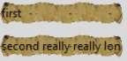
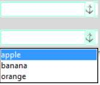
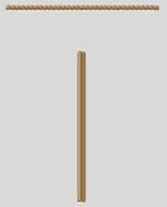
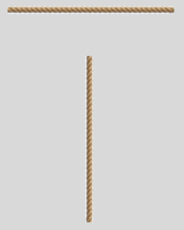
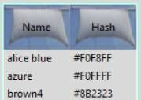
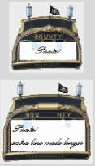
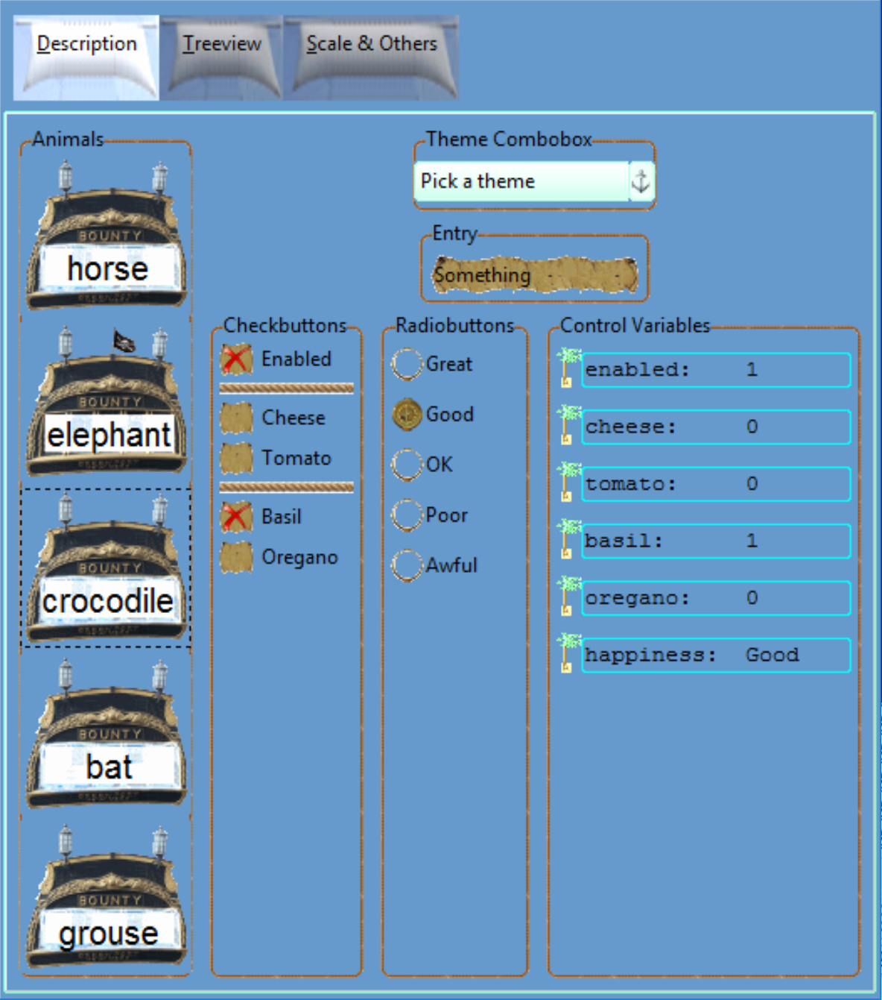

.. _07blue_sky:

====================
Blue Sky Thinking
====================

We may decide to adapt one of the existing ttktheme themes, using constructs 
copied from other themes as demonstrated previously - that is not what I mean 
by "Blue Sky Thinking", I mean something a little more unconventional.

The interesting point here is that with virtually no drawing we can create
widgets that show off different facets. 

* Frame 
   soft introduction into using an image and standard Style.element_create
   and Style.layout
* Piratz Sizegrip 
   widget with single state using Style.theme_create then ``"element create"`` 
   (two separate words)
* Piratz Label 
   multiple states, showing how to ensure the image expands correctly and 
   setting the text position.
* Piratz LabelFrame 
   showing that the frame element still responds correctly when text is inserted.
* Piratz Scrollbar 
   first use a layout then add a completely new element.
* Piratz Separator 
   Using layout to create vertical and horizontal elements that did not yet exist.
* Piratz Button 
   Creative states, also added layout to change position of dashed line in focus
* Piratz Progressbar and Scale 
   a little animation

Frame
=====

The first example is probably best run as a standalone style for frame. The 
idea is copied from a website `canvas image <https://datatofish.com/how-to-create-a-gui-in-python/>`_
that demonstrated how to use the tkinter canvas to contain the background 
image and some other widgets together with a matplotlib interface. This works 
but the geometry management is limited to the canvas system. If we use frame 
as our parent widget all the normal geometry managers - grid, pack and place 
- can be used. The only minor problem is that it works best with a full view 
of the background image. Use the example 07frame_background_image.py 

Frame with Background
---------------------

.. image:: /figures/07frame_background.jpg
   :width: 592px
   :height: 359px
   :align: center

.. sidebar:: Frame

   Look in the upper left hand corner for label and entry

to see what I mean, use a jpg image of your choice as backdrop, typically a 
panoramic view. Since these may be downloaded from many digital cameras and 
are usually half the size of a png or gif of equivalent size.

.. container:: toggle

   .. container:: header 

       *Show/Hide Code* 07frame_background_image.py

   .. literalinclude:: examples/07frame_background_image.py

Piratz
======

In my quest for blue sky thinking I'm using piratz as a theme, that certainly 
is different, but should not be taken too seriously, on the other hand it was 
fun to dream up the widgets and their associated images then see how to display 
them. The second example 07pirate_label.py can be used as a template for our 
subsequent pirate examples.

Piratz Sizegrip
---------------

.. image:: /figures/07piratz_sizegrip.jpg
   :width: 312px
   :height: 81px
   :align: center

We will be building a standalone python script based on the individual widget
scripts generated here and for the rest of this chapter. Since Sizegrip has 
no other states than its normal we need only to think of a suitable image, 
then use this to change its component - sizegrip - by means of element create
within the command theme_create. 

.. note:: Images are found in piratz, the subdirectory of images, and all are
   png files, as later on it will make things easier.

The important lines are the following::

     'sizegrip': {"element create":
          ('image', "sizegrip")}

which you will find sandwiched between the comment lines::

   # start of theme extract
   
   # end of theme extract - don't forget to add comma at end when inserting

``'sizegrip'`` is the element with which we are working, this being unique 
requires no identifiying widget name. ``"sizegrip"`` is the image alias name,
based on the image name itself sizegrip.png, so take the image name less the 
image suffix. These two lines are what we shall be inserting into the Piratz
standalone theme together with an end comma to allow further clauses to be
inserted.

Unless we add columnconfigure and rowconfigure to the test script sizegrip 
positions itself in the upper left corner, instead of the lower right corner.

.. literalinclude:: examples/07pirate_sizegrip.py
   :emphasize-lines: 19,20
   :linenos:

theme_create requires a new theme name, ``"yummy"``, and a ttk standard theme 
name (alt, clam, classic or default) as the parent, later on use the new 
theme name.:: 

   16 style.theme_create( "yummy", parent="clam", settings={
   .....
   24 style.theme_use('yummy')
   .....

theme_settings requires a ttk standard theme name and the same in theme_use.::

   17 style.theme_settings('default', {
   .....
   24 style.theme_use('default')
   .....

Piratz Label
------------

.. image:: /figures/07piratz_label.jpg
   :width: 149px
   :height: 362px
   :align: center

.. sidebar:: State Changes

   This has a function to help select state, which cancels the old state  
   before the new state is called. 

First create our image, this invokes a Caribbean island, the palm tree poses 
a challenge, particularly if the label grows in height. Choose border sizes 
that give the desired effect, then test using theme_create or theme_settings 
rather than styling (individual widget with configure, layout and map). 

Increase the height of the widget by using two lines of text - certainly easier 
than adding a configure clause. 

Try changing the border size to [20, 6, 4, 4], it looks reasonable if we have 
sticky "ew" and only one line of code, however let's keep it suitable for 
more than one line of text and change back to the original border size 
[17, 9, 7, 3] and sticky "news". 

The padding [17,5,3,3] is required to position the text. 

.. figure:: /figures/07pir_label.png
   :width: 560px
   :height: 272px
   :align: center

   Piratz Label with white Surround

   The surround has been left white to show the grid.

.. topic:: Calculating Border and Padding Sizes

   As we saw earlier **border** affects how the widget will look when its size
   is changed, whilst **padding** helps to position text.
   
   Look at the image below, it is enlarged to show the pixels, we can estimate 
   the border sizes. After the border is set the padding can be sorted out. If 
   there is a surrounding area around the image (maybe needed for shading) 
   include this in your calculations. The top and left measurements are
   border those on the right and bottom refer to padding.
   
   Remember the first line is 0 and we count from left to right on the first 
   entry but right to left on the third, look at the image to get a feel. Yes
   we are counting the top to bottom on the second entry and bottom to top on
   the fourth entry.

.. image:: figures/07pir-label-grid.png
   :width: 550px
   :height: 370px
   :align: center

Having created the image it is relatively easy to make it grey in our image 
editor and save the image for the disabled state. 

The text area has been made transparent, in fact the appearance may look 
better without a white surround, so we'll make the surround transparent as
well. 

Run the script and see whether the states look right. As you see we can test
more than one widget and prove that the settings and widgets operate as 
expected.

.. container:: toggle

   .. container:: header

       *Show/Hide Code* 07pirate_label.py

   .. literalinclude:: examples/07pirate_label.py

Piratz Label Frame
------------------

The labelframe was created, and labels were used to flesh out the frame. The 
labelframe required padding in the layout management to ensure that any 
widget placed inside the frame did not affect the frame and cleared the outer 
borders.

.. container:: toggle

   .. container:: header

       *Show/Hide Code* 07pirate_labelframe.py

   .. literalinclude:: examples/07pirate_labelframe.py
      :start-after: style = Style()

.. note:: All the pirate scripts are similar at the beginning upto 
   ``style = Style()``, and is only fully shown in 07pirate_label

Piratz Entry
------------

Let us try the entry widget. The thinking here is that we have a fairly simple 
widget, so an image of an old yellowed document may be appropriate. The image 
has irregular edges, so instead of a smooth expansion I have purposefully 
chosen border values that create more jagged borders. 

If required we could impose an old font such as the equivalent of 
"Palace Script MT" in Windows. As with pirate label there was no need to 
create a layout, ``"element create"`` is all we need.

.. container:: toggle

   .. container:: header

       *Show/Hide Code* 07pirate_entry.py

   .. literalinclude:: examples/07pirate_entry.py
      :start-after: style = Style()

Piratz Combobox
---------------

.. sidebar:: Combobox

   Be careful about which theme to use, when testing we cannot use clam for 
   some reason, remember this was used to position the down arrow for our 
   green and orange themes. When loaded into the final piratz theme it works 
   with clam.

Take combobox next, it is best not to alter this too much - since we 
need to incorporate a drop down list - so let's use the images from ubuntu. 
Remember ubuntu uses png, which is easier to manipulate than gif within PIL. 
We can see that ubuntu uses theme create without layout. 

.. topic:: Changing Colours of a Widget

   All the ubuntu images have a brown-beige look which we can change to 
   aquamarine based colours using 07list_colours.py and 07shift_colours.py, 
   this then matches our label widget. If we list the colours sorted by the 
   sum of the colour components, we can detect the different shades, then 
   we apply the darkest shade of brown-beige to the shift colours as our main 
   source colour. The shift script sorts out the shades of brown-beige and 
   substitutes shades of aquamarine. It is best to skip over arrows by creating 
   a mask by commenting out parts of the substitution process. Afterwards the 
   arrows are removed by painting over using the appropriate image background 
   colour with an image editor. The arrow is then replaced by an anchor. 
   
   There are various options available to change the colours, the system chosen is not the most rigorous, but seems to produce 
   surprisingly good results. To create a finished colour 3 colours are required, 
   the source pixel, a notional main source colour (called pivot in the program) 
   to which each pixel is compared and a target colour from which the required 
   colour is produced by adjusting the target colour. If a widget appears to use 
   a different hue we can substitute a new pivot and target colours - a commented 
   example is included. The 3 colour channels are linearly adjusted based on 
   the two constant points, if the source was white then the sum of the channels 
   would be 765 and the individual channels of the final colour would would be 255, 
   the other point we know is that if the source is the same as our pivot colour, 
   then the channel values of the final colour would be the same as our target 
   colour.

.. container:: toggle

   .. container:: header

       *Show/Hide Code* 07pirate_combobox.py

   .. literalinclude:: examples/07pirate_combobox.py
      :start-after: style = Style()

Piratz Scrollbar
----------------

Looking at the scrollbars next, they have components which will change with 
orientation, so together with changes of state there are quite a few images used. 
07pirate_scrollbar.py is the original script. I like the images from ubuntu 
so we can change their colours to aquamarine and subsititute the coconut tree 
from pirate_label for the arrows (steppers). The thumb image is a coconut, so 
for the first attempt there was no grip. 

The trough has been copied from elegance, with a colour change, this shows 
how the trough can be created from an image. Ubuntu used the trough from the 
parent theme and changed its colour with a configure command - obviously both 
approaches are equally valid, but the image can give more flexibility. 

Since there are changes to the arrangement compared to the parent theme we will 
need a layout, which will need to be copied and changed as appropriate for 
the other orientation. It is important that the thumb component has the element 
"expand" set to True or 1, otherwise the thumb cannot be moved using the mouse 
- this in turn means that the thumb will no longer remain circular but becomes 
oval. The original script is available.

Just as it was necessary to set the border limits in pirate_label so thumb needs 
to have its border set (try experimenting with a border of 1). An oval coconut 
is not really what we want, we can keep it circular if we change the layout 
slightly - borrowed from the plastik theme - utilise a thumb and grip, the 
grip is our coconut and the thumb is a beach, as in the first script the thumb 
expands and has differing states, but the grip only changes between vertical 
and horizontal orientations. If you want you can uncomment out the third arrow 
in the layout in this script. 

The flexibility of the tkinter theme is shown to its full limits - quite 
impressive.

.. container:: toggle

   .. container:: header

       *Show/Hide Code* 07pirate_scrollbar_grip.py

   .. literalinclude:: examples/07pirate_scrollbar_grip.py
      :start-after: style = Style()

Piratz Separator
----------------

Let's choose the Separator as the next widget. At first glance it may seem 
to be a simple widget to alter, but looking at its layout we find that 
the separator has an orientation, and its only component consists of 
Separator.separator with no orientation. 

There is no proper way to make the vertical separator react correctly without 
a vertical component, so first of all let's improvise. There are 
2 separator images in the images directory which should look like rope.

.. |vsep| image:: images/piratz/separator-v.png
   :width: 14px
   :height: 30px

.. |hsep| image:: images/piratz/separator.png
   :width: 30px
   :height: 14px

|hsep| horizontal separator

|vsep| vertical separator

   Not using layout

   Look closely at the vertical separator

.. container:: toggle

   .. container:: header

       *Show/Hide Code* 07pirate_separator.py

   .. literalinclude:: examples/07pirate_separator.py
      :start-after: style = Style()
      :emphasize-lines: 7,8,19

.. topic:: Attempts using no layout

   the relevant part of theme_create is::

      'Separator.separator': {"element create":
         ('image', "separator",
         #('invalid', "separator-v"), ## uncomment when using 2nd state
         {'border':[3],'sticky': 'nsew'})} ## change from 3 to 2

   The horizontal separator works as expected, but the vertical separator image 
   is forced to react as the horizontal image. As done before use 
   the place manager to display the widget and make the horizontal separator 
   `widg.place(x=5, y=5, width=150)` then vertical separator has 
   `widg1.place(x=75, y=50, height=150, width=5)` which gives the best looking 
   widget, but it's not perfect. 

   We can improve the situation if we add a second state then the vertical 
   separator improves considerably, but we require a call to this second state 
   in the vertical mode from the program. First run the script as is, then 
   uncomment the two highlighted lines, and change border sizes. 

Think back to the scrollbar, the final solution was to have a grip which 
involved changing the layout to be able to include the new element. Also look
at the scrollbar arrangement we had a horizontal layout that listed all its 
elements, and a vertical layout with its set of elements. When element create 
is invoked we need to distinguish between orientations, so if the element name 
has an orientation built into its name we just need `'Scrollbar.uparrow': {"element create":`
whereas we need `"Vertical.Scrollbar.thumb": {"element create":`.

Let's try this with separator.

.. code-block:: python

    'Horizontal.TSeparator': {'layout': [
        ('Horizontal.Separator.hseparator',{"sticky": "ew"},
        )]},
    
    'Vertical.TSeparator': {'layout': [
        ('Vertical.Separator.vseparator',{"sticky": "ns"},
        )]},

    'Separator.hseparator': {"element create":
        ('image', "separator",
         {'border':[3],'sticky': 'ew'})},

    'Separator.vseparator': {"element create":
        ('image', "separator-v",
         {'border':[3],'sticky': 'ns'})}

That worked and gave us 

   Using layout

   See how the vertical separator now looks

If we now try using a common element name (separator).

.. code-block:: python

    'Horizontal.TSeparator': {'layout': [
        ('Horizontal.Separator.separator',{"sticky": "ew"},
        )]},
    
    'Vertical.TSeparator': {'layout': [
        ('Vertical.Separator.separator',{"sticky": "ns"},
        )]},

    'Horizontal.Separator.separator': {"element create":
        ('image', "separator",
         {'border':[3],'sticky': 'ew'})},

    'Vertical.Separator.separator': {"element create":
        ('image', "separator-v",
         {'border':[3],'sticky': 'ns'})}

The results were exactly the same. Tkinter is pretty impressive.

Radio and Check Buttons
-----------------------

.. |radio| image:: figures/07piratz_radio.jpg
   :width: 86px
   :height: 66px

Radiobutton |radio| Checkbutton |checkb|

.. sidebar:: States

   There are compound states used in the checkbox, there must be at least 
   two states whenever there is a selected state for pressed, active and
   disabled.

Both radio- and check buttons are created in a similar fashion, in that 
multiple images were created for the various states. All images need to be 
the same size and if they are about the same between the two widgets that 
would not be such a bad idea.

Whenever a radio or check button is disabled or enabled its selection must
be maintained.  

Radio Buttons
^^^^^^^^^^^^^^

.. container:: toggle

   .. container:: header

       *Show/Hide Code* 07pirate_radio.py

   .. literalinclude:: examples/07pirate_radio.py
      :start-after: style = Style()

Check Buttons
^^^^^^^^^^^^^^

.. container:: toggle

   .. container:: header

       *Show/Hide Code* 07pirate_check.py

   .. literalinclude:: examples/07pirate_check.py
      :start-after: style = Style()

Notebook and Treeview
-----------------------

.. |note| image:: figures/07piratz_note.jpg
   :width: 211px
   :height: 108px

Notebook |note| Treeview |tree|

Notebook
^^^^^^^^

.. sidebar:: Notebook

   When a tab is selected the sail changes colour.

Try this with and without the optional map. If we did not have images the 
tab would have moved. You could experiment with different sized images to 
give the same effect.

.. container:: toggle

   .. container:: header

       *Show/Hide Code* 07pirate_notebook.py

   .. literalinclude:: examples/07pirate_notebook.py
      :start-after: style = Style()

Treeview
^^^^^^^^^

The widgets notebook and treeview both use sails for their tabs, the 
adjustment of the border and padding was a little tricky, but
followed along the lines already developed for label. Treeview had used a 
bordercolor with an alias name, so do not forget to set this up in the 
piratz_theme.py.

.. code-block:: python

   colours = {'bordercolor': '#7FFFD4'}

.. container:: toggle

   .. container:: header

       *Show/Hide Code* 07pirate_treeview.py

   .. literalinclude:: examples/07pirate_treeview.py
      :start-after: style = Style()

Button
------

.. |b-disabled| image:: figures/07piratz_button-d.jpg
   :width: 116px
   :height: 200px

.. |b-focus| image:: figures/07piratz_button-f.jpg
   :width: 116px
   :height: 206px

.. |b-pressed| image:: figures/07piratz_button-p.jpg
   :width: 114px
   :height: 200px

.. |b-selected| image:: figures/07piratz_button-s.jpg
   :width: 112px
   :height: 201px

.. table:: Pirate Button

   ============= ============= ============= ============= =============
     active       disabled      focus         pressed       selected
   ============= ============= ============= ============= =============
   |b-active|    |b-disabled|  |b-focus|     |b-pressed|   |b-selected|
   ============= ============= ============= ============= =============

The button widget is based on the rear view of a sailing ship. This gives us 
an opportunity to create rather different state changes from the normal, where we 
can use the lights and raise the flag. The vertical border was limited to a 
few pixels so that the name stays intact. An outside dashed line is more 
suitable for focus, which then required both configure and layout. These do 
not work if run as separate clauses, it is best to run them under a single 
call to the button class "TButton". This differs from the tcl scripts where 
configure and layout are run separately.

.. container:: toggle

   .. container:: header

       *Show/Hide Code* 07pirate_button.py

   .. literalinclude:: examples/07pirate_button.py
      :start-after: style = Style()

Progressbar and Scale
---------------------

.. |p-prog| image:: figures/07piratz_prog.jpg
   :width: 178px
   :height: 241px

.. table:: Default Progressbar and Scale

   ========================= =========================
    Piratz Progressbar        Piratz Scale
   ========================= =========================
    |p-prog|                  |p-scale|
   ========================= =========================

The last two widgets are on the face of it not particularly exciting. Check 
out how a progressbar and scale work :ref:`Themed notebook`.
Not exactly gripping stuff is it? 

.. table:: Default Progressbar and Scale

   ========================= =========================
    Default Progressbar       Default Scale
   ========================= =========================
    |d-prog|                  |d-scale|
   ========================= =========================

Progressbar
^^^^^^^^^^^^

However with a bit of thought we can "improve" these somewhat. I'm no artist,
so the graphics come from the game funny boat.The horizontal progressbar is 
a pirate ship sailing left to right, all we need is to detect the value then 
use this to trigger another state just as the value reaches 100. Use the "after" 
universal widget function that fires after a time delay and calls a customised 
function steer() which checks on the widget value, if it reaches 100 it 
changes the state and the direction flag. When the value reaches 0 it changes 
back to the original state and direction flag. The states in element_create 
and the customised function need compound states that have a negative second 
state as well as the called state, we are cancelling out the active state 
when we call the background state and vice versa. The function steer is shown
below:: 

   dir0 = 1
   dir1 = 1
   def steer():
      global dir0
      widg['value'] += 1 * dir0
      if widg['value'] == 100:
         widg.state(['background','!active'])
         dir0 = -1
         widg.after(50, steer)
      elif widg['value'] == 0:
         widg.state(['active','!background'])
         dir0 = 1
         widg.after(50, steer)
      else:
         widg.after(50, steer)

Since the trough can also be an image we make it a tropical seascape.

The vertical progressbar is slightly more complicated as we have a flapping 
seagull, therefore we require 3 states, and each state has to include both 
the other two negative states. Run both progressbars in "indeterminate" mode 
and make the length the same as your trough image. 

.. container:: toggle

   .. container:: header

       *Show/Hide Code* 07pirate_progressbar.py

   .. literalinclude:: examples/07pirate_progressbar.py
      :start-after: style = Style()

Scale
^^^^^^

In the scale widget we have a similar situation but we can use the ``command`` 
property to trigger our external function, which simplifies matters somewhat, 
we need only to concentrate on obtaining the scale value then trigger the state 
changes at pre-determined settings. The horizontal scale has several states 
not only for the slider but the trough as well. This makes the state calls
more interesting than usual. When calling a state remember to cancel the 
other states.

.. container:: toggle

   .. container:: header

       *Show/Hide Code* 07pirate_scale.py

   .. literalinclude:: examples/07pirate_scale.py
      :start-after: style = Style()

Alright we needed customised functions but I think it a small price to pay - 
or else you would need to build customised widgets and that is another 
ballgame entirely.

Piratz Theme
------------

Once the widgets have been all tested we can build up piratz_theme.py, we may 
also require common colours and a common tkfont. When testing choose a suitable 
test program, such as 07piratz_notebook - based on 06themed_notebook - put the 
piratz images in a sub-directory and make sure that the script points to your 
sub-directory (probably "piratz"), the file piratz_theme needs to be on the
same directory as your main program. A few sub-programs have been added to 
ensure that the progressbar and scale react as expected. The result will 
probably make you say "With a little effort I could do better" - good have a 
go, in general the images are the most time consuming, but the whole is 
surprisingly straightforward.

.. container:: toggle

   .. container:: header

       *Show/Hide Code* 07piratz_notebook.py

   .. literalinclude:: examples/07piratz_notebook.py
      :emphasize-lines: 20
