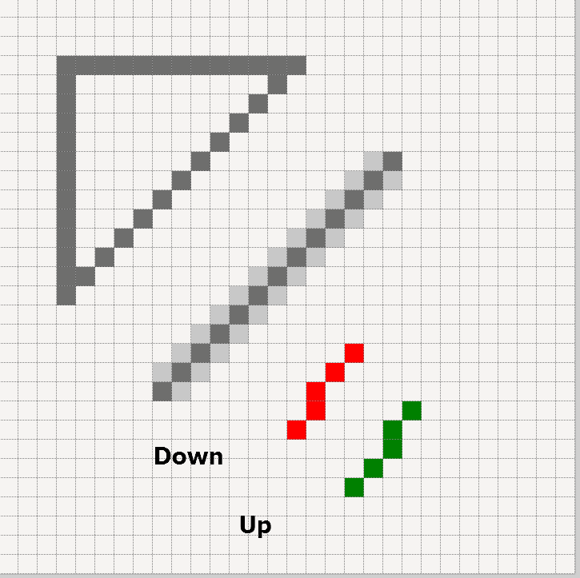

.. _08down_to_earth:

================
Down to Earth
================

Introduction
============

As we have seen it is relatively simple to find an image then use this for a 
widget. What may be more difficult is to design a widget from scratch. Using 
an existing widget as a template, as we did in the previous chapter, we can 
alter its colours to produce similar looking widgets. Simple drawing tools 
such as PIL ImageDraw or tkinter Canvas are all we need since the widgets
are quite small. We are fortunate in that we can see what has already been 
achieved in ttktheme. 

.. _comboarrow:

.. figure:: figures/08comboarrow_large.png
   :width: 160px
   :height: 240px
   :align: center

Enlarge an image such as comboarrow-n.png from the Ubuntu theme and see 
that the outer border is one pixel wide. There are highlights and shadows also 
one pixel wide. The corners are a simple angle construction. The most tricky 
part is probably the arrow, which has a dark grey outer part and a light grey 
inner part. Several lighter pixels used for antialiasing surround the arrow 
and the diagonal lines, exactly how these were produced will become clearer 
a little later.

Comparing this widget to others it becomes clear that many of the ttktheme 
widgets are made in a similar manner. They are all of a similar size there 
are no arcs, all lines are one pixel wide and diagonals are used  with 
some using antialiasing to give the impression of rounded corners. 

Antialiasing
============

.. topic:: Angled Lines

   Since displays can only switch on the adjacent pixel horizontally or 
   vertically next to the previous pixel, angled lines require an 
   antialias treatment to remove their jagged appearance. 

   Lines and Antialiasing 
 
   The vertical and horizontal lines are smooth, but the diagonal line, 
   drawn as is, is jagged (aliased) or antialiased. Antialised lines have 
   pixels, with a colour between the line and background colour, placed next 
   to the line pixels. 

There are several approaches we may use to perform antialiasing. The one used 
is based upon drawing the image several times larger then resize to the 
required size whilst applying a resampling filter. This creates differently 
coloured pixels, as exist in comboarrow-n.png. 

Applying this to an enlarged image of two lines joined by a diagonal, then 
resized with a filter, antialias pixels are made but these are not 
as intense as in the original image. Colour is equalized between adjacent 
darker and lighter colours, noticeably from the line ends. 

.. topic:: Alternative Methods Antialiasing 

   Another promising approach might be to use an application that already has 
   an option to create antialiased lines, such as aggdraw or cv2, tkinter 
   canvas has no such option. 
   
   Unfortunately most of the alternative approaches have unexpected side 
   effects, which directly affect the image geometry.

.. sidebar:: Corner Antialiasing Pixels

   No additional pixel placing is required, it's all done automagically.

Below it will be shown that the corners can have intensified antialiasing by 
reproducing the image at a larger size, say nine times as large, then making 
real corners (not just drawing wide diagonals), then reduce the image size 
while applying a resampling filter. The antialias pixels are now compressing 
corners into these few pixels, making them more intense and believable. 

Unfortunately the arrow has no such aid. 

.. topic:: Antialiasing Arrow

   If you look at the lines image above, notice the two parallel lines on the 
   right handside, the red one was drawn starting from the top while the green 
   one starting from the bottom - see how the lines follow different paths. 
   Draw lines adjacent to the arrow slanting sides. Ensure that the lines 
   are drawn in the right direction so as to exactly copy the arrow sides. 
   It is easy to count how many arrow pixels are adjacent to these lines, 
   then change their pixel colour according to the pixel count.

Drawing with PIL(Pillow)
========================

.. topic:: Tkinter Canvas or PIL

   We could have used tkinter canvas but the drawing can only be saved as a pdf 
   file. Since we want a png or gif file, we need PIL to capture the pdf 
   output before conversion, let's try only using PIL since the drawing is 
   not too complicated.

.. note:: If you have never drawn with PIL or require a refresher the following 
   paragraphs should help. 

PIL has several modules, the two we will mainly require are 
Image and ImageDraw. Image deals with the file whereas ImageDraw gives us the 
ability to create lines, arcs, rectangles and polygons - a bit like tkinter 
canvas. We draw directly on the image without needing a canvas. 

After importing the necessary modules, create a new image file, then create a 
function for drawing. The coordinate system is the normal computer one with 
the upper left hand corner being 0,0 (x,y coordinates) x increases across 
the screen y increases down the screen. Note that all coordinates are given 
to the drawing methods as a list (square brackets) [x0,y0,x1,y1 ...] or a 
list of tuples (round brackets) [(x0,y0),(x1,y1) ...].

.. container:: toggle

   .. container:: header

       *Show/Hide Code*

   .. code-block:: python
      :emphasize-lines: 15 - 22
      :linenos:
   
      from PIL import Image, ImageDraw
   
      w = 24  # used to set width
      h = 24  # used to set height
      transparent = (255,255,255,0) 
      # used to set background colour - using an RGBA format
   
      img = Image.new('RGBA', (w,h), transparent) 
      # create a new image organized with RGBA pixels, 
      # of a given size with the set background colour, 
      # in this instance transparent
      idraw = ImageDraw.Draw(img) 
      # create function for drawing within the new image img.
   
      idraw.line([0,0,w-1,0],fill='black',width=1) 
      # draw line on upper part of the image
      idraw.line([0,0,0,h-1],fill='black',width=1) 
      # draw line on left part of the image
      idraw.line([w-1,0,w-1,h-1],fill='black',width=1) 
      # draw line on left part of the image
      idraw.line([0,h-1,w-1,h-1],fill='black',width=1) 
      # draw line on lower part of the image
   
      img.save('line_test.png') # save to file

Start by making a square formed from four black lines one pixel wide. 
Note that we needed to use the coordinates width-1 and height-1 (w-1, h-1), 
this ensures that the lines fit just inside our image and are 24 pixels long, 
(since the starting point is zero and our image size is 24x24). We could 
have drawn the lines as a single line in sequence. ::

   idraw.line([0,0,w-1,0,w-1,h-1,0,h-1,0,0]) 
   # alternative method to draw lines, calling line only once

.. note:: With this method start and finish at the same point (in this 
   case 0,0), the default colour is white. Test by replacing the 
   highlighted lines 15-22.

If we had used a polygon then there normally is no need to close off. The 
outside of the polygon is called outline, fill can be used as an internal 
filling method.::

   idraw.polygon([0,0,w-1,0,w-1,h-1,0,h-1],outline='#FFFFFF',fill='red') 
   # alternative method to using line
   # the colours specified here are a hash and a named colour

.. sidebar:: Drawing Arcs at Small Radii

   At small radii arcs get into all sorts of trouble and are to be avoided,
   unless they have a radius of 9px or larger.

In order to draw curved lines we need to know the bounding box that 
defines the size and position of the curve. We can use the square we drew 
before and utilise its upper left and lower right points to define the 
bounding box for a circle - a special case of the ellipse. Ellipses 
also use the same methods to colour as used by polygons. 

.. figure:: /figures/08ellipses.png
   :width: 50
   :height: 50
   
   Small Circles
   
   Circles progressing in size from 1 to 9 pixel radius

.. topic:: Colours in PIL

   PIL is flexible when specifying colours - we can use RGBA, RGB, hash value 
   or a named colour. Be careful when using names it uses the X11 system 
   that is similar to the CSS3, but it may not always agree with the tkinter 
   list of named colours. For the more adventurous HSL and HSV are supported 
   with the ImageColor module - ``"hsl(hue,saturation%,lightness%)"``
   ``"hsv(hue,saturation%,value%)"``, but both should be converted back to RGB
   with ImageColor.getrgb() before being used for an image.

Continuing on with our drawing, insert a circle in our square.

::

   idraw.ellipse([0,0,w-1,h-1],outline='red') 
   # not quite right - too small

Redraw with a slightly larger circle.::

   idraw.ellipse([0,0,w,h],outline='red') 
   # also not right - too big

Maybe a case of the Goldilocks size, if h and w had been 23 then the first 
attempt would have been correct. If we draw a circle it has a radius that 
must be an integer, so the bounding box must be an even number of pixels 
wide and high. The outside black square we drew corresponds to the bounding 
box, see that the circle overlaps the the bounding box on all four sides, 
and our case should touch all four sides of the image, in the real world 
lines have breadth which is why the bounding box is not a simple dimension, 
this is not quite the same as tkinter canvas shown in *8.11 Canvas Oval Objects* 
in the `"Tkinter 8.5 reference a GUI for Python" <https://www.hsg-kl.de/faecher/inf/python/tkinter/tkinter.pdf>`_.

Change the ellipse (circle) into 4 arcs::

   idraw.arc([0,0,w-1,h-1],start=0,end=90,fill='red') 
   # angles are measured from 3 o’clock, increasing clockwise
   idraw.arc([0,0,w-1,h-1],start=90,end=180,fill='green') 
   # the colour parameter is fill
   idraw.arc([0,0,w-1,h-1],start=180,end=270,fill='yellow')
   idraw.arc([0,0,w-1,h-1],start=270,end=360,fill='blue')

.. Note:: See how the arc is positioned and how start and end are specified,
   the same system is used for pieslice. 

If we wish to produce rounded corners in a large enough size so that curves 
can be drawn then we will need to enlarge everything, image size, lines and 
their widths. Ordinary lines can be directly drawn with their width without 
too much trouble. Arcs pose a problem since they have no width or fill method. 

Pieslice is the solution, we first draw a larger pieslice that picks up on
the required outside radius, then we draw a smaller pieslice that picks up 
on the inner radius. The larger pieslice has a colour corresponding to the 
borders whilst the smaller pieslice has a background colour. Both pieslices 
use the same centre.

In the first configuration the two borders run along the outside edges then 
are joined by pieslices with radii corresponding to the width of the border. 
Let's start a new file.

.. container:: toggle

   .. container:: header

       *Show/Hide Code*

   .. code-block:: python
      :linenos:
      :emphasize-lines: 16,18

      from PIL import Image, ImageDraw
   
      e = 9  # enlargement
      d = (e-1)//2 # displacement
      w = 23 # normal image width
      h = 23 # normal image height
      we = w*e # enlarged image width
      he = h*e # enlarged image height
      g = 1 # gap
      s = g*e # space (enlarged gap)
   
      img = Image.new('RGB', (we,he), 'white') 
      # nothing fancy using an enlarged size
      idraw = ImageDraw.Draw(img)
   
      idraw.line([s,0,we-1,0],fill='black',width=e) 
      # draw line on upper part of the image, gap at the upper left
      idraw.line([0,s,0,he-1],fill='black',width=e) 
      # draw line on left part of the image, gap at the upper left
   
      img.save('corner_test'+str(g)+'.png') 
      # save to file - seeing what we have drawn in the enlarged size

Not quite right, the lines are thick but the full width does not show 
(magnify until you can see the pixels), therefore we need to adjust both 
lines. The line width was given as 9 pixels (enlargement factor) but only 5 
are showing.

   Top left corner of corner_test1.png

Wider lines appear to be referenced from a location close to their centre 
rather than an outside edge. Lines with odd sized widths use the central 
measurement less 1, whereas lines with even sized widths use the same size 
as the previous odd value. This means that lines of 1, 2 or 3 pixels width 
need no adjustment whereas wider lines will need either a vertical or horizontal 
displacement.

After adding the line displacement (d) to the line, add a pieslice, with a
different colour, allowing us to trace errors a little easier ...

.. container:: toggle

   .. container:: header

       *Show/Hide Code*

   .. code-block:: python
      :emphasize-lines: 1,3

      idraw.line([s,d,we-1,d],fill='black',width=e) 
      # adjusted for linewidth using d
      idraw.line([d,s,d,he-1],fill='black',width=e) 
      # adjusted for linewidth
      
      idraw.pieslice([0,0,s*2-1,s*e-1],fill='orange',outline='orange', 
         start=180,end=270) 
      # the bounding box starts at 0,0 then finishes at s*2-1,s*e-1
      # if alright, change to black then resize
      if g> 1:
         idraw.pieslice([s//2,s//2,s*2-s//2-1,s*2-s//2-1],
         fill='yellow',outline='yellow', start=180,end=270)

   
      imgx=img.resize((w,h)) 
      # changed the image to our reduced size 
      imgx.save('corner_testx'+str(g)+'.png', quality=95) 
      # save to file final size with no resampling filter
      # the corner pixels are all black - should be improved with a filter
   
      imgb=img.resize((w,h),Image.BICUBIC)
      imgb.save('corner_testb'+str(g)+'.png', quality=95) 
      # save to file using bicubic filter
      
      imgL=img.resize((w,h),Image.LANCZOS)
      imgL.save('corner_testL'+str(g)+'.png', quality=95) 
      # save to file using lanczos filter

The image was saved after being resized with a filter. A reference to the 
gap size is given in the image name. Small differences in the antialiasing
pixel colours can also be tested by changing the filter from bicubic to 
lanczos. Only one pieslice is needed at a gap size of one, otherwise an 
extra pieslice is required.

.. figure:: images/08corners.png
   :width: 520
   :height: 465
   
   Corners Created with Changing Gap Sizes

   The gap is filled by pieslice(s) to create our arcs. 
   The upper row of the corner image shows a simple border with various gaps 
   starting from 1 and increasing to 5. The next row uses an outer border 
   where only the inner border is joined, whilst the last row shows the effect 
   of joining both inner and outer borders. In the lower two rows the gaps 
   progress from 2 to 6. 

When we enlarge the gap the internal part of the pieslice needs to be taken 
out with a second pieslice using the same colour as the background. As the 
gap increases further the pieslice (arc) changes its bounding box not only with 
increasing pieslice radius but where it is centred. 

.. sidebar:: Calling the Function

   The PIL function is called with the ImageDraw alias preceding it, as in
   ``idraw.pieslice(...``, whereas our help function places the alias inside the
   function as in ``create_pieslice(idraw,c,r...``.

It is much easier to draw the pieslice, or any of the other regular curved 
lines, using a simple helping function, such as create_pieslice. Here pieslice
is created using the centre (c) and radius (r).::

   def create_pieslice(idraw,c,r,outline='#888888',fill='#888888',start=0,end=90):
      return idraw.pieslice([c[0]-r,c[1]-r,c[0]+r-1,c[1]+r-1],
         outline=outline,fill=fill,start=start,end=end)

As we change the gap size we can see the effects of the resampling filter 
and compare whether a bicubic or lanczos works better. Also check what happens 
if we use an enlargement factor of 8, in particular on the original size and 
whether the pieslice marries up with the border lines and whether this 
noticeably affects the final image after filtering. 

With increased gap size the final corner layout changes. On the simple border
first of all the gap is simply a filled join then at a gap of 3 the 
filling has a stepped inward part, at a gap of 4 the filling becomes a straight
diagonal, while at a gap of 5 the diagonal becomes stepped again this time 
outwards. Using a gap of 1, there is no real chance for the filter to get to 
grips, all it can do is produce very dark greys along the borders, with a 
lighter grey at the junction of the 2 lines at 1,1 but this is unlikely to 
fool most people into believing that we have a rounded corner, (see Simple 
Border with a gap of 1).

As an exercise it is instructive to use the reduced image without any filter, 
then resize this image back to the enlarged size. This should create an 
angular image which we can now once again reduce in size but with a lanczos 
filter, the result should be similar to the image created when we used pieslices, 
but the antialias pixels will be washed out and the result would not fool many. 

Alter the script to include an outer border and an inner border. Then we 
tie both borders together with pieslices, the resulting changes with 
different sized gaps help us to find out how the original widget was 
constructed. 

.. |comboa| image:: figures/08comboarrow_large.png
   :width: 80
   :height: 120

.. |combo| image:: figures/08combo_large.png
   :width: 120
   :height: 120

.. table:: combo-n.png and comboarrow-n.png

   ============================== ==============================
   |combo|                        |comboa|
   ============================== ==============================

Look at the differences between combo-n.png and comboarrow-n.png, apart from 
image size note that the plain combo has an outer lighter border and that the 
corner diagonal has no step, whereas the comboarrow image has a plain border 
and a stepped diagonal facing outwards. From this information we can now 
deduce the gap size, hence the required pieslice radii. 

We can create rectangles directly using *rectangle*, 
this uses a bounding box, similar to pieslice, and just like pieslice 
we can create thick rectangles using two or more nested rectangles. However 
what is important is that we can simplify our scripting and the following uses 
principles derived from http://nadiana.com/pil-tutorial-basic-advanced-drawing. 

.. topic:: A Surfeit of Rectangles.

   When using *line* to draw rectangles, especially nested ones, the script
   will quickly become overloaded with variables to generalize the script, 
   *rectangle* can help cut through this jungle.

Create a rectangle with rounded corners, which will have an image with 
nested rectangles that start as large as the image, then decrease by our 
enlargement factor (equivalent to 1 pixel at the final size) . Decide on the 
rectangle colours, the corners will be dealt with later. We are going to 
create 3 rectangles, the outer will be a light colour, the next one darker 
and the last filled with a background. This follows the pattern of many 
widgets.

.. note:: If we only use fill then the rectangle is drawn the same size as 
   if we had used outline - this differs from tkinter canvas.

.. container:: toggle

   .. container:: header

       *Show/Hide Code*

   .. code-block:: python

      from PIL import Image, ImageDraw
   
      e = 9 # enlargement, also thickness between rectangles
      w,h = 16,24
      we,he = w*e,h*e
   
      def create_rectangle(size, outer, border, background, thick):
         wi,ht = size
         box = 0, 0, wi-1, ht-1 
         # adjust the size of the rectangle to suit the image size
         rect = Image.new('RGBA', (wi, ht), (0, 0, 0, 0))
         draw = ImageDraw.Draw(rect)
         draw.rectangle(box, fill=outer) # The outer rectangle
         draw.rectangle( # The border rectangle
            (box[0] + thick, box[1] + thick, box[2] - thick, box[3] - thick),
            fill=border)
         draw.rectangle( # The background rectangle
            (box[0] + 2*thick, box[1] + 2*thick, box[2] - 2*thick, box[3] - 2*thick),
            fill=background)
         return rect
   
      inp = create_rectangle((we,he), "lightblue", "blue", 'white', e)
      inp.save('rect.png')

Apart from the initial size adjustment to the box size, the script has no 
variable requiring "-1". All the changes required for the inner rectangles
were for differences in size corresponding to thickness of the band around 
the rectangles and these behaved as expected. 

.. note:: Look at the methods of creating a PIL image and its draw module and
   how the image is finally saved.

The next part is to create the corners, for this we use pieslice as before, 
make a corner image that is pasted in turn onto all four corners. Where the 
corners are pasted parts of the rectangles are overdrawn, so no gap is 
drawn. Use the assist function so that pieslice is dependant on its 
centre and radius, rather than a bounding box. 08rounded_rectangle.py 
and 08rounded_rectangle_both.py are the two scripts on which we can base 
many of our widget scripts, the first script has the corner joining the 
single border, whereas the second script joins both borders.

.. container:: toggle

   .. container:: header

       *Show/Hide Code* 08rounded_rectangle.py

   .. literalinclude:: examples/08rounded_rectangle.py

We have three functions, the first function is our helping function for the 
pieslice. The next two functions are more interesting. In round_corner 
we have a function that independantly draws a corner consisting of two 
pieslices and creates a small image with its own ImageDraw method with alias. 
The third function also has its own image and drawing methods, creates two 
rectangles whose sizes and colours will be matched by the pieslices. The corner 
is called 4 times and is pasted and rotated as required, (the corner 
image is treated as a rectangle that is positioned by its upper left corner 
inside the rectangle image).

.. container:: toggle

   .. container:: header

       *Show/Hide Code* 08rounded_rectangle_both.py

   .. literalinclude:: examples/08rounded_rectangle_both.py

This is similar to 08rounded_rectangle.py, except that we draw three 
rectangles and three pieslices, which in turn match up to the rectangles. 
The corner mask is enlarged slightly to accommodate the extra pieslice.

Colour Schemes and Gradients
============================

Colour Schemes
--------------

.. sidebar:: Widget Colour Guidelines

   None that I found.

Having sorted out the widget outline it is important to fix its
colouration and maybe a colour gradient. Remember colours created through 
antialiasing obviously affect the appearance but mostly are derived implicitly.

The following guidelines are to be taken as a starting point only, since they 
are based on internal decorating practice which uses the normal colour wheel,
so take with a pinch of salt. 

:One Hue: Stick to one hue adjusting the saturation and value - which lends itself
   to the hsv colour space. Neutral colours probably work best, which means 
   almost anything that is not bright red, orange or yellow. 

   Gradients should be straightforward. 

:Side by Side: two adjacent colours. 
   
:Opposites: two complimentary colours, which are exactly opposite in the normal 
   colour wheel, vibrant colours are produced especially if both have a large 
   saturation. 
   
   They will automatically give a warm and a cool colour. 
   
   Gradients will be tricky when both colours are used as the end colours. 
   Intermediate colours may need to be defined to avoid bad looking gradients. 
   If you should use the HSV colour scheme it will produce the perimeter rgb 
   colours which will look like a rainbow - not too clever.
   
:Three Together: three colours - choosing adjacent colours should look harmonious, it 
   works best if one colour dominates.
   
:Spaced Three: three colours - evenly spaced around the normal wheel. As with 
   complimentary colours gradients may not be so straightforward.
   
:Opposite Three: three colours - choose one colour then select the adjacent 
   colours to the complimentary colour. This should produce a toned down 
   complimentary colour scheme. Still be careful of gradients.

.. figure:: figures/08rgb_hsv.png
   :width: 436
   :height: 332
   :align: center

   RGB and HSV Colour Wheel

   This colour wheel comes from paint.net. Notice how the selection on the 
   perimeter of the rgb wheel and shows up on the individual components.

   RGB and HSL Colour Selector

   This colour selector comes from tkinter on Windows. HSL has much the same
   limitations as HSV except that the number range changes.

.. figure:: figures/08rgb_lch.png
   :width: 417
   :height: 295
   :align: center

   RGB and LCH Colour Selector
   
   The colour selector in GIMP uses either Lab or HSV, this version of Lab 
   produces Lightness, Chroma and Hue. Lightness is adjusted for the various 
   hues so can be used where we wish to change the hues but keep absolute
   lightness constant.

.. note:: The HSV colour space is related to the RGB colour space in that 
   the HSV hues are the same as the rgb perimeter colours, giving 360 HSV
   hues. The RGB perimiter colours produce HSV colours with 100 in 
   both saturation and value components.

   ====== ============= =============== =============== ====================
   Hue    RGB           HSV             HSL             LCH
   ====== ============= =============== =============== ====================
   red    (255,0,  0)   (0,100,100)     (0,  240,120)   (54.3, 106.8, 40.9)
   yellow (255,255,0)   (60,100,100)    (40, 240,120)   (97.6, 94.7,  99.6)
   green  (0,  255,0)   (120,100,100)   (80, 240,120)   (87.8, 113.3, 134.4)
   blue   (0,  0,  255) (240,100,100)   (160,240,120)   (29.6, 131.2, 301.4)
   black  (0,  0,  0)   (0,  0,  0)     (160,0,  0)     (0,    0,     0)
   white  (255,255,255) (0,0,100)       (160,0,  240)   (100,  0,     141.2)
   ====== ============= =============== =============== ====================

Gradients
---------

.. figure:: figures/08rgb_hsv_grad.png
   :width: 256
   :height: 128
   :align: center

   **Overcomplicated** Gradients
   
   Both gradients started and finished at the same colours (134, 255, 0) 
   (255, 0, 117). The upper gradient was made in RGB and created a greyish 
   centre. The lower made in HSV also used a smoothing function. Neither is
   useful.

When selecting a colour scheme the normal colour wheel helps but remember 
gradients will be created in RGB, so some adjustment may be required. 

.. sidebar:: Start Simple

   The extreme gradients would normally not fit into our scheme of things.
   Simple gradients are often all we need.

.. topic:: Simple and Extreme Gradients

   The single hue and adjacent hue options can produce pleasing gradients, 
   without too much trouble.

   Say we have two adjacent colours, or colours only one value apart, then the 
   gradient will transition smoothly, so yellow to green will transition through 
   yellow-green and appear satisfactory. However if we tried purple to green 
   then we will see a greyish intermediate colour in the RGB colourspace, whereas 
   HSV will produce purple-blue, blue and blue-green as intermediate colours. 
   Say we tried to transition between blue and yellow then we could force the 
   intermediate colour to be at green thus avoiding grey, additional intermediate 
   colours should make an even better transition.

   If you wish to transition with an alpha change only (transparency) then 
   ensure the starting and finishing hue are the same. 

White, black and grey can be used as end colours in any option to produce 
gradients. As already stated, if grey is produced as an intermediate colour 
then the gradient normally needs adjustment. 

Simple Gradient using Line
^^^^^^^^^^^^^^^^^^^^^^^^^^

You should be able to detect the use of gradients in some of the widgets. 
Since we are dealing with small images we should be able to make
gradioents by drawing lines that change colour using simple linear 
interpolation. The colour is simply RGB, rather than HSV, HSL or CIELAB. 

We have a starting and a finishing colour separated into their rgb components. 

.. container:: toggle

   .. container:: header

       *Show/Hide Code* gradient snippet

   .. code-block:: python

      r,g,b = start_colour
      dr = float(stop_colour[0] - r)/steps 
      # change of r component
      dg = float(stop_colour[1] - g)/steps 
      # likewise g
      db = float(stop_colour[2] - b)/steps 
      # and b
 
      for i in range(steps):
         r,g,b = r+dr, g+dg, b+db # first colour in gradient
         idraw.line([x0, y0+i, x0+wi, y0+i], fill=(int(r),int(g),int(b)))

The above snippet of code might be used on images larger than our widgets, 
if used as it stands the first colour will be slightly different to our starting 
colour. After the start colour is corrected the finishing colour will then need 
to be corrected. At our image sizes this small error can be quite noticeable.

.. container:: toggle

   .. container:: header

       *Show/Hide Code* corrected gradient snippet

   .. code-block:: python
      :emphasize-lines: 2,4,6,8

      r,g,b = start_colour
      dr = float(stop_colour[0] - r)/(steps-1) 
      # slightly increase the change to r 
      dg = float(stop_colour[1] - g)/(steps-1) 
      # likewise g
      db = float(stop_colour[2] - b)/(steps-1) 
      # and b
      r,g,b = r-dr, g-dg, b-db 
      # correction for first colour in gradient

      for i in range(steps):
         r,g,b = r+dr, g+dg, b+db
         idraw.line([x0, y0+i, x0+wi, y0+i], fill=(int(r),int(g),int(b)))

The starting colour has been changed so that the first line depicts the 
right colour, so now we need to adjust the last line to be on the finishing 
colour, (slightly enlarging the differences in the rgb components).

We can replace the above with an assisting function that produces the 
required linear interpolation.::

   def LerpColourRGB(c1,c2,t): # suitable for RGB 
      return (int(c1[0]+(c2[0]-c1[0])*t),int(c1[1]+(c2[1]-c1[1])*t),
         int(c1[2]+(c2[2]-c1[2])*t))

The function treats the rgb components separately and ensures that the result 
is an integer. The line gradient now becomes::

   for i in range(steps):
      idraw.line([x0, y0+i, x0+wi, y0+i], 
         fill=LerpColour(start_colour,stop_colour,i/(steps-1))

All the component differences are being handled in the one function also the
start and end colour are true without any adjustment - much simpler.

Simple Gradients using 2D Figures
^^^^^^^^^^^^^^^^^^^^^^^^^^^^^^^^^^

.. |rect1| image:: figures/08rect1.png
   :width: 94
   :height: 94

.. |circ| image:: figures/08circle.png
   :width: 94
   :height: 94

.. |ell| image:: figures/08ellipse.png
   :width: 94
   :height: 112

.. table:: 2D Figures in Gradients

   =========== ======================================
   Rectangle   |rect2|
   Rectangle   |rect1|
   Ellipse     |ell1|
   Ellipse     |ell|
   Circle      |circ1|
   Circle      |circ|
   =========== ======================================

Using the same principal of linear interpolation we can create a more three
dimensional look by using a rectangle, an ellipse or a circle instead of a line, 
remembering to make allowance for the fact that the figure has width as well 
as height. Starting with the largest figure, nest slightly smaller figures
inside. At each successive figure change the colour, use only fill not 
outline - otherwise small areas will be left unchanged.

The rectangle is the easiest one to use as we are normally creating a gradient 
over a rectangular area. Circles and ellipses have to be made larger so that 
the corners of the gradient area touch the inside of the ellipse/circle.

The circle can be drawn off centre allowing us to create a more interesting 
highlight. Test for yourself by commenting and uncommenting the appropriate
figure, also see what happens when the colours start_colour and stop_colour 
are swopped.

.. container:: toggle

   .. container:: header

       *Show/Hide Code* 08test_gradients.py

   .. literalinclude:: examples/08test_gradients.py

.. topic:: Finding the Ellipse that Encloses the Rectangle

   The ellipse that is enclosed by the rectangle can be drawn straightaway, 
   just use the rectangle as the enclosing box. To find the ellipse that
   encloses the rectangle is not so obvious. Using a square and circles, it 
   can be seen that the enclosing circle must be 1.414 (root 2 ) times larger 
   than the circle inside the square. By analogy the outer ellipse should
   also be 1.414 times the inner ellipse, so adjust the outer semi-axes.  
   The ellipse should touch the gradient rectangle at all four corners.
   Nested ellipses are then drawn whilst changing the fill at each step. 

Radial Gradient
^^^^^^^^^^^^^^^^

.. figure:: figures/08radial.png
   :width: 94
   :height: 94
   :align: center

.. sidebar:: Experiment with odd sized Images

   Since radial gradients use the central point it is useful to experiment 
   with odd sized images which can be accurately centralised. 

Use points to make a radial gradient, creating a similar effect to the 
ellipse method above, but is easier to apply. 

.. container:: toggle

   .. container:: header

       *Show/Hide Code* 08radial_gradient.py

   .. literalinclude:: examples/08radial_gradient.py

The Arrow
=========

Simple Arrows
-------------

Arrows are to be found in comboboxes and scrollbars. Their two main problems
are to ensure that the upward and downward slope match exactly, and to produce 
antialiasing pixels of sufficient intensity. The arrow can be 
rotated to match scrollbars.

Look at our comboarrow_ it has a dark triangle surrounding a lighter fill.
It seems to be a good candidate for a polygon - so let's try it.

Enlarging the image combobox-n.png it can be seen that the arrow ouline has a
horizontal line joined to an arrow tip by two slanting lines.::

   from PIL import Image, ImageDraw

   img = Image.new('RGBA', (16,24), '#F6F4F2')
   idraw = ImageDraw.Draw(img)
   idraw.polygon([(5,11),(11,11),(8,15)],outline='#6E6E6D')

   img.save('../figures/arrowtest.png')

.. figure:: figures/08arrow_test1.png
   :width: 144
   :height: 113
   :align: center

The result looks lopsided and we should not even consider using it. The 
righthand slope matches combobox-n.png but the lefthand side has changed the 
position of the double pixel. No matter how we sequence the three 
points of the polygon there will always be a problem with one of the 
sides. This calls for a little bit of experimenting, but we can see that the 
lefthand side passes through point 6,12 then finishes at 5,11, mirroring the 
the righthand side (starting at 11,11 then passing through 10,12). What happens 
when the line is made to draw to this point then left to complete the last 
pixel? The slopes of the lines joining the arrow tip to points 5,11 and 6,12 
are slightly different, so something ought to change.

Alter the polygon to include point 6,12 (automatically closing off at 5,11)::

   idraw.polygon([(5,11),(11,11),(8,15),(6,12)],outline='#6E6E6D')

It seems we were lucky, both sides match. This works at this sort of line
size, at larger magnifications this method is no longer applicable. 

Now we can use a fill in the polygon and create our arrow. 

.. |just| image:: figures/08just_arrow.png
   :width: 174
   :height: 128

.. table:: Antialiasing in Arrows

   =========== ======================================
   Original    |just|
   Constructed |anti|
   =========== ======================================

That solves the first of our problems, we now have only the antialiasing to
solve. Look at combobox-n.png closely, there seems to be a pattern to the
antialiasing. When the pixels adjoin one of the arrow elements we have a 
light pixel, when next to two arrow elements we have a medium coloured pixel
and when adjoining three arrow elements we have a dark pixel. 

We might consider drawing an enlarged arrow then reduce with a filter, 
unfortunately the polygon does not support width and when drawn with lines the 
reduced image looks more like a space invader than an arrow. The best bet 
seems to be to trace the sides and concoct our antialiasing pixels.

Construct the arrow as above, draw two lines next to the sides using 
colours that do not clash with existing colours. Pick out the pixels that 
have the construction line colours, then sum up the number of adjacent arrow
pixels to these selected pixels. Use these subtotals to determine what the 
antialias colour should be for each construction line. The result should look
like the "constructed" image above.

.. container:: toggle

   .. container:: header

       *Show/Hide Code* 08arrow_anti.py

   .. literalinclude:: examples/08arrow_anti.py

Alternative Arrow
-----------------

If we look at the arrows used throughout the standard themes and in ttktheme
there are not many we can say are exactly gripping. Most comboboxes are plain
triangles or a simple chevron. The classic theme with an enlarged borderwidth
is the best of the bunch (piratz with an anchor and palm tree are excluded).

.. sidebar:: Antialiasing 

   Use the same system as with the simple arrow, or leave out.

When a state changes the colours can be shifted around to give the sense of 
being pressed. 

.. container:: toggle

   .. container:: header

       *Show/Hide Code* 08arrow_anti.py

   .. literalinclude:: examples/08alt_arrow.py

