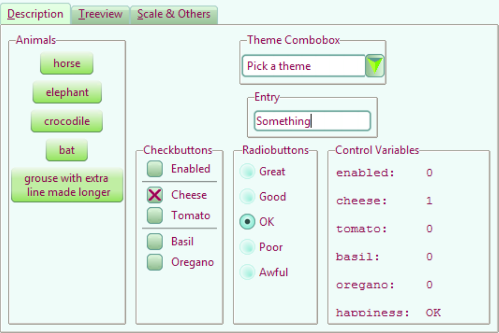

.. _10lime:

===============
The Third Theme
===============

This should be the third theme and so as not to confuse let's call it Lime.

Create a Standalone Theme
=========================

Using information gained from existing themes, we'll try to use common images
as done in the ttktheme Blue, and borrowing heavily from the Ubuntu theme for
style. The standalone theme in python can be easily tested, although if you 
are competent in TCL I'm sure it's just as easy to test with that language.

After the first attempt or so it was found that the widget sizes had to be 
changed, so common images were not always possible. This 
theme will use images for most of the varying widgets and their states. Many 
widgets in ttktheme simply reused the standard theme, sometimes altering the
colour of an element or two. 

Common Imported Code
--------------------

.. sidebar:: Naming Common Code

   Each of these two scripts roundrect and tools and have no preceeding chaper 
   number so that they can be imported.

Using one starting image it should be possible to create most, if not all, of 
the other images for a single widget. Use a class from roundrect
that can create a rounded rectangle with a plain or gradient filled inner 
part. The border can be single or double. Each of these four options 
can be made with an open side as used in tabs for the notebook. Supply the 
size, enlargement factor, gap (radius), fill and gradient colours whether it 
should be treated as a tab.

.. table:: Options for roundrect.py

   =============== ======== =============
   Class           Border   Internal Fill
   =============== ======== =============
   Base_Rect         single plain
   Bi_Base_Rect      double plain
   Gr_Base_Rect      single gradient
   GR_Bi_Base_Rect   double gradient
   =============== ======== =============

Each option provides a completed image.

.. container:: toggle

   .. container:: header

       *Show/Hide Code* roundrect.py

   .. literalinclude:: examples/roundrect.py

Where a non-standard widget is created use tools.py, which can be supplemented
as necessary. The toolbox only uses functions, so it is possible to 
work with an image that is already opened in the calling program, make the 
change then return back to the original image. When creating a border with
its own gradient there are actions that need to be made before the image is
resized, so the complete widget would not be suitable. Examples are given in
the alternative button, scale trough and progressbar.

Only gr_2d_rect creates an almost complete widget, used to make a simple
border with 2d gradient based on rectangles, otherwise the other functions
are called individually.  

.. container:: toggle

   .. container:: header

       *Show/Hide Code* tools.py

   .. literalinclude:: examples/tools.py

Each widget has its own generation and separate test script. The latter are 
similar to the 07pirate scripts. 

Lime Scrollbar
--------------

   Horizontal Scrollbar

The scrollbar consists of four parts, and each can have more than one state,
so quite a few images.

Scrollbar Thumb
^^^^^^^^^^^^^^^^

.. |htp| image:: images/lime/slider-hp.png
   :width: 25
   :height: 21

.. |ha| image:: images/lime/slider-ha.png
   :width: 25
   :height: 21

.. table:: Lime Horizontal Scrollbar Thumb / Slider

   ================= ================= ================= =================
   Normal            Pressed           Active             Disabled
   |hn|              |htp|              |ha|               |hd|
   ================= ================= ================= =================

As seen in the Blue theme the scrollbar thumb/slider can be used as a common
image for several other widgets. This aids us in ensuring that the various
widgets have a recognisable theme look.

Even though the blue theme seems to have one of the more interesting thumbs, 
we may still be able to use some of the properties of the Ubuntu comboarrow, 
where the rounded corners look distinctly better. Also before applying a 
gradient let's see if we can add shadows and highlights with the light 
falling from the upper left to lower right.

.. topic:: Initial Method of Working

   #. Make the scrollbar thumb/slider file to create an image.
   #. Use the thumb image and add the arrow.
   #. Using the right arrow image make the left arrow.
   #. Copy the pirate scrollbar file 07pirate_scrollbar.py and use as 
      10lime_scrollbar.py. Comment out all the files and states not yet
      present, such as the vertical scrollbars and troughs.
   #. Be particularly critical of the shape and colouring. Now is the time
      to adjust and prove that the template looks good.
   #. Start creating the vertical scrollbar and then the other states.

* Select File Size
   To assist centering make the file with an odd number of pixels . It is 
   useful to see the results of the gradient and corners being created, so save 
   the large image, which can be overwritten later. 

* Construct the Border(s)
   There was no need to explicitly draw the outside rectangle, our outer borders 
   have been created by the background colour the central area being made into a 
   gradient. 

* Internal Fill/Gradient
   Initially when making the gradient use its start and end colours 
   as the internal corner fill. The paler corner fill colours may need a slight 
   adjustment since the eye is more sensitive to the contrast. Later on a 
   function was created that made this adjustment within a standard widget.

* Highlights and Shadows
   Now for the highlights and shadows, our gradient should give the impression 
   that the centre is raised therefore create a highlight on the upper and left 
   sides. The hightlights did not work too well, even when made before
   resizing.

* Resize
   Resize - normally with a Lanczos resampling filter.

* Complete the Corners
   Make the corners transparent. 

Now that is finished, we'd better see that it works before using it. If 
we need to reduce it in size then we'll have to rethink the corner sizes.

.. sidebar:: Construction Class

   There should be quite a few similar looking widgets, so start making a
   construction class. The principles are best explained through 
   `Sammy the Shark tutorial <https://cuny.manifoldapp.org/read/59ff9b35-d1a7-4a79-9bde-4e8bf12c5108/section/2b30f08f-b316-4087-879a-81785709dcb6>`_

The final construct had four states, starting from the normal theme turn it
upside down and we have the pressed state, lighten it and we have the active
state finally turn it into greyscale and we have the disabled state. The 
vertical thumb was made by turning the horizontal thumb 90° to create the
vertical normal state, then repeating the above actions to create the other 
three vertical states.

Scrollbar Trough and Arrows
^^^^^^^^^^^^^^^^^^^^^^^^^^^^

.. |aha| image:: images/lime/arrowright-a.png
   :width: 25
   :height: 21

.. |ahd| image:: images/lime/arrowright-d.png
   :width: 25
   :height: 21

.. table:: Lime Right Arrow

   ================= ================= ================= =================
   Normal            Pressed           Active             Disabled
   |ahn|              |ahp|              |aha|               |ahd|
   ================= ================= ================= =================

The blue trough has no separate image, therefore it is being generated from 
the parent theme. Let's see if the result is acceptable. 

Arrows share the same background image which is the thumb image.

.. topic:: Arrow Transposition and Rotate

   When making the transposition, remember that it is FLIP_LEFT_RIGHT, not
   ROTATE_180, to keep the arrow and gradient running in the same direction.
   
   As the image is rectangular use the transpose method, save the image then 
   reopen it if needing to work with it further - ``rotate()`` should only 
   be used on square images. 

Let's see if the alternative arrow can be used. Since the background is 
green be careful about the contrast with the 3 green arrow colours.

.. sidebar:: Widget Sizes

   Some GUI produce pictures with widgets about the same size as the widget
   whereas others and starting the code from the OS will show widgets twice
   their pixel size.

The first result is not too bad, the arrow and thumb have a good shape, the
corners look nicely round but the thumb is about 50 as opposed to 30 pixels.
The background gradient is a bit too sickly and was changed. The vertical
size in a down arrow needs to match the combobox size, and as the arrow is
longer than broad the border width could be reduced, the arrows were 
shoehorned into the background image. 

Because the expected light source comes from the upper left corner the 
horizontal gradient had to be reversed, leaving the arrow colours as is. 
Ensure that the thumb gradient orientation allows it to expand without odd 
looking results - the arrows do not have a size change.

Once these three parts of the scrollbar have been finalised transpose each 
image to make the vertical scrollbars. 

.. container:: toggle

   .. container:: header

       *Show/Hide Code* 10scrollbarthumb.py

   .. literalinclude:: examples/10scrollbarthumb.py

.. container:: toggle

   .. container:: header

       *Show/Hide Code* 10scrollbararrow.py

   .. literalinclude:: examples/10scrollbararrow.py

.. container:: toggle

   .. container:: header

       *Show/Hide Code* 10lime_scrollbar.py

   .. literalinclude:: examples/10lime_scrollbar.py

Lime Checkbox
-------------

.. |cnu| image:: images/lime/check-nu.png
   :width: 19
   :height: 18

.. |chu| image:: images/lime//check-hu.png
   :width: 19
   :height: 18

.. |cdu| image:: images/lime//check-du.png
   :width: 19
   :height: 18

.. |cdc| image:: images/lime//check-dc.png
   :width: 19
   :height: 18

.. table:: Lime Checkbox

   ========= ========= ========= ========= ========= =========
   Normal    Normal    Active    Active    Disabled  Disabled
   unchecked checked   unchecked checked   unchecked checked
   |cnu|     |cnc|      |chu|    |chc|      |cdu|     |cdc|
   ========= ========= ========= ========= ========= =========

Looking at the blue widgets the checkbox is similar to the scrollbar thumb.
The check buttons have images showing highlighted(h) and normal(n) combined 
with checked(c) and unchecked(u) tags, corresponding to active and selected 
states. In the selected state there are compound states with active and 
disabled.

The gradient will be as our thumb, but the surrounding frame is lighter. At
normal size the difference in the upper and left sides with the lower and 
right sides is not really discernable. The check mark is a simple cross with 
double lines drawn at 45 degrees.

When testing we can re-use 07pirate_check.py as 10lime_check.py. Be careful
when setting up the states. The active states come immediately after the 
normal state and active selected precedes plain active.

.. container:: toggle

   .. container:: header

       *Show/Hide Code* 10check.py

   .. literalinclude:: examples/10check.py

.. container:: toggle

   .. container:: header

       *Show/Hide Code* 10lime_check.py

   .. literalinclude:: examples/10lime_check.py

Lime Button
-----------

.. figure:: images/lime/button-sa.png
   :width: 27
   :height: 27

   Button with Double Border
   
   Standard image made using the common class.

.. container:: toggle

   .. container:: header

       *Show/Hide Code* 10button.py

   .. literalinclude:: examples/10button.py

.. |bn| image:: images/lime/button-n.png
   :width: 25
   :height: 25

.. |ba| image:: images/lime/button-a.png
   :width: 25
   :height: 25

.. |bd| image:: images/lime/button-d.png
   :width: 25
   :height: 25

.. table:: Lime Button (alternative)

   ================= ================= ================= =================
   Normal            Pressed           Active             Disabled
   |bn|              |bp|              |ba|               |bd|
   ================= ================= ================= =================

There are quite a few button variations to pick from, to start with use the 
standard widget from the common code. 

If we now look at the alternative button the border has a gradient that changes 
from near white at the upper part. Inside the widget a second gradient runs
from top to the bottom border. This is based on ideas from the keramik button.

The border was initially quite dark and surrounded a fairly light gradient,
created by an import from ``tools``. A second image was created with just a 
slightly darker gradient. The two images were coalesced using PIL ImageChops
lighter. The goal was to replace the border with a gradient, but
retain the internal gradient. Afterwards resize then create the extra states. 
Set the border dimensions such that when the button is expanded vertically 
only a narrow band is utilised, horizontally make allowance for the corners.

In order to enable the pressed state it had to be placed just after the 
normal state, with the active state next. The appearance had horizontal 
stripes due to the gradient, which was cured by an aggressive use of the 
border dimensions just as we had done in the pirate theme. The text 
foreground was changed to dark red to give contrast to the background.

.. container:: toggle

   .. container:: header

       *Show/Hide Code* 10buttonalternative.py

   .. literalinclude:: examples/10buttonalternative.py

.. container:: toggle

   .. container:: header

       *Show/Hide Code* 10lime_button.py

   .. literalinclude:: examples/10lime_button.py

.. container:: toggle

   .. container:: header

       *Show/Hide Code* 10lime_button_alt.py

   .. literalinclude:: examples/10lime_button_alt.py

Menubutton
-----------

The choice seems to be between a menubutton with a down arrow, as in the
combobox, a rectangle as used by some or two arrows as in elegance. Once 
again the blue theme has no special image.

Lime Notebook
-------------

.. table:: Lime Notebook (alternative)

   ================= ================= ================= =================
   Normal            Pressed           Active             Disabled
   |tn|              |tp|              |ta|               |td|
   ================= ================= ================= =================

The blue notebook has a few configuration lines, and the result is 
disappointing, The ony user feedback occurs when the tab is active. The 
better looking themes have a selected tab that is lighter than the 
background, when the tab is active it lightens also when selected it slightly 
grows in height. The deselected tab darkens. 

.. sidebar:: Initial Attempt

   As in keramik, the right hand side had a line of transparent pixels, 
   this was quickly discarded since the tabs showed a gap between one another.

The methods used by keramik look promising, we'll need four images, three 
being slightly larger and paler. All four images have no lower corners. On 
the normal or disabled tab, there is a band of transparent pixels on the 
upperside and the lowerside is cropped, this gives the effect of resizing.

There is also a method included to expand the tab size after it has been
selected. The parent notebook should have its tabmargins set to allow the 
expansion by the tab.

.. container:: toggle

   .. container:: header

       *Show/Hide Code* 10notebook.py

   .. literalinclude:: examples/10notebook.py

.. container:: toggle

   .. container:: header

       *Show/Hide Code* 10lime_notebook.py

   .. literalinclude:: examples/10lime_notebook.py

Lime Scale
----------

.. |vs| image:: figures/10largevscale.png
   :width: 62
   :height: 70

.. |hs| image:: figures/10largehscale.png
   :width: 69
   :height: 70

.. table:: Lime Scale 

   ================= ================= 
   Vertical           Horizontal       
   standard           alternative
   |vs|              |hs|              
   ================= ================= 

The vertical scale has been fashioned from the standard code.

The horizontal scale has an alternative trough. The keramik scale trough has 
been used as a template, and the slider has been copied from the blue theme. 
When building the trough ensure that the upper border is overdrawn by the 
gradient. The upper corners were lightened to fit in with the gradient. 

When building the trough, using element_create, ensure that the border reflects the
method of trough expansion. We want the trough to expand horizontally, so a
vertical gradient is required, the trough should be slightly lower than the
upper part of the slider, so a ``'sticky': 'ews'`` is important. Don't forget to make
the border fit the trough image, so that we expand from the centre of the
image ``'height': 10`` - ``'border': [6,0,6,0]``. 

.. container:: toggle

   .. container:: header

       *Show/Hide Code* 10scale.py

   .. literalinclude:: examples/10scale.py

.. container:: toggle

   .. container:: header

       *Show/Hide Code* 10scale_trough.py

   .. literalinclude:: examples/10scale_trough.py

.. container:: toggle

   .. container:: header

       *Show/Hide Code* 10scale_trough_alt.py

   .. literalinclude:: examples/10scale_trough_alt.py

.. container:: toggle

   .. container:: header

       *Show/Hide Code* 10lime_scale.py

   .. literalinclude:: examples/10lime_scale.py

Lime Progressbar
----------------

.. |vp| image:: images/lime/iprog.png
   :width: 34
   :height: 34

.. table:: Lime Progressbar 

   ================= ================= 
    Horizontal       Vertical       
    rectangles       radial
   |hp|              |vp|              
   ================= ================= 

Let's see if we can reuse two of the thumb images for the trough, then all 
we require are internal parts to form the horizontal and vertical progress 
sliders. The horizontal slider used rectangles and the vertical one used 
points for radial gradients, so a comparison can be made.

.. container:: toggle

   .. container:: header

       *Show/Hide Code* 10progressbar.py

   .. literalinclude:: examples/10progressbar.py

.. container:: toggle

   .. container:: header

       *Show/Hide Code* 10prog_alt.py

   .. literalinclude:: examples/10prog_alt.py

.. container:: toggle

   .. container:: header

       *Show/Hide Code* 10lime_prog.py

   .. literalinclude:: examples/10lime_prog.py

Lime Radiobuttons
-----------------

.. |rs| image:: images/lime/radio-s.png
   :width: 25
   :height: 25

.. |rd| image:: images/lime/radio-d.png
   :width: 25
   :height: 25

.. table:: Lime Radiobox

   ================= ================= ================= =================
   Normal            Selected           Disabled         Disabled Selected
   |rn|              |rs|              |rd|               |rds|
   ================= ================= ================= =================

Both radiobuttons have to be created, since whether we use a circular or
diamond shape we have nothing yet in our lime images. The best looking ones
were from aquativo, which meant decoding to view them, the unselected button 
is grey with a highlight in the lower half, the selected button is colourful 
with a dark centre.

.. container:: toggle

   .. container:: header

       *Show/Hide Code* 10radio.py

   .. literalinclude:: examples/10radio.py

.. container:: toggle

   .. container:: header

       *Show/Hide Code* 10lime_radio.py

   .. literalinclude:: examples/10lime_radio.py

Lime Treeview
-------------

.. |thp| image:: images/lime/slider-hp.png
   :width: 25
   :height: 21

.. |tha| image:: images/lime/slider-ha.png
   :width: 25
   :height: 21

.. table:: Lime Treeview

   ================= ================= ================= 
   Normal            Active            Pressed         
   |thn|              |tha|              |thp|             
   ================= ================= ================= 

The treeview heading has three different images that were the same as those 
used in scrollbar thumb. It is probably not possible to use selected, the
headings do not react interactively and only the treeview body reacts to
binding.

Notice the extra bit of mapping to enable the row selection being highlighted.

.. container:: toggle

   .. container:: header

       *Show/Hide Code* 10lime_treeview.py

   .. literalinclude:: examples/10lime_treeview.py

Combobox and Entry
------------------

.. |cod| image:: images/lime/combo-d.png
   :width: 23
   :height: 25

.. |en| image:: images/lime/entry-n.png
   :width: 26
   :height: 25

.. |ei| image:: images/lime/entry-i.png
   :width: 26
   :height: 25

.. |ed| image:: images/lime/entry-d.png
   :width: 26
   :height: 25

.. table:: Lime Combo and Entry

   ============== ============== ============== ============== ============== 
   Normal         Normal         Disabled       Disabled       Invalid  
   Entry          Combo          Entry          Combo          Entry 
   |en|           |con|          |ed|           |cod|          |ei| 
   ============== ============== ============== ============== ============== 

In the end combobox looked out of place with its plain down arrow. The down
arrow can be reused and entry based on the combobox before it is cropped.

.. container:: toggle

   .. container:: header

       *Show/Hide Code* 10combo_entry.py

   .. literalinclude:: examples/10combo_entry.py

.. container:: toggle

   .. container:: header

       *Show/Hide Code* 10lime_combobox.py

   .. literalinclude:: examples/10lime_combobox.py

.. container:: toggle

   .. container:: header

       *Show/Hide Code* 10lime_entry.py

   .. literalinclude:: examples/10lime_entry.py

Common and Colours
-------------------

   10third_theme_note.py

We can now see whether the colours and common settings are correct. The
colours only seem to react correctly if a hash value is used, RGB seemed to
create only black. 

We can also clean up the code a bit and ensure that the image aliases 
correspond to the file names.

Lime Theme
^^^^^^^^^^

When satisfied start builing lime_theme.py, put lime theme in the *examples*
directory, just ensure that there is the references to *lime* in the 
``style.theme_create`` clause. Ensure that the files are referenced with the
correct image type ``png``.

Adapt 07piratz-notebook.py to 10third_theme_note.py where we can see the
widgets in a mini application. The application will point to the image
directory ``../images/lime``.

.. container:: toggle

   .. container:: header

       *Show/Hide Code* 10lime_various.py

   .. literalinclude:: examples/10lime_various.py

In Conclusion
=============

There you have it, you now have the tools to make your own theme, which 
includes the most common elements and their construction. 

Lastly a big vote of thanks to all those developers and programmers without
whom this would not have been possible.

 

 
