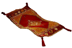

.. _authors:

============
Contributors
============

Edgar Donk

=======
Contact
=======

Any comments please forward to 

edga.donk@gmx.de

Just to anticipate what you are probably thinking - I know it's much 
too long.

Repository
==========

You should find all the python examples and their widget images here.

`Putting on the Style! <https://github.com/Edgar-Donk/tkinter.ttk.style/tree/master>`_

Read the Docs
=============

Where you'll find the explanations.

`Read the Docs <https://tkinterttkstyle.readthedocs.io/en/latest/index.html>`_

More
====

.. raw:: html

   <head>
   <link rel="stylesheet" href="_static/imagehover_min.css">
   
   </head>
   

   Hover over the carpet
   <figure class="imghvr-zoom-out-right">
      
         <figcaption>
            Just click on one of the images  
            to get whisked away on the html magic carpet.
         </figcaption>
   </figure>
   

   </body>

Some of the trickier parts of tkinter.ttk
-----------------------------------------

.. _froth: https://frothy-brew.readthedocs.io/en/latest/index.html

.. image:: _static/frothy_brew.png
   :target: froth_

From ttk.notebook to ttk.scale, with canvas move and create a colour picker.

Linking Python to Arduino
-------------------------

.. _ard: https://electronic-python.readthedocs.io/en/latest/index.html

.. image:: _static/arduino.png
   :target: ard_

Basics and working with VPython, then create a digital gauge.

