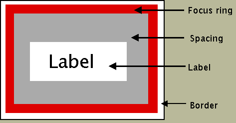
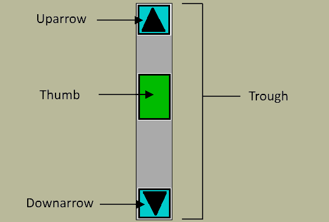

==================
Widget Composition
==================

We can think of a widget in terms of a collection of components, which in 
turn are made up of elements. Each of the widgets has one or more components 
and elements that can be referenced directly using the Style class. Remember 
- every ttk widget has a ``style`` property option where we put a 
cross-reference to the Style() command which can modify a widget's appearance 
(colour, size, relief and font).

Take a look at the button widget it is a rectangular shape divided into 4 
elements, starting from the outside - border, focus, spacing and label. 

Button Elements
-----------------

   Elements of a Button

Button is a single part (Button) made up of several elements.

While we are thinking of elements look at the vertical scrollbar. 

Scrollbar Elements
--------------------

   Elements of a Scrollbar

.. sidebar:: Scrollbar

   Scrollbar has parts that move in relation to each other, whereas 
   Button consists of a single static part. Each part is called an element
   and each has its own element_options.

The vertical scrollbar has up and down arrows as well as a thumb element 
all contained in a trough (yet another element). Within the Style class 
there are methods to find out the element names, their relative 
positions and their options, so do not fret or worry about trying to 
remember everything in detail.

.. note:: The Widget and its Elements

    In the official documentation the widget only comprises of
    elements, so a button layout is called up by ``TButton``. The 
    element names are preceded by ``Button`` such as **Button.border**,
    **Button.focus**, **Button.padding** or **Button.label**.
    
    In contrast the scrollbar layout is called up either by 
    ``Vertical.TScrollbar`` or by ``Horizontal.TScrollbar``. 
    The element names will be preceded by
    ``Vertical.Scrollbar`` or ``Horizontal.Scrollbar`` such as 
    **Vertical.Scrollbar.trough**, **Vertical.Scrollbar.uparrow**,
    **Vertical.Scrollbar.downarrow** or **Vertical.Scrollbar.thumb**.

.. _widget-elements: