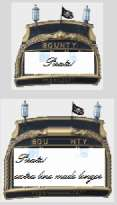
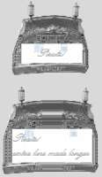
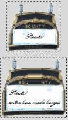
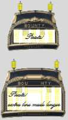
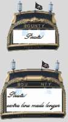

Button
------

.. table:: Pirate Button

   ============= ============= ============= ============= =============
     active       disabled      focus         pressed       selected
   ============= ============= ============= ============= =============
   |b-active|    |b-disabled|  |b-focus|     |b-pressed|   |b-selected|
   ============= ============= ============= ============= =============

The button widget is based on the rear view of a sailing ship. This gives us 
an opportunity to create rather different state changes from the normal, where we 
can use the lights and raise the flag. The vertical border was limited to a 
few pixels so that the name stays intact. An outside dashed line is more 
suitable for focus, which then required both configure and layout. These do 
not work if run as separate clauses, it is best to run them under a single 
call to the button class "TButton". This differs from the tcl scripts where 
configure and layout are run separately.

.. container:: toggle

   .. container:: header

       *Show/Hide Code* 07pirate_button.py

   .. literalinclude:: ../examples/07pirate_button.py
      :start-after: style = Style()
