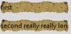

Piratz Entry
------------

Let us try the entry widget. The thinking here is that we have a fairly simple 
widget, so an image of an old yellowed document may be appropriate. The image 
has irregular edges, so instead of a smooth expansion I have purposefully 
chosen border values that create more jagged borders. 

If required we could impose an old font such as the equivalent of 
"Palace Script MT" in Windows. As with pirate label there was no need to 
create a layout, ``"element create"`` is all we need.

.. container:: toggle

   .. container:: header

       *Show/Hide Code* 07pirate_entry.py

   .. literalinclude:: ../examples/07pirate_entry.py
      :start-after: style = Style()
