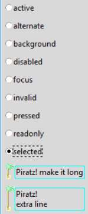

Piratz Label
------------

.. sidebar:: State Changes

   This has a function to help select state, which cancels the old state  
   before the new state is called. 

First create our image, this invokes a Caribbean island, the palm tree poses 
a challenge, particularly if the label grows in height. Choose border sizes 
that give the desired effect, then test using theme_create or theme_settings 
rather than styling (individual widget with configure, layout and map). 

Increase the height of the widget by using two lines of text - certainly easier 
than adding a configure clause. 

Try changing the border size to [20, 6, 4, 4], it looks reasonable if we have 
sticky "ew" and only one line of code, however let's keep it suitable for 
more than one line of text and change back to the original border size 
[17, 9, 7, 3] and sticky "news". 

The padding [17,5,3,3] is required to position the text. 

   Piratz Label with white Surround

   The surround has been left white to show the grid.

.. topic:: Calculating Border and Padding Sizes

   As we saw earlier **border** affects how the widget will look when its size
   is changed, whilst **padding** helps to position text.
   
   Look at the image below, it is enlarged to show the pixels, we can estimate 
   the border sizes. After the border is set the padding can be sorted out. If 
   there is a surrounding area around the image (maybe needed for shading) 
   include this in your calculations. The top and left measurements are
   border those on the right and bottom refer to padding.
   
   Remember the first line is 0 and we count from left to right on the first 
   entry but right to left on the third, look at the image to get a feel. Yes
   we are counting the top to bottom on the second entry and bottom to top on
   the fourth entry.

Having created the image it is relatively easy to make it grey in our image 
editor and save the image for the disabled state. 

The text area has been made transparent, in fact the appearance may look 
better without a white surround, so we'll make the surround transparent as
well. 

Run the script and see whether the states look right. As you see we can test
more than one widget and prove that the settings and widgets operate as 
expected.

.. container:: toggle

   .. container:: header

       *Show/Hide Code* 07pirate_label.py

   .. literalinclude:: ../examples/07pirate_label.py
