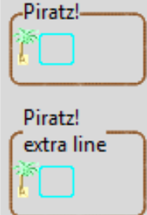

Piratz Label Frame
------------------

The labelframe was created, and labels were used to flesh out the frame. The 
labelframe required padding in the layout management to ensure that any 
widget placed inside the frame did not affect the frame and cleared the outer 
borders.

.. raw:: html

   

   

   <b><i> Show/Hide Code </i> 07pirate_labelframe.py </b>

.. literalinclude:: ../examples/07pirate_labelframe.py
      :start-after: style = Style()

.. raw:: html

   

|

.. note:: All the pirate scripts are similar at the beginning upto 
   ``style = Style()``, and is only fully shown in 07pirate_label
