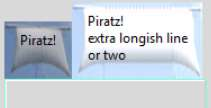
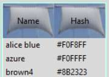

Notebook and Treeview
-----------------------

Notebook |note| Treeview |tree|

Notebook
^^^^^^^^

.. sidebar:: Notebook

   When a tab is selected the sail changes colour.

Try this with and without the optional map. If we did not have images the 
tab would have moved. You could experiment with different sized images to 
give the same effect.

.. container:: toggle

   .. container:: header

       *Show/Hide Code* 07pirate_notebook.py

   .. literalinclude:: ../examples/07pirate_notebook.py
      :start-after: style = Style()

Treeview
^^^^^^^^^

The widgets notebook and treeview both use sails for their tabs, the 
adjustment of the border and padding was a little tricky, but
followed along the lines already developed for label. Treeview had used a 
bordercolor with an alias name, so do not forget to set this up in the 
piratz_theme.py.

.. code-block:: python

   colors = {'bordercolor': '#7FFFD4'}

Select a row, it does not show, we have to make the selection highlight
the row. We have not covered this yet, check the ``plastik theme``.

.. code-block:: python

   ### extract from plastik_theme ###
   # added map to treeview for selection
        "Treeview": {"configure": {"padding": 0},
         "map": {"background": [("selected", colors["selectbg"])],
            "foreground": [("selected", colors["selectfg"])]}
      },

enlarge **colors** to include background and foreground::

   colors = {'bordercolor': '#7FFFD4',
            "selectbg": "#2d2d66",
            "selectfg": "#ffffff"}

Treeview required a ``map`` command to create the selected row, together
with two additional colours.

.. container:: toggle

   .. container:: header

       *Show/Hide Code* 07pirate_treeview.py

   .. literalinclude:: ../examples/07pirate_treeview.py
      :start-after: style = Style()
