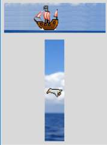

Progressbar and Scale
---------------------

.. |p-scale| image:: ../figures/07piratz_scale.jpg
   :width: 232px
   :height: 301px

.. table:: Default Progressbar and Scale

   ========================= =========================
    Piratz Progressbar        Piratz Scale
   ========================= =========================
    |p-prog|                  |p-scale|
   ========================= =========================

The last two widgets are on the face of it not particularly exciting. Check 
out how a progressbar and scale work :ref:`Themed notebook`.
Not exactly gripping stuff is it? 

.. |d-prog| image:: ../figures/07default_prog.jpg
   :width: 179px
   :height: 59px

.. |d-scale| image:: ../figures/07default_scale.jpg
   :width: 358px
   :height: 73px

.. table:: Default Progressbar and Scale

   ========================= =========================
    Default Progressbar       Default Scale
   ========================= =========================
    |d-prog|                  |d-scale|
   ========================= =========================

Progressbar
^^^^^^^^^^^^

However with a bit of thought we can "improve" these somewhat. I'm no artist,
so the graphics come from the game funny boat.The horizontal progressbar is 
a pirate ship sailing left to right, all we need is to detect the value then 
use this to trigger another state just as the value reaches 100. Use the "after" 
universal widget function that fires after a time delay and calls a customised 
function steer() which checks on the widget value, if it reaches 100 it 
changes the state and the direction flag. When the value reaches 0 it changes 
back to the original state and direction flag. The states in element_create 
and the customised function need compound states that have a negative second 
state as well as the called state, we are cancelling out the active state 
when we call the background state and vice versa. The function steer is shown
below:: 

   dir0 = 1
   dir1 = 1
   def steer():
      global dir0
      widg['value'] += 1 * dir0
      if widg['value'] == 100:
         widg.state(['background','!active'])
         dir0 = -1
         widg.after(50, steer)
      elif widg['value'] == 0:
         widg.state(['active','!background'])
         dir0 = 1
         widg.after(50, steer)
      else:
         widg.after(50, steer)

Since the trough can also be an image we make it a tropical seascape.

The vertical progressbar is slightly more complicated as we have a flapping 
seagull, therefore we require 3 states, and each state has to include both 
the other two negative states. Run both progressbars in "indeterminate" mode 
and make the length the same as your trough image. 

.. container:: toggle

   .. container:: header

       *Show/Hide Code* 07pirate_progressbar.py

   .. literalinclude:: ../examples/07pirate_progressbar.py
      :start-after: style = Style()

Scale
^^^^^^

In the scale widget we have a similar situation to progressbar but we can use 
the ``command`` property to trigger our external function, which simplifies 
matters somewhat, we need only to concentrate on obtaining the scale value 
then trigger the state changes at pre-determined settings. The horizontal 
scale has several states not only for the slider but the trough as well. 
This makes the state calls more interesting than usual. When calling a state 
remember to cancel the other states.

.. container:: toggle

   .. container:: header

       *Show/Hide Code* 07pirate_scale.py

   .. literalinclude:: ../examples/07pirate_scale.py
      :start-after: style = Style()

Alright we needed customised functions but I think it a small price to pay - 
or else you would need to build customised widgets and that is another 
ballgame entirely.
