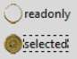
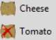

Radio and Check Buttons
-----------------------

Radiobutton |radio| Checkbutton |checkb|

.. sidebar:: States

   There are compound states used in the checkbox, there must be at least 
   two states whenever there is a selected state for pressed, active and
   disabled.

Both radio- and check buttons are created in a similar fashion, in that 
multiple images were created for the various states. All images need to be 
the same size and if they are about the same distance between the lines of
widgets that 
would not be such a bad idea.

Whenever a radio or check button is disabled or enabled its selection must
be maintained.  

Radio Buttons
^^^^^^^^^^^^^^

.. raw:: html

   

   

   <b><i> Show/Hide Code </i> 07pirate_radio.py </b>

.. literalinclude:: ../examples/07pirate_radio.py
      :start-after: style = Style()

.. raw:: html

   

|

Check Buttons
^^^^^^^^^^^^^^

.. raw:: html

   

   

   <b><i> Show/Hide Code </i> 07pirate_check.py </b>

.. literalinclude:: ../examples/07pirate_check.py
      :start-after: style = Style()

.. raw:: html

   

|
