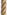
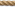
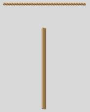
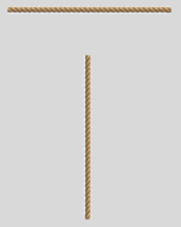

Piratz Separator
----------------

Let's choose the Separator as the next widget. At first glance it may seem 
to be a simple widget to alter, but looking at its layout we find that 
the separator has an orientation, and its only component consists of 
Separator.separator with no orientation. 

There is no proper way to make the vertical separator react correctly without 
a vertical component, so first of all let's improvise. There are 
2 separator images in the images directory which should look like rope.

|hsep| horizontal separator

|vsep| vertical separator

   Not using layout

   Look closely at the vertical separator

.. container:: toggle

   .. container:: header

       *Show/Hide Code* 07pirate_separator.py

   .. literalinclude:: ../examples/07pirate_separator.py
      :start-after: style = Style()
      :emphasize-lines: 7,8,19

.. topic:: Attempts using no layout

   the relevant part of theme_create is::

      'Separator.separator': {"element create":
         ('image', "separator",
         #('invalid', "separator-v"), ## uncomment when using 2nd state
         {'border':[3],'sticky': 'nsew'})} ## change from 3 to 2

   The horizontal separator works as expected, but the vertical separator image 
   is forced to react as the horizontal image. As done before use 
   the place manager to display the widget and make the horizontal separator 
   `widg.place(x=5, y=5, width=150)` then vertical separator has 
   `widg1.place(x=75, y=50, height=150, width=5)` which gives the best looking 
   widget, but it's not perfect. 

   We can improve the situation if we add a second state then the vertical 
   separator improves considerably, but we require a call to this second state 
   in the vertical mode from the program. First run the script as is, then 
   uncomment the two highlighted lines, and change border sizes. 

Think back to the scrollbar, the final solution was to have a grip which 
involved changing the layout to be able to include the new element. Also look
at the scrollbar arrangement we had a horizontal layout that listed all its 
elements, and a vertical layout with its set of elements. When element create 
is invoked we need to distinguish between orientations, so if the element name 
has an orientation built into its name we just need `'Scrollbar.uparrow': {"element create":`
whereas we need `"Vertical.Scrollbar.thumb": {"element create":`.

Let's try this with separator.

.. code-block:: python

    'Horizontal.TSeparator': {'layout': [
        ('Horizontal.Separator.hseparator',{"sticky": "ew"},
        )]},
    
    'Vertical.TSeparator': {'layout': [
        ('Vertical.Separator.vseparator',{"sticky": "ns"},
        )]},

    'Separator.hseparator': {"element create":
        ('image', "separator",
         {'border':[3],'sticky': 'ew'})},

    'Separator.vseparator': {"element create":
        ('image', "separator-v",
         {'border':[3],'sticky': 'ns'})}

That worked and gave us 

   Using layout

   See how the vertical separator now looks

If we now try using a common element name (separator).

.. code-block:: python

    'Horizontal.TSeparator': {'layout': [
        ('Horizontal.Separator.separator',{"sticky": "ew"},
        )]},
    
    'Vertical.TSeparator': {'layout': [
        ('Vertical.Separator.separator',{"sticky": "ns"},
        )]},

    'Horizontal.Separator.separator': {"element create":
        ('image', "separator",
         {'border':[3],'sticky': 'ew'})},

    'Vertical.Separator.separator': {"element create":
        ('image', "separator-v",
         {'border':[3],'sticky': 'ns'})}

The results were exactly the same. Tkinter is pretty impressive.
