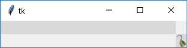

Piratz Sizegrip
---------------

We will be building a standalone python script based on the individual widget
scripts generated here and for the rest of this chapter. Since Sizegrip has 
no other states than its normal we need only to think of a suitable image, 
then use this to change its component - sizegrip - by means of element create
within the command theme_create. 

.. note:: Images are found in piratz, the subdirectory of images, and all are
   png files, as later on it will make things easier.

The important lines are the following::

     'sizegrip': {"element create":
          ('image', "sizegrip")}

which you will find sandwiched between the comment lines::

   # start of theme extract
   
   # end of theme extract - don't forget to add comma at end when inserting

``'sizegrip'`` is the element with which we are working, this being unique 
requires no identifiying widget name. ``"sizegrip"`` is the image alias name,
based on the image name itself sizegrip.png, so take the image name less the 
image suffix. These two lines are what we shall be inserting into the Piratz
standalone theme together with an end comma to allow further clauses to be
inserted.

Unless we add columnconfigure and rowconfigure to the test script sizegrip 
positions itself in the upper left corner, instead of the lower right corner.

.. literalinclude:: ../examples/07pirate_sizegrip.py
   :emphasize-lines: 19,20
   :linenos:

theme_create requires a new theme name, ``"yummy"``, and a ttk standard theme 
name (alt, clam, classic or default) as the parent, later on use the new 
theme name.:: 

   16 style.theme_create( "yummy", parent="clam", settings={
   .....
   24 style.theme_use('yummy')
   .....

theme_settings requires a ttk standard theme name and the same in theme_use.::

   17 style.theme_settings('default', {
   .....
   24 style.theme_use('default')
   .....
