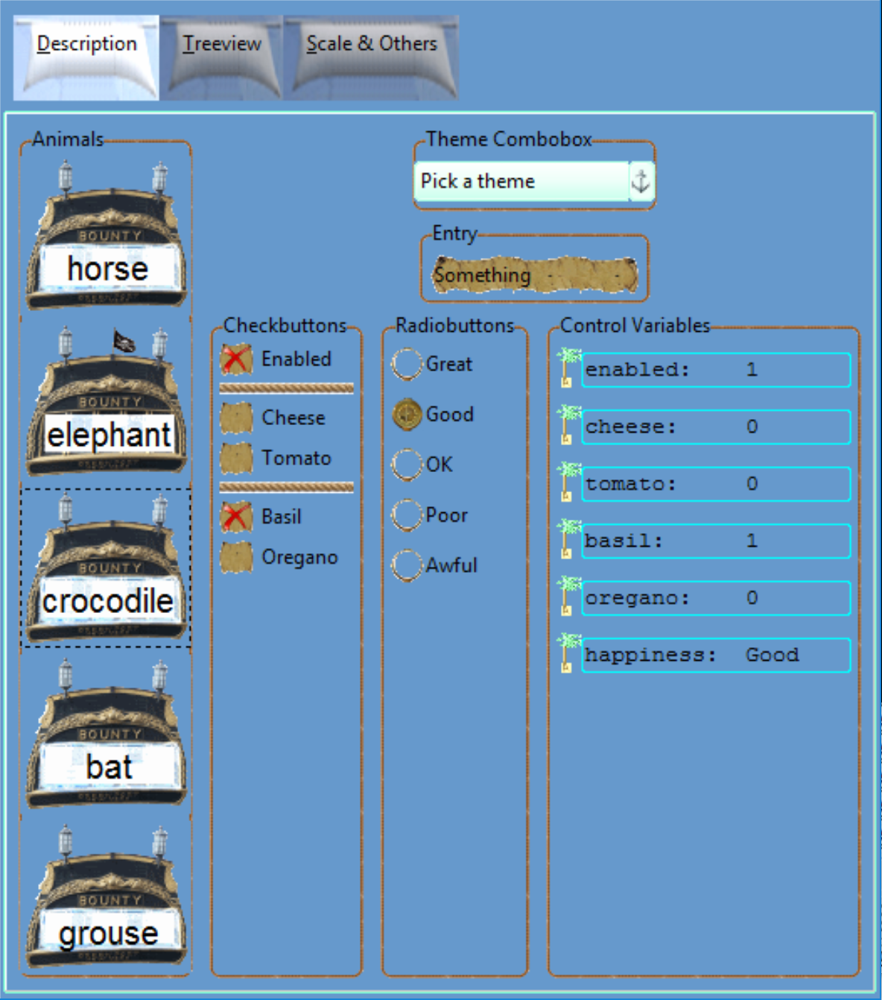

Piratz Theme
------------

Once the widgets have been all tested we can build up piratz_theme.py, we may 
also require common colours and a common tkfont. When testing choose a suitable 
test program, such as 07piratz_notebook - based on 06themed_notebook - put the 
piratz images in a sub-directory and make sure that the script points to your 
sub-directory (probably "piratz"), the file piratz_theme needs to be on the
same directory as your main program. A few sub-programs have been added to 
ensure that the progressbar and scale react as expected. The result will 
probably make you say "With a little effort I could do better" - good have a 
go, in general the images are the most time consuming, but the whole is 
surprisingly straightforward.

.. container:: toggle

   .. container:: header

       *Show/Hide Code* 07piratz_notebook.py

   .. literalinclude:: ../examples/07piratz_notebook.py
      :emphasize-lines: 20