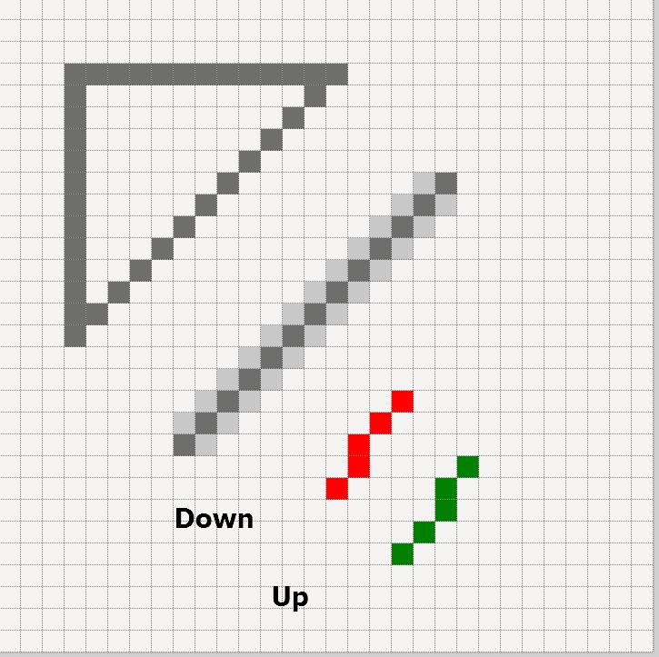

Antialiasing
============

.. topic:: Angled Lines

   Since displays can only switch on the adjacent pixel horizontally or 
   vertically next to the previous pixel, angled lines require an 
   antialias treatment to remove their jagged appearance. 

   Lines and Antialiasing 
 
   The vertical and horizontal lines are smooth, but the diagonal line, 
   drawn as is, is jagged (aliased) or antialiased. Antialised lines have 
   pixels, with a colour between the line and background colour, placed next 
   to the line pixels. 

There are several approaches we may use to perform antialiasing. The one used 
is based upon drawing the image several times larger, then resize to the 
required size whilst applying a resampling filter. This creates differently 
coloured pixels, as exist in comboarrow-n.png. 

Apply this to an enlarged image of two lines joined by a diagonal say, then 
resize with a filter, antialias pixels are made but these are not 
as intense as in the original image. Colour is equalized between adjacent 
darker and lighter colours, noticeably around the line ends. 

.. topic:: Alternative Methods Antialiasing 

   Another approach might be to use an application that already has 
   an option to create antialiased lines, such as aggdraw or cv2, tkinter 
   canvas has no such option. 
   
   Unfortunately most of the alternative approaches have unexpected side 
   effects, which directly affect the image geometry.

.. sidebar:: Corner Antialiasing Pixels

   No additional pixel placing is required, it's all done automagically.

Later on it will be shown that the corners can have intensified antialiasing by 
reproducing the image at a larger size, say nine times larger, make 
real corners (not just drawing wide diagonals), then reduce the image size 
while applying a resampling filter. The antialias pixels are now compressing 
corners into these few pixels, making them more intense and believable. 

Unfortunately the arrow has no such aid. 

.. topic:: Antialiasing Arrow

   If you look at the lines image above, notice the two parallel lines on the 
   right handside, the red one was drawn starting from the top while the green 
   one starting from the bottom - see how the lines follow different paths. 
   Draw lines adjacent to the arrow slanting sides. Ensure that the lines 
   are drawn in the right direction so as to exactly copy the arrow sides. 
   It is easy to count how many arrow pixels are adjacent to these lines, 
   then change their pixel colour according to the pixel count.
