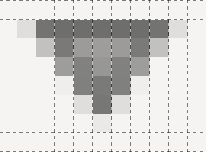

The Arrow
=========

Simple Arrows
-------------

Arrows are to be found in comboboxes and scrollbars. Their two main problems
are to ensure that the upward and downward slope match exactly, and to produce 
antialiasing pixels of sufficient intensity. The arrow can be 
rotated to match scrollbars.

Look at our :ref:`comboarrow<comboarrow>` it has a dark triangle surrounding 
a lighter fill.
It seems to be a good candidate for a polygon - so let's try it.

Enlarging the image combobox-n.png it can be seen that the arrow ouline has a
horizontal line joined to an arrow tip by two slanting lines.::

   from PIL import Image, ImageDraw

   img = Image.new('RGBA', (16,24), '#F6F4F2')
   idraw = ImageDraw.Draw(img)
   idraw.polygon([(5,11),(11,11),(8,15)],outline='#6E6E6D')

   img.save('../figures/arrowtest.png')

.. figure:: ../figures/08arrow_test1.png
   :width: 144
   :height: 113
   :align: center

The result looks lopsided and we should not even consider using it. The 
righthand slope matches combobox-n.png but the lefthand side has changed the 
position of the double pixel. No matter how we sequence the three 
points of the polygon there will always be a problem with one of the 
sides. This calls for a little bit of experimenting, but we can see that the 
lefthand side passes through point 6,12 then finishes at 5,11, mirroring the 
the righthand side (starting at 11,11 then passing through 10,12). What happens 
when the line is made to draw to this point then left to complete the last 
pixel? The slopes of the lines joining the arrow tip to points 5,11 and 6,12 
are slightly different, so something ought to change.

Alter the polygon to include point 6,12 (automatically closing off at 5,11)::

   idraw.polygon([(5,11),(11,11),(8,15),(6,12)],outline='#6E6E6D')

.. figure:: ../figures/08arrow_test2.png
   :width: 146
   :height: 112
   :align: center

It seems we were lucky, both sides match. This works at this sort of line
size, at larger magnifications this method is no longer applicable. 

Now we can use a fill in the polygon and create our arrow. 

.. |anti| image:: ../figures/08just_anti.png
   :width: 172
   :height: 126

.. table:: Antialiasing in Arrows

   =========== ======================================
   Original    |just|
   Constructed |anti|
   =========== ======================================

That solves the first of our problems, we now have only the antialiasing to
solve. Look at combobox-n.png closely, there seems to be a pattern to the
antialiasing. When the pixels adjoin one of the arrow elements we have a 
light pixel, when next to two arrow elements we have a medium coloured pixel
and when adjoining three arrow elements we have a dark pixel. 

We might consider drawing an enlarged arrow then reduce with a filter, 
unfortunately the polygon does not support width and when drawn with lines the 
reduced image looks more like a space invader than an arrow. The best bet 
seems to be to trace the sides and concoct our antialiasing pixels.

Construct the arrow as above, draw two lines next to the sides using 
colours that do not clash with existing colours. Pick out the pixels that 
have the construction line colours, then sum up the number of adjacent arrow
pixels to these selected pixels. Use these subtotals to determine what the 
antialias colour should be for each construction line. The result should look
like the "constructed" image above.

.. container:: toggle

   .. container:: header

       *Show/Hide Code* 08arrow_anti.py

   .. literalinclude:: ../examples/08arrow_anti.py

Alternative Arrow
-----------------

.. figure:: ../figures/08alt_arrow.png
   :width: 208
   :height: 195
   :align: center

If we look at the arrows used throughout the standard themes and in ttktheme
there are not many we can say are exactly gripping. Most comboboxes are plain
triangles or a simple chevron. The classic theme with an enlarged borderwidth
is the best of the bunch (piratz with an anchor and palm tree are excluded).

.. sidebar:: Antialiasing 

   Use the same system as with the simple arrow, or leave out.

When a state changes, the colours can be shifted around to give the sense of 
being pressed. 

.. container:: toggle

   .. container:: header

       *Show/Hide Code* 08alt_arrow.py

   .. literalinclude:: ../examples/08alt_arrow.py
