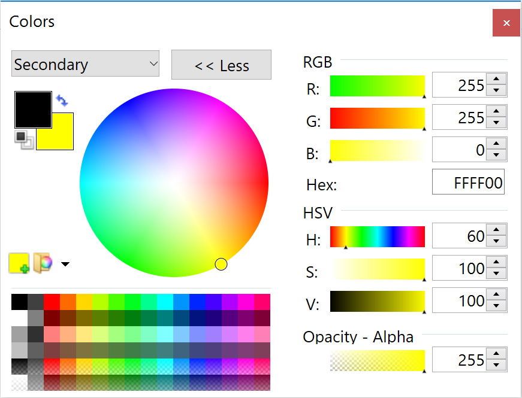
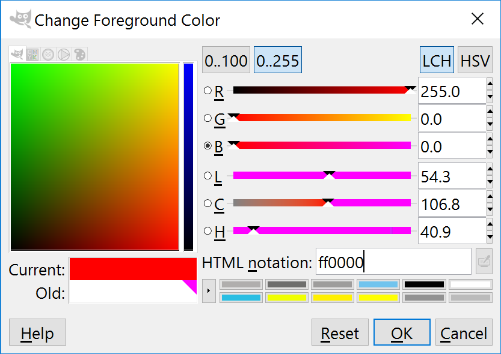
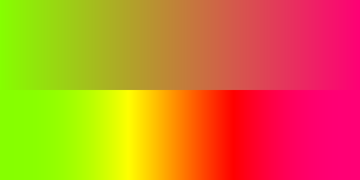
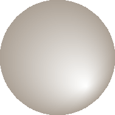
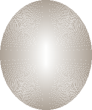

Colour Schemes and Gradients
============================

Colour Schemes
--------------

.. sidebar:: Widget Colour Guidelines

   None that I found.

Having sorted out the widget outline it is important to fix its
colouration and maybe a colour gradient. Remember colours created through 
antialiasing obviously affect the appearance but mostly are derived implicitly.

.. figure:: ../figures/08ryb-wheel.png
    :width: 350px
    :height: 350px
    :align: center

    Red Yellow Blue colour wheel

    At the centre of the wheel, where all three colours come together, 
    the resulting colour is a muddy brown. (If in doubt try it with coloured 
    pencils).

The following guidelines are to be taken as a starting point only, since they 
are based on internal decorating practice which uses the RYB colour wheel,
so take with a pinch of salt. When printing the 
`CMYK colour wheel <https://warrenmars.com/visual_art/theory/colour_wheel/colour_wheel.htm>`_
is truer.

:One Hue: Stick to one hue adjusting the saturation and value - which lends itself
   to the hsv colour space. Neutral colours probably work best, which means 
   almost anything that is not bright red, orange or yellow. 

   Gradients should be straightforward. 

:Side by Side: two adjacent colours. 
   
:Opposites: two complimentary colours, which are exactly opposite in the normal 
   colour wheel, vibrant colours are produced especially if both have a large 
   saturation. 
   
   They will automatically give a warm and a cool colour. 
   
   Gradients will be tricky when both colours are used as the end colours. 
   Intermediate colours may need to be defined to avoid bad looking gradients. 
   If you should use the HSV colour scheme it will produce the perimeter rgb 
   colours which will look like a rainbow - not too clever.
   
:Three Together: three colours - choosing adjacent colours should look harmonious, it 
   works best if one colour dominates.
   
:Spaced Three: three colours - evenly spaced around the normal wheel. As with 
   complimentary colours gradients may not be so straightforward.
   
:Opposite Three: three colours - choose one colour then select the adjacent 
   colours to the complimentary colour. This should produce a toned down 
   complimentary colour scheme. Still be careful of gradients.

   RGB and HSV Colour Wheel

   This colour wheel comes from paint.net. Notice how the selection on the 
   perimeter of the rgb wheel shows up on the individual components.

.. figure:: ../figures/08rgb_hsl.png
   :width: 348
   :height: 244
   :align: center

   RGB and HSL Colour Selector

   This colour selector comes from tkinter on Windows. HSL has similar
   properties to HSV except that the number range changes.

   RGB and LCH Colour Selector
   
   The colour selector in GIMP uses either Lab or HSV, this version of Lab 
   produces Lightness, Chroma and Hue. Lightness is adjusted for the various 
   hues so can be used where we wish to change the hues but keep absolute
   lightness constant.

.. note:: The HSV colour space is related to the RGB colour space in that 
   the HSV hues are the same as the rgb perimeter colours, giving 360 HSV
   hues. The RGB perimiter colours produce HSV colours with 100 in 
   both saturation and value components.

   ====== ============= =============== =============== ====================
   Hue    RGB           HSV             HSL             LCH
   ====== ============= =============== =============== ====================
   red    (255,0,  0)   (0,100,100)     (0,  240,120)   (54.3, 106.8, 40.9)
   yellow (255,255,0)   (60,100,100)    (40, 240,120)   (97.6, 94.7,  99.6)
   green  (0,  255,0)   (120,100,100)   (80, 240,120)   (87.8, 113.3, 134.4)
   blue   (0,  0,  255) (240,100,100)   (160,240,120)   (29.6, 131.2, 301.4)
   black  (0,  0,  0)   (0,  0,  0)     (160,0,  0)     (0,    0,     0)
   white  (255,255,255) (0,0,100)       (160,0,  240)   (100,  0,     141.2)
   ====== ============= =============== =============== ====================

Gradients
---------

   **Overcomplicated** Gradients
   
   Both gradients started and finished at the same colours (134, 255, 0) 
   (255, 0, 117). The upper gradient was made in RGB and created a greyish 
   centre, the lower made in HSV together with a smoothing function, 
   neither should be used.

When selecting a colour scheme the normal colour wheel helps but remember 
gradients will be created in RGB, so some adjustment may be required. 

.. sidebar:: Start Simple

   The extreme gradients would normally not fit into our scheme of things.
   Simple gradients are often all we need.

.. topic:: Simple and Extreme Gradients

   The single hue and adjacent hue options can produce pleasing gradients, 
   without too much trouble.

   Say we have two adjacent colours, or colours only one value apart, then the 
   gradient will transition smoothly, so yellow to green will transition through 
   yellow-green and appear satisfactory. However if we tried purple to green 
   then we will see a greyish intermediate colour in the RGB colourspace, whereas 
   HSV will produce purple-blue, blue and blue-green as intermediate colours. 
   Say we tried to transition between blue and yellow then we could force the 
   intermediate colour to be at green thus avoiding grey, additional intermediate 
   colours should make an even better transition.

   If you wish to transition with an alpha change only (transparency) then 
   ensure the starting and finishing hue are the same. 

White, black and grey can be used as end colours in any option to produce 
gradients. As already stated, if grey is produced as an intermediate colour 
then the colour gradient normally needs adjustment. 

Simple Gradient using Line
^^^^^^^^^^^^^^^^^^^^^^^^^^

You should be able to detect the use of gradients in some of the widgets. 
Since we are dealing with small images we should be able to make
gradients by drawing lines that change colour using simple linear 
interpolation. The colour is simply RGB, rather than HSV, HSL or CIELAB. 

We have a starting and a finishing colour separated into their rgb components. 

.. container:: toggle

   .. container:: header

       *Show/Hide Code* gradient snippet

   .. code-block:: python

      r,g,b = start_colour
      dr = float(stop_colour[0] - r)/steps 
      # change of r component
      dg = float(stop_colour[1] - g)/steps 
      # likewise g
      db = float(stop_colour[2] - b)/steps 
      # and b
 
      for i in range(steps):
         r,g,b = r+dr, g+dg, b+db # first colour in gradient
         idraw.line([x0, y0+i, x0+wi, y0+i], fill=(int(r),int(g),int(b)))

The above snippet of code might be used on images larger than our widgets, 
if used as it stands the first colour will be slightly different to our starting 
colour. After the start colour is corrected the finishing colour will then need 
to be corrected. At our image sizes this small error can be quite noticeable.

.. container:: toggle

   .. container:: header

       *Show/Hide Code* corrected gradient snippet

   .. code-block:: python
      :emphasize-lines: 2,4,6,8

      r,g,b = start_colour
      dr = float(stop_colour[0] - r)/(steps-1) 
      # slightly increase the change to r 
      dg = float(stop_colour[1] - g)/(steps-1) 
      # likewise g
      db = float(stop_colour[2] - b)/(steps-1) 
      # and b
      r,g,b = r-dr, g-dg, b-db 
      # correction for first colour in gradient

      for i in range(steps):
         r,g,b = r+dr, g+dg, b+db
         idraw.line([x0, y0+i, x0+wi, y0+i], fill=(int(r),int(g),int(b)))

The starting colour has been changed so that the first line depicts the 
right colour, so now we need to adjust the last line to be on the finishing 
colour, (slightly enlarging the differences in the rgb components).

We can replace the above with an assisting function that produces the 
required linear interpolation.::

   def LerpColourRGB(c1,c2,t): # suitable for RGB 
      return (int(c1[0]+(c2[0]-c1[0])*t),int(c1[1]+(c2[1]-c1[1])*t),
         int(c1[2]+(c2[2]-c1[2])*t))

The function treats the rgb components separately and ensures that the result 
is an integer. The line gradient now becomes::

   for i in range(steps):
      idraw.line([x0, y0+i, x0+wi, y0+i], 
         fill=LerpColour(start_colour,stop_colour,i/(steps-1))

All the component differences are being handled in the one function also the
start and end colour are true without any adjustment - much simpler.

Simple Gradients using 2D Figures
^^^^^^^^^^^^^^^^^^^^^^^^^^^^^^^^^^

.. |rect2| image:: ../figures/08rect2.png
   :width: 94
   :height: 94

.. |circ1| image:: ../figures/08circle1.png
   :width: 94
   :height: 94

.. |ell1| image:: ../figures/08ellipse1.png
   :width: 94
   :height: 112

.. table:: 2D Figures in Gradients

   =========== ======================================
   Rectangle   |rect2|
   Rectangle   |rect1|
   Ellipse     |ell1|
   Ellipse     |ell|
   Circle      |circ1|
   Circle      |circ|
   =========== ======================================

Using the same principal of linear interpolation we can create a more three
dimensional look by using a rectangle, an ellipse or a circle instead of a line, 
remembering to make allowance for the fact that the figure has width as well 
as height. Starting with the largest figure, nest slightly smaller figures
inside. At each successive figure change the colour, use only fill not 
outline - otherwise small areas will be left unchanged.

The rectangle is the easiest one to use as we are normally creating a gradient 
over a rectangular area. Circles and ellipses have to be made larger so that 
the corners of the gradient area touch the inside of the ellipse/circle.

The circle can be drawn off centre allowing us to create a more interesting 
highlight. Test for yourself by commenting and uncommenting the appropriate
figure, also see what happens when the colours start_colour and stop_colour 
are swopped.

.. container:: toggle

   .. container:: header

       *Show/Hide Code* 08test_gradients.py

   .. literalinclude:: ../examples/08test_gradients.py

.. topic:: Finding the Ellipse that Encloses the Rectangle

   The ellipse that is enclosed by the rectangle can be drawn straightaway, 
   just use the rectangle as the enclosing box. To find the ellipse that
   encloses the rectangle is not so obvious. Using a square and circles, it 
   can be seen that the enclosing circle must be 1.414 (root 2 ) times larger 
   than the circle inside the square. By analogy the outer ellipse should
   also be 1.414 times the inner ellipse, so adjust the outer semi-axes.  
   The ellipse should touch the gradient rectangle at all four corners.
   Nested ellipses are then drawn whilst changing the fill at each step. 

Radial Gradient
^^^^^^^^^^^^^^^^

.. sidebar:: Experiment with odd sized Images

   Since radial gradients use the central point it is useful to experiment 
   with odd sized images which can be accurately centralised. 

Use points to make a radial gradient, creating a similar effect to the 
ellipse method above, but is easier to apply. 

.. container:: toggle

   .. container:: header

       *Show/Hide Code* 08radial_gradient.py

   .. literalinclude:: ../examples/08radial_gradient.py
