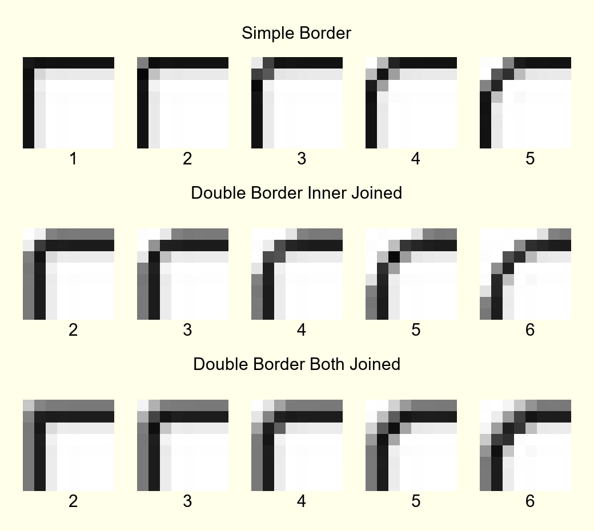

Drawing with PIL(Pillow)
========================

.. topic:: Tkinter Canvas or PIL

   We could have used tkinter canvas but the drawing can only be saved as a pdf 
   file. Since we want a png or gif file, we need PIL to capture the pdf 
   output before conversion, let's try only using PIL since the drawing is 
   not too complicated.

.. note:: If you have never drawn with PIL or require a refresher the following 
   paragraphs should help. 

PIL has several modules, the two we will mainly require are 
Image and ImageDraw. Image deals with the file whereas ImageDraw gives us the 
ability to create lines, arcs, rectangles and polygons - a bit like tkinter 
canvas. We draw directly on the image without needing a canvas. 

After importing the necessary modules, create a new image file, then create a 
function for drawing. The coordinate system is the normal computer one with 
the upper left hand corner being 0,0 (x,y coordinates) x increases across 
the screen y increases down the screen. Note that all coordinates are given 
to the drawing methods as a list (square brackets) [x0,y0,x1,y1 ...] or a 
list of tuples (round brackets) [(x0,y0),(x1,y1) ...].

.. container:: toggle

   .. container:: header

       *Show/Hide Code*

   .. code-block:: python
      :emphasize-lines: 15 - 22
      :linenos:
   
      from PIL import Image, ImageDraw
   
      w = 24  # used to set width
      h = 24  # used to set height
      transparent = (255,255,255,0) 
      # used to set background colour - using an RGBA format
   
      img = Image.new('RGBA', (w,h), transparent) 
      # create a new image organized with RGBA pixels, 
      # of a given size with the set background colour, 
      # in this instance transparent
      idraw = ImageDraw.Draw(img) 
      # create function for drawing within the new image img.
   
      idraw.line([0,0,w-1,0],fill='black',width=1) 
      # draw line on upper part of the image
      idraw.line([0,0,0,h-1],fill='black',width=1) 
      # draw line on left part of the image
      idraw.line([w-1,0,w-1,h-1],fill='black',width=1) 
      # draw line on left part of the image
      idraw.line([0,h-1,w-1,h-1],fill='black',width=1) 
      # draw line on lower part of the image
   
      idraw.ellipse([0,0,w-1,h-1],outline='red')

      img.save('line_test.png') # save to file

Start by making a square formed from four black lines one pixel wide. 
Note that we needed to use the coordinates width-1 and height-1 (w-1, h-1), 
this ensures that the lines fit just inside our image and are 24 pixels long, 
(since the starting point is zero and our image size is 24x24). We could 
have drawn the lines as a single line in sequence. ::

   idraw.line([0,0,w-1,0,w-1,h-1,0,h-1,0,0]) 
   # alternative method to draw lines, calling line only once

.. note:: With this method start and finish at the same point (in this 
   case 0,0), the default colour is white. Test by replacing the 
   highlighted lines 15-22.

If we had used a polygon then there normally is no need to close off. The 
outside of the polygon is called outline, fill can be used as an internal 
filling method.::

   idraw.polygon([0,0,w-1,0,w-1,h-1,0,h-1],outline='#FFFFFF',fill='red') 
   # alternative method to using line
   # the colours specified here are a hash and a named colour

.. sidebar:: Drawing Arcs at Small Radii

   At small radii arcs get into all sorts of trouble and are to be avoided,
   unless they have a radius of 9px or larger.

In order to draw curved lines we need to know the bounding box that 
defines the size and position of the curve. We can use the square we drew 
before and utilise its upper left and lower right points to define the 
bounding box for a circle - a special case of the ellipse. Ellipses 
also use the same methods to colour as used by polygons. 

   
   Small Circles
   
   Circles progressing in size from 1 to 9 pixel radius

.. topic:: Colours in PIL

   PIL is flexible when specifying colours - we can use RGBA, RGB, hash value 
   or a named colour. Be careful when using names it uses the X11 system 
   that is similar to the CSS3, but it may not always agree with the tkinter 
   list of named colours. For the more adventurous HSL and HSV are supported 
   with the ImageColor module - ``"hsl(hue,saturation%,lightness%)"``
   ``"hsv(hue,saturation%,value%)"``, but both should be converted back to RGB
   with ImageColor.getrgb() before being used for an image.

Continuing on with our drawing, insert a circle in our square.

::

   idraw.ellipse([0,0,w-1,h-1],outline='red') 
   # not quite right - too small

Redraw with a slightly larger circle.::

   idraw.ellipse([0,0,w,h],outline='red') 
   # also not right - too big

Maybe a case of the Goldilocks size, if h and w had been 23 then the first 
attempt would have been correct. If we draw a circle it has a radius that 
must be an integer, so the bounding box must be an even number of pixels 
wide and high. The outside black square we drew corresponds to the bounding 
box, see that the circle overlaps the the bounding box on all four sides, 
and our case should touch all four sides of the image, in the real world 
lines have breadth which is why the bounding box is not a simple dimension, 
this is not quite the same as tkinter canvas shown in *8.11 Canvas Oval Objects* 
in the `"Tkinter 8.5 reference a GUI for Python" <https://anzeljg.github.io/rin2/book2/2405/docs/tkinter/tkinter.pdf>`_.

Change the ellipse (circle) into 4 arcs::

   idraw.arc([0,0,w-1,h-1],start=0,end=90,fill='red') 
   # angles are measured from 3 o’clock, increasing clockwise
   idraw.arc([0,0,w-1,h-1],start=90,end=180,fill='green') 
   # the colour parameter is fill
   idraw.arc([0,0,w-1,h-1],start=180,end=270,fill='yellow')
   idraw.arc([0,0,w-1,h-1],start=270,end=360,fill='blue')

.. Note:: See how the arc is positioned and how start and end are specified,
   the same system is used for pieslice. 

If we wish to produce rounded corners in a large enough size so that curves 
can be drawn then we will need to enlarge everything, image size, lines and 
their widths. Ordinary lines can be directly drawn with their width without 
too much trouble. Arcs pose a problem since they have no width or fill method. 

Pieslice is the solution, we first draw a larger pieslice that picks up on
the required outside radius, then we draw a smaller pieslice that picks up 
on the inner radius. The larger pieslice has a colour corresponding to the 
corner whilst the smaller pieslice has a background colour. Both pieslices 
use the same centre.

In the first configuration the two borders run along the outside edges then 
are joined by pieslices with radii corresponding to the width of the border. 
Let's start a new file.

.. container:: toggle

   .. container:: header

       *Show/Hide Code*

   .. code-block:: python
      :linenos:
      :emphasize-lines: 16,18

      from PIL import Image, ImageDraw
   
      e = 9  # enlargement
      d = (e-1)//2 # displacement
      w = 23 # normal image width
      h = 23 # normal image height
      we = w*e # enlarged image width
      he = h*e # enlarged image height
      g = 1 # gap
      s = g*e # space (enlarged gap)
   
      img = Image.new('RGB', (we,he), 'white') 
      # nothing fancy using an enlarged size
      idraw = ImageDraw.Draw(img)
   
      idraw.line([s,0,we-1,0],fill='black',width=e) 
      # draw line on upper part of the image, gap at the upper left
      idraw.line([0,s,0,he-1],fill='black',width=e) 
      # draw line on left part of the image, gap at the upper left
   
      img.save('corner_test'+str(g)+'.png') 
      # save to file - seeing what we have drawn in the enlarged size

Not quite right, the lines are thick but the full width does not show 
(magnify until you can see the pixels), therefore we need to adjust both 
lines. The line width was given as 9 pixels (enlargement factor) but only 5 
are showing.

.. figure:: ../figures/08corner_test.png
   :width: 329
   :height: 337
   :align: center

   Top left corner of corner_test1.png

Wider lines appear to be referenced from a location close to their centre 
rather than an outside edge. Lines with odd sized widths use the central 
measurement less 1, whereas lines with even sized widths use the same size 
as the previous odd value. This means that lines of 1, 2 or 3 pixels width 
need no adjustment whereas wider lines will need either a vertical or horizontal 
displacement.

After adding the line displacement (d) to the line, add a pieslice, with a
different colour, allowing us to trace errors a little easier ...

.. container:: toggle

   .. container:: header

       *Show/Hide Code*

   .. code-block:: python
      :emphasize-lines: 1,3

      idraw.line([s,d,we-1,d],fill='black',width=e) 
      # adjusted for linewidth using d
      idraw.line([d,s,d,he-1],fill='black',width=e) 
      # adjusted for linewidth
      
      idraw.pieslice([0,0,s*2-1,s*e-1],fill='orange',outline='orange', 
         start=180,end=270) 
      # the bounding box starts at 0,0 then finishes at s*2-1,s*e-1
      # if alright, change to black then resize
      if g> 1:
         idraw.pieslice([s//2,s//2,s*2-s//2-1,s*2-s//2-1],
         fill='yellow',outline='yellow', start=180,end=270)

   
      imgx=img.resize((w,h)) 
      # changed the image to our reduced size 
      imgx.save('corner_testx'+str(g)+'.png', quality=95) 
      # save to file final size with no resampling filter
      # the corner pixels are all black - should be improved with a filter
   
      imgb=img.resize((w,h),Image.BICUBIC)
      imgb.save('corner_testb'+str(g)+'.png', quality=95) 
      # save to file using bicubic filter
      
      imgL=img.resize((w,h),Image.LANCZOS)
      imgL.save('corner_testL'+str(g)+'.png', quality=95) 
      # save to file using lanczos filter

The image was saved after being resized with a filter. A reference to the 
gap size is given in the image name. Small differences in the antialiasing
pixel colours can also be tested by changing the filter from bicubic to 
lanczos. Only one pieslice is needed at a gap size of one, otherwise an 
extra pieslice is required.

   
   Corners Created with Changing Gap Sizes

   The gap is filled by pieslice(s) to create our arcs. 
   The upper row of the corner image shows a simple border with various gaps 
   starting from 1 and increasing to 5. The next row uses an outer border 
   where only the inner border is joined, whilst the last row shows the effect 
   of joining both inner and outer borders. In the lower two rows the gaps 
   progress from 2 to 6. 

When we enlarge the gap use two pieslices, the larger filled with the corner 
colour, the second filled with the background colour. The difference in
pieslice radii gives the corner thickness. As the 
gap increases further the pieslice (arc) changes its bounding box not only with 
increasing pieslice radius but where it is centred. 

.. sidebar:: Calling the Function

   The PIL function is called with the ImageDraw alias preceding it, as in
   ``idraw.pieslice(...``, whereas our help function places the alias inside the
   function as in ``create_pieslice(idraw,c,r...``.

It is often much easier to draw the pieslice, or any of the other regular curved 
lines, using a simple helping function, such as create_pieslice. Here pieslice
is created using the centre (c) and radius (r).::

   def create_pieslice(idraw,c,r,outline='#888888',fill='#888888',start=0,end=90):
      return idraw.pieslice([c[0]-r,c[1]-r,c[0]+r-1,c[1]+r-1],
         outline=outline,fill=fill,start=start,end=end)

As we change the gap size we can see the effects of the resampling filter 
and compare whether a bicubic or lanczos works better. Also check what happens 
if we use an enlargement factor of 8, in particular on the original size and 
whether the pieslice marries up with the border lines and whether this 
noticeably affects the final image after filtering. 

With increased gap size the final corner layout changes. On the simple border
the gap is simply a filled join then at a gap of 3 the 
filling has a stepped inward part, at a gap of 4 the filling becomes a straight
diagonal, while at a gap of 5 the filling becomes an outward stepped 
diagonal. Using a gap of 1, there is no real chance for the filter to get to 
grips, all it can do is produce very dark greys along the borders, with a 
lighter grey at the junction of the 2 lines at 1,1 but this is unlikely to 
fool most people into believing that we have a rounded corner, (see Simple 
Border with a gap of 1).

As an exercise it is instructive to use the reduced image without any filter, 
then resize this image back to the enlarged size. This should create an 
angular image which we can now once again reduce in size but with a lanczos 
filter, the result should be similar to the image created when we used pieslices, 
but the antialias pixels will be washed out and the result would not fool many. 

Alter the script to include an outer border and an inner border. Then 
tie both borders together with pieslices, the resulting changes with 
different sized gaps help us to find out how the original widget was 
constructed. 

.. |comboa| image:: ../figures/08comboarrow_large.png
   :width: 80
   :height: 120

.. |combo| image:: ../figures/08combo_large.png
   :width: 120
   :height: 120

.. table:: combo-n.png and comboarrow-n.png

   ============================== ==============================
   |combo|                        |comboa|
   ============================== ==============================

Look at the differences between combo-n.png and comboarrow-n.png, apart from 
image size note that the plain combo has an outer lighter border and that the 
corner diagonal has no step, whereas the comboarrow image has a plain border 
and a stepped diagonal facing outwards. From this information we can now 
deduce the gap size, hence the required pieslice radii. 

We can create rectangles directly using *rectangle*, 
this uses a bounding box, similar to pieslice, and just like pieslice 
we can create thick rectangles using two or more nested rectangles. However 
what is important is that we can simplify our scripting and the following uses 
principles derived from http://nadiana.com/pil-tutorial-basic-advanced-drawing. 

Simple Rectangle in PIL
-----------------------

.. topic:: A Surfeit of Lines.

   When using *line* to draw rectangles, especially nested ones, the script
   will quickly become overloaded with variables to generalize the script, 
   *rectangle* can help cut through this jungle.

   .. figure:: ../figures/08rect.png
      :width: 207
      :height: 207
      :align: center

      Blue Rectangle

      Drawn at enlarged size, draw large rectangle in blue, draw the inner
      rectangle in light blue.

   Create a coloured rectangle, which will be a PIL Image with 
   nested rectangles that is  shown at the enlarged size. Decide on the 
   rectangle colours, the corners will be dealt with later. We are going to 
   create 2 rectangles, the outer will be blue and the inner one white. 
   If the original rectangle has a thickness of one pixel, when enlarging
   the thickness becomes one times the enlargement factor (e).

   .. note:: If we only use ``fill`` then the rectangle is drawn the same 
      size as if we had used outline - this differs from tkinter canvas.

   .. container:: toggle

      .. container:: header

         *Show/Hide Code* 08rectangle.py

      .. literalinclude:: ../examples/08rectangle.py

   Apart from the initial size adjustment to the box size, the script has no 
   variable requiring ``-1``. All the changes required for the inner rectangles
   were for differences in size corresponding to thickness of the band around 
   the rectangles and these behaved as expected. 

   .. note:: Look at the methods of creating a PIL image and its draw module and
      how the image is finally saved. Alternatively, we can directly show the 
      image on an image processor.

Rounded Rectangles
------------------

Simple Border
^^^^^^^^^^^^^^

   Blue Rectangle with Rounded Corners

   Blue Rectangle with Rounded Corners Resized

The next part is to create the corners, for this we use pieslice, 
make a corner image that is pasted in turn onto all four corners. Where the 
corners are pasted parts of the rectangles are overdrawn, so complete 
rectangles can be used. Use the assist function so that pieslice is dependant 
on its centre and radius, rather than a bounding box.

   Blue Rectangle with Rounded Corners Resized and enlarged

.. container:: toggle

   .. container:: header

       *Show/Hide Code* 08rounded_rectangle.py

   .. literalinclude:: ../examples/08rounded_rectangle.py

We have three functions, the first function is our helping function for the 
pieslice. The next two functions are more interesting. In round_corner 
we have a function that independantly draws a corner consisting of two 
pieslices and creates a small image with its own ImageDraw method with alias. 
The third function also has its own image and drawing methods, creates two 
rectangles whose sizes and colours will be matched by the pieslices. The corner 
is called 4 times and is pasted and rotated as required, (the corner 
image is treated as a rectangle that is positioned by its upper left corner 
inside the rectangle image).

Double Border inner Joined
^^^^^^^^^^^^^^^^^^^^^^^^^^

   Two Blue Rectangles with Rounded Corners resized and enlarged

08rounded_rectangle_inner.py similar to 08rounded_rectangle.py, except that 
we draw three rectangles and two pieslices, which in turn match up with 
the inner rectangle. The corner mask is enlarged slightly so that the dark
blue rectangle matches the simple border.

.. container:: toggle

   .. container:: header

       *Show/Hide Code* 08rounded_rectangle_inner.py

   .. literalinclude:: ../examples/08rounded_rectangle_inner.py

Double Border both Joined
^^^^^^^^^^^^^^^^^^^^^^^^^^

   Two Blue Rectangles with Rounded Corners resized and enlarged

08rounded_rectangle_both.py similar to 08rounded_rectangle.py, except that 
we draw three 
rectangles and three pieslices, which in turn match up to the rectangles. 
The corner mask is enlarged slightly so that the dark
blue rectangle matches the simple border.

.. container:: toggle

   .. container:: header

       *Show/Hide Code* 08rounded_rectangle_both.py

   .. literalinclude:: ../examples/08rounded_rectangle_both.py

08rounded_rectangle.py, 08rounded_rectangle_inner.py 
and 08rounded_rectangle_both.py are the three scripts on which we can base 
many of our widget scripts, the first script has the corner joining the 
single border, the second script has two borders with only the inner border
is joined whereas the third script joins both borders.
