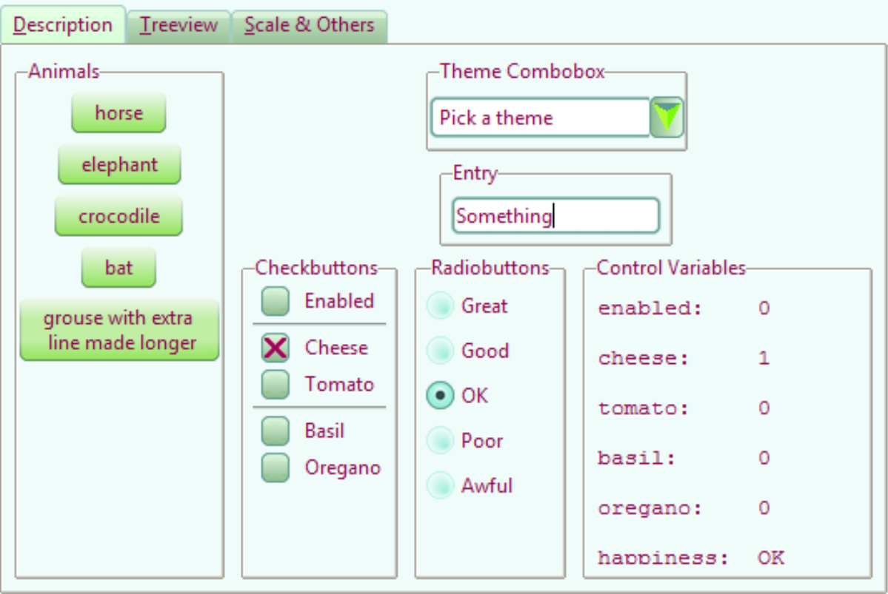

Common and Colours
-------------------

   10third_theme_note.py

We can now see whether the colours and common settings are correct. The
colours only seem to react correctly if a hash value is used, RGB seemed to
create only black. 

We can also clean up the code a bit and ensure that the image aliases 
correspond to the file names.

Lime_Theme 
^^^^^^^^^^

When satisfied start building lime_theme.py, put lime theme in the *examples*
directory, just ensure that there is the references to *lime* in the 
``style.theme_create`` clause. Ensure that the files are referenced with the
correct image type ``png``.

Adapt 07piratz-notebook.py to 10third_theme_note.py where we can see the
widgets in a mini application. The application will point to the image
directory ``../images/lime``.

.. container:: toggle

   .. container:: header

       *Show/Hide Code* 10lime_various.py

   .. literalinclude:: ../examples/10lime_various.py

In Conclusion
^^^^^^^^^^^^^^

There you have it, you now have the tools to make your own theme, which 
includes the most common elements and their construction. 

Lastly a big vote of thanks to all those developers and programmers without
whom this would not have been possible.
