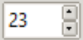
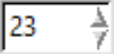
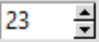
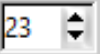
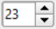
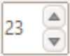

Spinbox
-------

Spinbox is a late entry as it was not part of the original changeover to ttk.
You will need Python 3.7 or later in order to see the results. In appearance
it is similar to the Combobox, therefore similar strictures discovered in 
chapter 06 "So you want to roll your own" used for Combobox apply. In 
addition we need to have two arrows displaying. Let's see whether an existing 
theme has a good looking solution. We can use the script 06theme_notebook.py,
the Spinbox has been used on the third tab "Sliders & Others".

.. |spa| image:: ../figures/spin_alt.png
   :width: 115
   :height: 48

.. _spinbox-table:

.. table:: Spinbox Standard Themes

   ============== ============== ============== ============== 
   Alt            Clam           Classic        Default      
   |spa|          |spc|          |spcc|         |spd|         
   ============== ============== ============== ============== 

.. table:: Spinbox Ttkthemes 

   ============== ============== ==============
   Keramik        Plastik        Ubuntu        
   |spk|          |spp|          |spu|        
   ============== ============== ==============

Comparing the standard themes with those from ttkthemes it should be noted
that only keramik and plastik were the only ttkthemes to have a customised
spinbox, others such as ubuntu relied on the parent theme. As a consequence
see how the border adjusts to accommodate the large arrows in ubuntu. Without
any customisation in lime it will inherit from clam, just as ubuntu did, and
produce almost the identical result. The other point to note is how the themes
treat the field around the numbers - adjust the numbers on the spinbox 
on all these themes. Plastik and classic themes win my approval, we have good
feedback from plastik and interesting arrows in classic. A border around the 
arrows makes the widget look complete.

.. sidebar:: Arrow Height

   Be careful that twice the arrow height does not equal the spinbox field 
   height. Twice the background height after being cropped equals the field
   height. The arrows need to be smaller than the background.

Using open borders, as used in the tabs on notebook, we should be able to 
create a good looking background for the arrows, which are smaller to those
in combobox. The layout will be inherited from clam, as we have 
already tested in "So you want to roll your own" :ref:`Customising Spinbox`. 
If necessary increase the spinbox field height so that the arrows can be 
easily seen. First create the necessary background containers for the arrows, 
included is the image for the plastik `buttons` component. The sizes can be
checked on 10lime_spinbox.py before the arrows are drawn.

.. container:: toggle

   .. container:: header

       *Show/Hide Code* 10spinbox.py

   .. literalinclude:: ../examples/10spinbox.py

Now draw the arrows on the background containers.

.. container:: toggle

   .. container:: header

       *Show/Hide Code* 10spin_arrows.py

   .. literalinclude:: ../examples/10spin_arrows.py

Test the results on 10lime_spinbox.py, add to lime_theme.py then check this
on 10third_theme_note.py.

.. Note:: Drawing matching arrow slopes is a little tricky, use the polygon
   outline to sort out the different slopes - but be warned changing to fill
   may create slightly different slopes.
