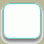
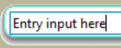
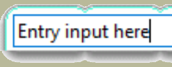

Rounded Frame
=============

The first example is based on that created by Bryan Oakley, a stalwart of 
StackOverflow. His original script created visible frames around entry and 
text widgets, example 05rounded_frame.py. 

.. figure:: ../figures/05rounded_frame.jpg
   :width: 244px
   :height: 36px
   :align: center

05rounded_frame
---------------

.. literalinclude:: ../examples/05rounded_frame.py
   :lines: 10-16, 53-56, 91-117

.. note:: For sanity's sake about 74 lines of image data have been ommitted.
   Only the first and last lines of the data file are seen above.

Discussion - Rounded Frame
--------------------------

Since he is using encoded data there is no reference to a file, instead 
PhotoImage refers to this data directly. Normally we have no states in the 
frame widget so he introduces lambda functions tied into Entry *FocusIn* and 
*FocusOut* events. He is using 2 separate images, the first is where the 
frame's contents have focus, the second where it loses focus. Click within 
the upper and lower frames, see how the outer colour changes, also note that 
the frame has decidedly rounded corners and a shadow on the right hand and 
lower sides. 
 
Let's remind ourselves about the layout and elements for frame::

	>>>s.theme_use('default')
	>>>s.layout('TFrame')
	[('Frame.border', {'sticky': 'nswe'})]
   
	>>>s.element_options('Frame.border') # only one component to query
	('background', 'borderwidth', 'relief')

In our example script, Bryan created an extra state (focus) and changed the 
border, using the command style.element_create::

	style.element_create("RoundedFrame", "image", "frameBorder", 
   # he was working on "RoundedFrame" the style cross reference, 
   # then he added an image "frameBorder" our default or normal state
	("focus", "frameFocusBorder"), border=16, sticky="nsew") 
   # next he added the state "focus" and set this to the image "frameFocusBorder"
   # then changed the border to 16

The border size, 16, is important, it is the allowance needed to create the 
rounded corners and shadows, without this the resulting widget would look 
jagged. The single figure 16 is the equivalent of having (16,16,16,16), a 
border of 16 along all sides. The lower frame has obviously grown in comparison 
to the upper frame and looks pretty smart, both frames have the same style
"RoundedFrame". 

Now is a good time to have a look at the underlying image. To do this we will 
need to decode the coded image. Since the script is quite old it was assumed 
to be a gif image. (Use all the data lines of the coded image).::

	import base64
	with open ('frameFocusBorder.gif','wb') as f:
		decoded = base64.decodebytes(b"""
	R0lGODlhQABAAPcAAHx+fMTCxKSipOTi5JSSlNTS1LSytPTy9IyKjMzKzKyq
	.....  ## coninuation ##
	Ry/99NIz//oGrZpUUEAAOw==""")
		f.write(decoded)

.. |ff-normal| image:: ../figures/05frameBorder.gif

.. table:: Rounded Frame Images

   ============================ ============================
    normal image                 focus image
   ============================ ============================
   |ff-normal|                   |ff-focus|
   ============================ ============================

Working with the code from img1 (frameFocusBorder) of 05rounded_frame.py, we 
should see that an image file frameFocusBorder.gif is created, that is 64 by 
64 pixels large. Load this on an image editor, zoom in so that the pixels 
are shown as squares and move your cursor to the centre of the corner, we 
then can see why we need to have a border of 16 all round. 

.. |ff12| image:: ../figures/05round12.png
   :width: 127
   :height: 48

.. table:: Effects of Changing the Border Sizes

   ======================== ======================== ========================
    Border 16                 Border 12               Border 8
   ======================== ======================== ========================
   |ff16|                   |ff12|                    |ff8|
   ======================== ======================== ========================

Reducing this figure to 8 say we will see about 13 indentations on the 
long side. A border of 12 will still show indentations, although not as 
pronounced, by 16 the indentations have disappeared altogether. Also look 
closely at the corners, the shadow affects the lower corner. It would seem 
that when a widget image needs to extend only the inner part of the image 
between the border extremities is utilised for the extension, in this case 
the middle 32 pixels of each side are used during an image extension. 

.. figure:: ../figures/05enlarged.png
   :width: 330px
   :height: 320px
   :align: center

   Top left hand corner showing 16 pixel distances from sides

Think about what you have just seen, it's pretty awesome isn't it? That small 
image was automagically enlarged to the required size with the barest of input, 
apart from telling the widget to change itself by creating an element and 
placing our image at the border we did not change a thing, the only sizing
command was the standard ``expand=1`` found in pack.

What happens when we adapt the above method for a labelframe? What about the 
top part of the frame where the text is written between a visible frame? Will 
we need a special method to create the gap? Ah well, fools rush in where 
angels fear to tread. Run 05rounded_labelframe.py. 

Rounded LabelFrame
------------------

.. figure:: ../figures/05rounded_labelframe.jpg
   :width: 123px
   :height: 61px
   :align: center

Only the element_create and layout parts have been shown.

.. literalinclude:: ../examples/05rounded_labelframe.py
   :lines: 60-62

.. sidebar:: Frame Colours

   You did notice the frame has a different colour - first obtain the decoded 
   image, make the changes to the colour then encode back once again. 

The labelframe reacts well, we see the label sitting in the frame break, and 
the colour changes as a result of the program logic. **The style.element_create 
and style.layout remain the same as for the frame example.** :: 

	import base64
	with open('borderGrey1.gif', 'rb') as f:
		encoded = base64.encodestring(f.read())
		print(encoded.decode('latin1')) 
      # 'latin1' contains all western characters but not the €

The grey image was modified to create a red widget which was then encoded.

.. container:: toggle

   .. container:: header

       *Show/Hide Code* 05rounded_labelframe.py

   .. literalinclude:: /examples/05rounded_labelframe.py