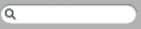

Search Entry
============

The next example, was found by trawling the internet, 05search_entry.py 

Script 05search_entry.py
------------------------

Most of the image data is not shown.

.. literalinclude:: ../examples/05search_entry.py
   :lines: 14-15, 53-83

This will create a special entry, resembling the mac search element. Once 
again the image is loaded as encoded data, this time the programmer uses the gif 
property to make multiple images. Look at the PhotoImage lines of code at the 
format property. The programmer is altering the entry widget, using the 
PhotoImage alias names "search1" rather than the s1 variable. ::

   s1 = PhotoImage("search1", data=data, format="gif -index 0")
   #                .......
   style.element_create("Search.field", "image", "search1",
   #                     ^^^^^^^^^^^^             .......
      ("focus", "search2"), border=[22, 7, 14], sticky="ew")
   style.layout("Search.entry", [
      ("Search.field", {"sticky": "nswe", "border": 1, "children":
   #    ^^^^^^^^^^^^
         [("Entry.padding", {"sticky": "nswe", "children":
               [("Entry.textarea", {"sticky": "nswe"})]
         })]
      })]
   )

Compare its layout to that of a normal entry widget. ``Entry.field`` was
replaced by ``Search.field``.::

   St.layout('TEntry')
	[('Entry.field',
	{'border': '1',
		'children': [('Entry.padding',
		{'children': [('Entry.textarea', {'sticky': 'nswe'})],
			'sticky': 'nswe'})],
		'sticky': 'nswe'})]

The other item to note is how he deals with the border width. Originally it 
was 1 all round, now it is ``border=[22, 7, 14]``. This follows the same 
convention as used for padding found in `"Tkinter 8.5 reference: a GUI for Python" 
<https://anzeljg.github.io/rin2/book2/2405/docs/tkinter/tkinter.pdf>`_, the 
left side is 22 and the right side 7 meanwhile top and bottom sides are 14. 
Check out table 05padding_border_layout.csv.

Table 05padding_border_layout.csv
---------------------------------

.. csv-table:: Padding and Border Layout
   :file: ../tables/05padding_border_layout.csv
   :header-rows: 1
   :widths: 10, 10, 10,10,10

Since we are using the normal interactive states of the entry widget, no 
additional programming is required as was necessary for the label example. 
Using our newly acquired image decoding skills we can see how the border 
layout numbers are derived. 22 pixels clears the tail of the magnifiying glass, 
7 pixels clears the corner and the top clearance, whilst 14 pixels clears the 
right hand end. 

.. sidebar:: Entry has Width but no Height

   Entry has an option for width, but nothing for height, so the programmer 
   felt safe. Checking on the textarea elements we can only set font and 
   width, so he was justified.

On the face of it, this widget can be widened horizontally, but there is no 
way we can extend it vertically without creating a strange looking 
magnifiying glass. 

When substituting an image for a border ensure there is a section that can 
be repeated on complementary sides, that is normally repeated both left and 
right, also top and bottom. 

We should now be able to understand how to manage themes. When we use a simple 
style change the affected widgets must have that style property that is cross 
referenced to Style.configure. When a theme change is made affected widgets 
require no such reference, therefore the reference used in the style changes, 
such as "search1" in 05search_entry.py, is appropriate to a style change. 
Below we shall use class names, once a style has been tested and 
is ready to be part of the customised theme we will use just "TButton" rather 
than "new.TButton" say, then all buttons would be altered by the style change 
within that themed script. 
