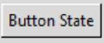

Standard Themes in ttk
======================

The 4 themes common to tkinter can be found where your python program is 
installed under the directory python36/tcl/tk8.6/ttk. They are listed with 
their own name plus"Theme" suffixed with ".tcl", apart from default which is 
listed as defaults.tcl. 

* **altTheme.tcl**
* aquaTheme.tcl
* **clamTheme.tcl**
* **classicTheme.tcl**
* **defaults.tcl**
* vistaTheme.tcl
* winTheme.tcl
* xpTheme.tcl

.. topic:: Viewing the Theme files

   There are obvious differences between the tcl and python languages
   but we can recognise some commands such as map and configure, we can also 
   spot the element and state names. A new part of the mix is when we look at 
   the OS specific themes, such as aqua or vista, they have variables that are 
   system dependant. Even so we should be able to recognise how some of our 
   scripts will respond. 

It would seem that the common themes allow us to modify 
all the components and elements and are able to give the widest possible 
support to any style alterations we wish to make. Contrast what happened
when we tried to modify one of the OS dependant themes and we required a 
less straightforward approach in :ref:`02Entry.py<02Entry.py>`. On the 
other hand the OS specific themes look up-to-date and ready to use as is. 

.. |alt| image:: ../figures/alt_but.jpg
   :width: 170px
   :height: 63px

.. |clam| image:: ../figures/clam_but.jpg
   :width: 170px
   :height: 78px

.. |classic| image:: ../figures/classic_but.jpg
   :width: 170px
   :height: 65px

.. |vista| image:: ../figures/vista_but.jpg
   :width: 170px
   :height: 63px

Buttons Created in Standard Themes
----------------------------------

.. table:: Using 03state_themes.py in ``selected`` State

   +-----------+-----------+-----------+-----------+----------+
   |    alt    |    clam   |  classic  |  default  |   vista  |
   +===========+===========+===========+===========+==========+
   |   |alt|   |   |clam|  | |classic| | |default| |  |vista| |
   +-----------+-----------+-----------+-----------+----------+

So far we have seen that the ttk themes achieve uniformity across all widgets, 
by using common changes on dynamic states, also by using the same element 
name within a widget or from widget to widget. A third aid to uniformity is 
by using using descriptive colour aliases rather than the colour names or 
hash values.

As stated at the beginning there are remarkably few instances of the more 
interesting style changes found when trawling the internet. Up until this 
point most of the examples could have been made referring `"Tkinter 8.5 
reference: a GUI for Python" <https://anzeljg.github.io/rin2/book2/2405/docs/tkinter/tkinter.pdf>`_.
The few instances I did find that displayed rounded corners and shadow 
effects I will reproduce here.
