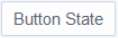
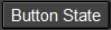
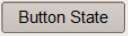
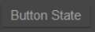
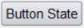

Ttkthemes
=========

.. sidebar:: Ttkthemes

   At the time of writing Ttkthemes was release 2.1.0 since then it has been
   updated, but the main themes should still be present.

Now would be a good a time as any to inspect what ttkthemes has to offer. 
Apart from the interface to python most is written in TCL scripting language. 
We can take stock of the themes on offer, most work with gif images, that are 
used as a substitute for the border part of the relevant widget. Almost all 
ttkthemes use one of the 4 common themes as a parent. It is interesting to 
note that Aquativo uses coded images, whereas the black theme has no images. 
Three themes use png images, but these are only usable with tkinter 8.6 and 
above. Finally most images are quite small, about 30 by 30 pixels, apparently 
with corners of one or three pixels radius - what apparent? Yep there is no 
actual curved line, though it looks like there are corners there.

.. |aquativo| image:: ../figures/aquativo.jpg
   :width: 102px
   :height: 32px

.. |elegance| image:: ../figures/elegance.jpg
   :width: 105px
   :height: 41px

.. |keramik| image:: ../figures/keramik.jpg
   :width: 112px
   :height: 40px

.. |keramik_alt| image:: ../figures/keramik_alt.jpg
   :width: 112px
   :height: 40px

.. |kroc| image:: ../figures/kroc.jpg
   :width: 127px
   :height: 38px

.. |radiance| image:: ../figures/radiance.jpg
   :width: 143px
   :height: 36px

.. |ubuntu| image:: ../figures/ubuntu.jpg
   :width: 143px
   :height: 36px

.. |winxpblue| image:: ../figures/winxpblue.jpg
   :width: 110px
   :height: 31px

.. sidebar:: Buttons in selected state

   Look closely at the corners and the general appearance of the button, some
   have a flat look others look as though they have a curved look. (Radiance 
   and ubuntu are similar except that ubuntu uses png files).

============ ==============
 ttktheme     selected
============ ==============
 aquativo     |aquativo| 
 arc          |arc| 
 black        |black|
 clearlooks   |clearlooks|
 elegance     |elegance|
 equilux      |equilux|
 keramik      |keramik|
 keramik_alt  |keramik_alt|
 kroc         |kroc|
 plastik      |plastik|
 radiance     |radiance|
 ubuntu       |ubuntu|
 winxpblue    |winxpblue|
============ ==============

If you want to modify the gif images in an image editor there should be no 
great problem, provided you do not try converting to another format and back 
again. Use the image editor for small simple changes. When checking out or 
modifying an image pixel by pixel use PIL (Pillow), also remember that gif 
refers to its colours by a number 1 to 256, requiring special programming, 
it would probably be better to use png from the outset.

If you were to install ttkthemes it is easy to switch between the normal 
themes and ttkthemes. Running the standard ttk Style module excludes ttkthemes, 
however you can load up ttkthemes with the following part script::

   .....
      try:  
         import ttkthemes as ts 
         self.s = ts.themed_style.ThemedStyle()
      except (NameError, AttributeError):
         self.s = Style()
   .....

then any normal command used by Style can be used unchanged, providing we use 
the same prefix system, in our case ``self.s.``, so 
``list(sorted(self.s.theme_names()))`` would work for both the standard themes 
and the ttkthemes.

When comparing the script of a ttktheme with a standard theme the first 
obvious difference is that we are loading the image files and using photo 
(PhotoImage in tkinter) on all the images, which can then be 
referred to by their image name without the gif or png suffix. Secondly we
have a theme create clause::

   namespace eval ttk::theme::clearlooks {

      package provide ttk::theme::clearlooks 0.1

      proc LoadImages {imgdir {patterns {*.gif}}} {
         foreach pattern $patterns {
            foreach file [glob -directory $imgdir $pattern] {
                set img [file tail [file rootname $file]]
                if {![info exists images($img)]} {
                    set images($img) [image create photo -file $file]
                }
            }
         }
         return [array get images]
      }

      variable I
      array set I [LoadImages \
                     [file join [file dirname [info script]] clearlooks] *.gif]
   ....
       ttk::style theme create clearlooks -parent clam -settings {

.. seealso:: 

   We will be using a standalone theme in python in the next chapter -
   the general layout is very similar to the tcl version - just that the 
   grammar changes.
   
Thereafter the ttkthemes closely follow the standard themes by first loading 
up the colour aliases, then setting the general settings using configure, 
followed by mapping the general states. From thereon the themes configure and 
map out the individual widgets, often the simple widgets are left out in which 
case the parent theme's widgets are used. The images are loaded using ``image
$I(image_filename)`` as opposed to ``"image", 'image_filename'`` in python.::

   ttk::style element create Button.button image [list $I(button-n) \
   
   "Button.button": {"element create":
            ("image", 'button-n',

The padding and border sizes would be shown as::

	-padding {6 2 6 2} or -border {22 7 14} 

compared to python::

	padding = [6, 2, 6, 2] or border=[22, 7, 14]

After all that we see that ttkthemes show one or two major differences to the 
standard themes - all states require their own separate images for each widget, 
which if properly used allows a more striking effect. Check some of the images 
- you may notice that a pressed image is the same as a normal image except 
that it has been inverted (this is often the case where a button has a simple 
gradient). Some themes could be easily adopted as they stand, or used 
as examples for certain effects. 

One other point, some widgets are made from two or more assemblies of 
components and elements. Each assembly will therefore require its own separate
image. For instance Button is simple and needs only one image per state, 
whereas combobox requires both the main body "combo" and the arrow 
"comboarrow" assemblies as separate images per state.

So once you are aware of how the themes work you may decide to devise your own. 
It takes quite a bit of time but is relatively straighforward.
