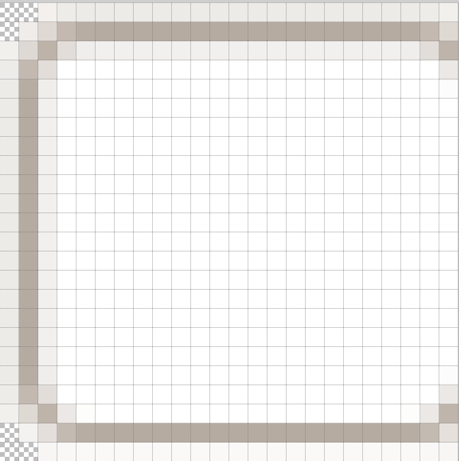
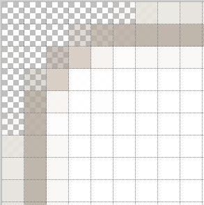
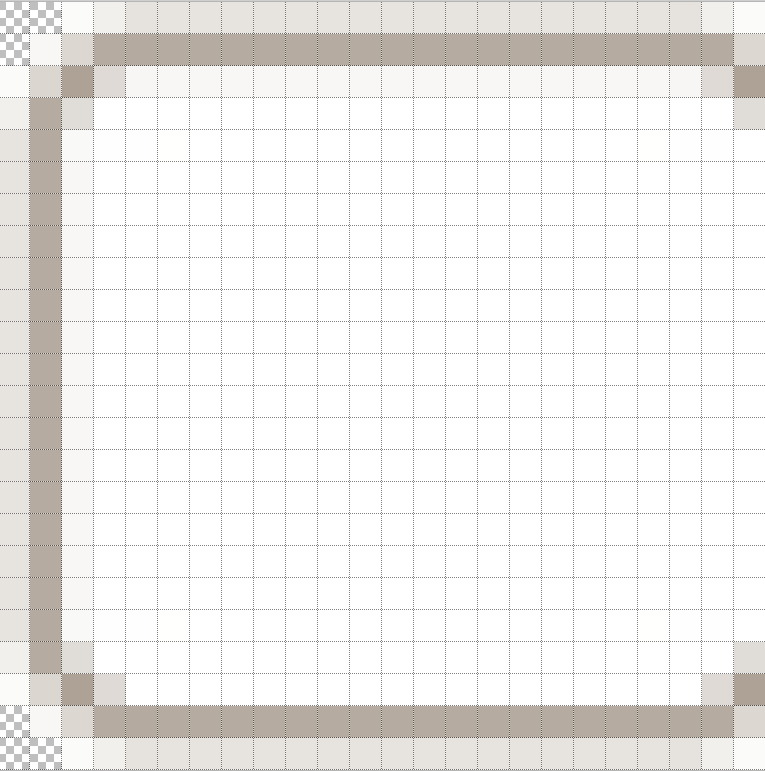

Ubuntu Combobox
===============

.. |comboa| image:: ../figures/08comboarrow_large.png
   :width: 80
   :height: 120

.. table:: combo-n.png and comboarrow-n.png

   ============================== ==============================
   |combo|                        |comboa|
   ============================== ==============================

Let's start with our old faithful - it shouldn't hold any surprises, just 
kidding.

Load comboarrow-n.png and combo-n.png into our image editor. This gives us
the sizes, layout and main colours without too much trouble. We are going to
create two files based on 08rounded_rectangle.py and 08rounded_rectangle_both.py.

If we tackle combo-n.png first, left and right sides seem to be mirror images,
just that the righthand side seems to have two columns cropped. The next 
question is whether the surrounding border consists of one, two or three 
frames. If three then we would see a shadow on the fourth row. We probably 
have a dark and a light frame, the shadow and highlight at the third column
and row we can add by hand. Next check that the central area is all one 
colour - since this is the text area this is not surprising. There are 
two areas of transparency at the uncropped corners.

The widget is 26 wide x 24 high (allowing for cropping, the outer and inner 
frames are #EDEBE7, #B6ABA0 whilst the central area is white. (The first
attempt used 2 pieslices, only joining the inner border). It looks alright
so let's reduce the image size ``img = img.resize((w,h),Image.LANCZOS)``. 
Looking at the result the corner definitely needs modification, the transparent 
area is way too large, and the outer antialias pixels have an alpha content 
that the original did not have. 

.. |combob| image:: ../figures/combo_corner.png
   :width: 114
   :height: 114

.. table:: Comparing Corners

   ================ ================
   Original          1st Attempt
   |combob|           |a|
   ================ ================

The outer frame needs to be joined by an arc this will reduce the background 
coloured corner area. Change the corner background to white seems a safe bet. 
We are going to modify the corner to have 3 pieslices. 

.. |b| image:: ../figures/09combob.png
   :width: 128
   :height: 128

.. |c| image:: ../figures/09comboc.png
   :width: 128
   :height: 128

.. |d| image:: ../figures/09combod.png
   :width: 128
   :height: 128

.. |e| image:: ../figures/09comboe.png
   :width: 128
   :height: 128
.. table:: Comparing Corners (more attempts)

   ================ ================ ================ ================
   2nd attempt       3rd attempt      just frame       4th attempt
   |b|               |c|               |d|               |e|
   ================ ================ ================ ================

Look at the 2nd attempt - it's better but something is still not right, the 
original has a straight diagonal ours kinks outwards, this was hidden by the 
alpha problem. Reduce the gap from 5 to 4 and run again. (I saved the 
output to a new image). 

Look at the colour. When the filter is applied we know that colour is 
changed, the frame becomes lighter and the adjacent pixels become darker, 
the question is can we estimate by how much. 

Checking combo-n.png again we see that there are two adjacent rows of 
lighter colour beside the upper and lefthand part of the frame. Let's try
adding both these colours to the frame colour, then draw the darkened frame
using a white background. Outer colour (237,235,231), inner colour (242,240,
239) and frame colour (182,171,160) would give a start colour (151,136,120).

Using just the frame with no outer frame left too many white pixels in the 
corner, but all is not lost since we now have a frame colour that is too dark.
This simplifies finding the frame start colour. 

All we need do now is make the corner near white pixels transparent, whiten 
the righthand and bottom inner sides and crop the righthand side. As you can 
see these actions have been left until after the image is resized.

   Constructed Combo 

Now for comboarrow-n.png, it has a main frame along the sides, the corners 
have a diagonal that bulges outward. There are highlights along the upper
and lefthand sides, the other two sides are shaded. The main area has a single
background colour, which helps in assessing what the starting frame colour was.
Lastly we have a downward pointing arrow, which we have already made, even
the antialias pixels.

Based on the script 08rounded_rectangle.py we should be able to create the 
frame, then set the arrow, place the transparent corner elements and draw 
the highlights. Using a simple border the gap size should be 5. The inner 
area is (246,244,242), the righthand shadow is (238,235,231) and the frame
is (215,208,200). We can therefore guess that the frame starting colour 
should be (207,199,189). 

The resulting rectangle looks good, but the final frame colour is not quite
right, which is not too surprising as we were using a different frame colour
to that found in combo, let's use that one. The result is slightly out, but 
within reason. Add the arrow, make the near white corner pixels transparent 
and add the highlights.

.. figure:: ../figures/09carrowlarge.png
   :width: 128
   :height: 192
   :align: center

   Constructed Comboarrow 

Afterwards compare the two widgets.

.. container:: toggle

   .. container:: header

       *Show/Hide Code* 09compare_combobox.py

   .. literalinclude:: ../examples/09compare_combobox.py

They compare well, if anything the comboarrow has a slightly darker frame,
the arrow appears off centre so if we were to create from scratch, rather 
than copy it, it would be better to change the image width to 25, say, and 
run again.

.. tip:: Remember to click on the arrows of the two widgets.
