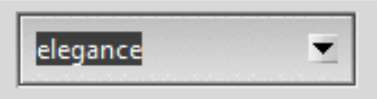
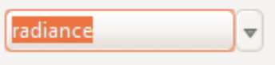
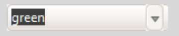
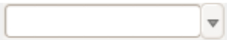

Combobox
========

Let's see if we can pin the above on an example or two. First let us change 
the combobox on both our test themes to that used by radiance. On my computer 
with Windows 10 and python 3.6, the combobox from elegance aka green looks 
like 

.. container:: toggle

   .. container:: header

       *Show/Hide Code* 06show_green_combo.py

   .. literalinclude:: ../examples/06show_green_combo.py

whereas radiance looks like

.. container:: toggle

   .. container:: header

       *Show/Hide Code* 06show_radiance_combo.py

   .. literalinclude:: ../examples/06show_radiance_combo.py

Say we prefer the radiance combobox and want to run it in our green theme.

Compare the tcl files, radiance.tcl consists of the following ::

        ## Combobox.
        #
        ttk::style configure TCombobox -selectbackground

        ttk::style element create Combobox.downarrow image \
            [list $I(comboarrow-n) \
                 disabled $I(comboarrow-d) \
                 pressed $I(comboarrow-p) \
                 active $I(comboarrow-a) \
                ] \
            -border 1 -sticky {}

        ttk::style element create Combobox.field image \
            [list $I(combo-n) \
                 {readonly disabled} $I(combo-rd) \
                 {readonly pressed} $I(combo-rp) \
                 {readonly focus} $I(combo-rf) \
                 readonly $I(combo-rn) \
                ] \
            -border 4 -sticky ew

whereas green.tcl looks like ::

        # Combobox
        #
        ::ttk::style element create Combobox.field image \
            [list $I(combo-active) \
                {readonly} $I(button-active) \
                {active}   $I(combo-active) \
            ] -border {9 10 32 15} -padding {9 4 8 4} -sticky news
        ::ttk::style element create Combobox.downarrow image \
            [list $I(stepper-down) disabled $I(stepper-down)] \
            -sticky e -border {15 0 0 0}

.. sidebar:: Image File Types

   Both these themes use gif files, since we are not changing the images it
   suits us to stay with this format.

In both cases the combobox uses **element create** for the components 
*field* and *downarrow*. Radiance has fewer images, which luckily do not have a 
name clash with any of the green image names. It seems that we should be able 
to replace the relevant script parts and copy all the radiance image files 
to the green image directory. When this is done we can test with one of our 
files such as 06theme_notebook.py, or 06combobox_text_theme.py. 

Both scripts have a combobox with theme selector, our green theme should be 
in the dropdown list, go on select it.
 
This should look something like:- 

which as you can see on my windows box is not quite the same as the radiance 
combobox, look at the position of the down arrow. Check green.tcl and see that 
there is no parent theme in the line::

	::ttk::style theme create green -settings {

unlike radiance.tcl where we find ::

	ttk::style theme create radiance -parent clam -settings {

since elegance (aka green) was probably created in Linux the normal theme would 
have been default. Using default as the parent theme the combobox is not 
altered enough - let's try the clam theme instead - ahh far better.

.. image:: ../images/green_cb_post.jpg
   :width: 342px
   :height: 72px
   :align: center

That wasn't too bad was it? Now for the orange theme, taken from orange.py . ::

   "Combobox.field": {"element create":
            ("image", 'combo-n',
                ('readonly', 'active', 'combo-ra'),
                ('focus', 'active', 'combo-fa'),
                ('active', 'combo-a'), ('!readonly', 'focus', 'combo-f'),
                ('readonly', 'combo-r'),
                {'border': [4, 6, 24, 15], 'padding': [4, 4, 5],
                 'sticky': 'news'}
            )
        },
        "Combobox.downarrow": {"element create":
            ("image", 'arrow-d', {'sticky': 'e', 'border': [15, 0, 0, 0]})
         },

We have to be careful not to overwrite orange combo- image files with our new 
files imported from radiance, give them a new designation, say ``combor-`` so the 
old files remain until all has been tested. Also we have to ensure that we have 
the python corresponding to the tcl in radiance.tcl. 

It's probably best to run a python test file such as 06widget_orange_test.py. 

.. _06widget_orange_test.py:

.. container:: toggle

   .. container:: header

       *Show/Hide Code* 06widget_orange_test.py

   .. literalinclude:: ../examples/06widget_orange_test.py
      :emphasize-lines: 25-43
      :linenos:

.. sidebar:: What about line 44?

   Those final brackets ``})`` close off ``style.theme_create('test',``
   ``parent="clam", settings={`` and should not be included since orange.py 
   already has its own theme_create.
   
   However we will need a finishing comma ``,`` to allow continuation to the 
   next section.

Copy the necessary radiance image files to our orange images directory, 
renaming as necessary. When running theme_create you can experiment 
having the parent directory as default instead of clam - the results should 
be similar to those given in the green.tcl test. The resulting python script 
within theme_create (lines25-43) can be used to overwrite the combobox part of orange.py. 
Remember to change any ``combor`` to ``combo``. We can test whether orange.py is correct using 06combo_orange.py. 

.. container:: toggle

   .. container:: header

       *Show/Hide Code* 06combo_orange.py

   .. literalinclude:: ../examples/06combo_orange.py

.. tip:: If the down arrow of the orange combobox is misplaced, as we saw
   above for the green theme, find the theme_create line in the orange theme
   and change "default" to "clam" which sorts out combobox but may have
   side effects on other widgets.

When working with radiance note how often the widgets have their images added 
by using "element create" - there are not so many widgets that require a 
layout and mapping. This bodes well for any future designs we may have since 
this is a relatively simple construct. 
