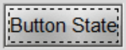
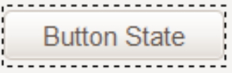

Customising Button Focus
========================

.. table:: Comparing Focus Displays

   ================ =======================
   elegance button   |efoc|
   radiance button   |rfoc|
   ================ =======================

Onto our next exercise - let us create a button where the focus state's dashed 
line surrounds the button. In radiance we see that the button part of the 
script looks like.

.. code-block:: tcl
   :emphasize-lines: 4

   ## Buttons.
   #
   ttk::style configure TButton -width -11 -anchor center
   ttk::style configure TButton -padding {10 0}
   ttk::style layout TButton {
      Button.focus -children {
         Button.button -children {
            Button.padding -children {
               Button.label
            }
         }
      }
   }

followed by an element create, which we can ignore as it does not concern 
focus. The first configure clause can be ignored as it concerns itself with 
size and anchor, however the second configure is interesting. Let's just 
insert this clause into the green.tcl button widget.

.. code-block:: tcl
   :emphasize-lines: 3

   # Button
   #
   ttk::style configure TButton -padding {10 0}
   ttk::style layout TButton {
      Button.background
      Button.button -children {
         Button.focus -children {
            Button.label
         }
      }
   }

Testing this we see no effect which should not be surprising when we see that 
at this stage the button widget has no element named padding. We can prove 
this by finding out the component and their element names from an active session. 
We can change the button layout of the green theme by adding ``Button.padding -children {`` 
and test again. It works! 

.. container:: toggle

   .. container:: header

       *Show/Hide Code* altered green Button

   .. code-block:: tcl
      :emphasize-lines: 1, 5

      ttk::style configure TButton -padding {10 0}
      ttk::style layout TButton {
         Button.focus -children {
            Button.button -children {
               Button.padding -children {
                  Button.label
               }
            }
         }
      }

Test the green button

.. container:: toggle

   .. container:: header

       *Show/Hide Code* 06show_green_button.py

   .. literalinclude:: ../examples/06show_green_button.py

Let's try it out on the orange theme. Checking out the button we see we have 
a configure and a layout that already has padding, so hopefully it works with 
only minimal changes. First we add padding to configure. When testing this 
does not work, so swop the Button.button and Button.padding positions in
the layout.

.. container:: toggle

   .. container:: header

       *Show/Hide Code* original orange Button

   .. code-block:: python
      :emphasize-lines: 4,5

        "TButton": {
            "configure": {"width": 10, "anchor": "center"},
            "layout": [
                ("Button.button", {"children":
                    [("Button.focus", {"children":
                        [("Button.padding", {"children":
                            [("Button.label", {"side": "left", "expand": 1})]
                        })]
                    })]
                })
            ]
        },

.. container:: toggle

   .. container:: header

       *Show/Hide Code* altered orange Button

   .. code-block:: python
      :emphasize-lines: 4,5

      "TButton": {
         "configure": {"width": 10, "anchor": "center", "padding": [10, 0]},
         "layout": [
            ("Button.focus", {"children":
               [("Button.button", {"children":
                  [("Button.padding", {"children":
                     [("Button.label", {"side": "left", "expand": 1})]
                  })]
               })]
            })
         ]
      },

This works. The conclusion is that one may have to test the configure and 
layout options with a small script such as 06widget_orange_test.py adapted to 
suit your needs. When the orange script is ready test the orange button.

.. container:: toggle

   .. container:: header

       *Show/Hide Code* 06show_orange_button.py

   .. literalinclude:: ../examples/06show_orange_button.py

When dealing with states it helps to keep in mind what will be required in 
the program in relation to that widget. It certainly helps to view how various 
themes tackled that problem. Some widgets can operate with a bare minimum of 
states, others may require quite a few, but don't forget that some themes use 
the common settings to help display states without the need for additional 
images.
