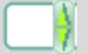

Customising Spinbox
===================

Since spinbox is a johnny-come-lately, unless you have Python 3.7 or greater, 
this won't work. 

We are going to use a spinbox widget when creating the lime theme later, but 
this throws up a layout problem similar to the examples above. Spinbox looks 
similar to the combobox, except that there are two arrows as opposed to the 
single down arrow in combobox. As a first thought there should not be an 
awful lot of difference between the two, apart from arrow size. 

When we worked with combobox we found that just using the clam theme solved
our spacing problem between the down arrow and the text border. Examples of
the spinbox working in one of the standard themes is shown later, see 
:ref: `Spinbox Standard Themes`. The effect we wanted with combobox is to place the
arrow directly adjacent to the text area, but in spinbox the arrows are all
within the border of the text area. Apart from plastik and keramik there are
no spinbox examples in ttkthemes, so information is a little sparse. 

Let us go ahead and create our own spinbox from elements from the lime theme,
first of all with no special configuration apart from using the clam theme
as parent. Use the file 06spinbox_nofrills.py, which is similar to that used
for combobox above, import the lime images for the combobox text body, and 
the up and down arrows. The arrows have already been reduced in size.

.. _spin-nofrills:

   
   Spinbox - no frills
   Look closely at the right hand side. 

The border of the text area has extended beyond the arrow area. There 
probably is a difference in the configurations used in the clam combobox and 
spinbox.::

   [('Combobox.downarrow', {'side': 'right', 'sticky': 'ns'}), 
     ('Combobox.field', {'expand': '1', 'sticky': 'nswe', 'children': 
       [('Combobox.padding', {'sticky': 'nswe', 'children': 
         [('Combobox.textarea', {'sticky': 'nswe'})]})]})]

   [('Spinbox.field', {'side': 'top', 'sticky': 'we', 'children': 
      [('null', {'side': 'right', 'sticky': '', 'children': 
         [('Spinbox.uparrow', {'side': 'top', 'sticky': 'e'}), 
            ('Spinbox.downarrow', {'side': 'bottom', 'sticky': 'e'})]}), 
               ('Spinbox.padding', {'sticky': 'nswe', 'children': 
                  [('Spinbox.textarea', {'sticky': 'nswe'})]})]})]

Compare this with those derived from the plastik theme.::

   [('Combobox.field', {'sticky': 'nswe', 'children': 
      [('Combobox.downarrow', {'side': 'right', 'sticky': 'ns'}), 
         ('Combobox.padding', {'expand': '1', 'sticky': 'nswe', 'children': 
            [('Combobox.textarea', {'sticky': 'nswe'})]})]})]
   
   [('Spinbox.field', {'side': 'top', 'sticky': 'we', 'children': 
      [('Spinbox.buttons', {'side': 'right', 'sticky': 'nswe', 'border': '1', 'children': 
         [('null', {'side': 'right', 'sticky': '', 'children': 
            [('Spinbox.uparrow', {'side': 'top', 'sticky': 'e'}), 
               ('Spinbox.downarrow', {'side': 'bottom', 'sticky': 'e'})]})]}), 
               ('Spinbox.padding', {'sticky': 'nswe', 'children': 
               [('Spinbox.textarea', {'sticky': 'nswe'})]})]})]

The main difference between the layouts of the clam and plastik spinboxes is
the addition of the `buttons` component positioned on the righthand side of 
the `field` component. Normally this image is totally transparent but when 
the arrows are pressed a highlight is shown. We could consider `buttons` to 
be equivalent to a frame - but what is the null component doing then?

Running the two alternative 06spinbox_plastik_layout.py and 
06spinbox_custom_layout.py we can see whether we can improve the appearance
or not. Unless we wish to utilise the highlight method, plastik produced no
better result. 

Reverting back to the nofrills, using the clam layout, change the setting 
used for padding in Spinbox.field (element create) from 1 to 0, save and run. 
This eliminates the extended field component, so we can use this later on in 
the lime theme. 

.. container:: toggle

   .. container:: header

       *Show/Hide Code* 06spinbox_nofrills.py

   .. literalinclude:: ../examples/06spinbox_nofrills.py

