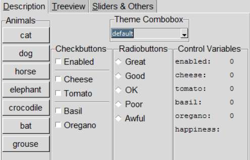

Themed notebook
===============

Let us refresh our memory of how a widget looks in the various themes, try 
06theme_notebook.py, which has most of the important widgets together with a 
theme selector. It has been set up to incorporate ttkthemes. The first tab 
contains most of the normally used widgets, the second tab has a treeview 
with scrollbars, in order to see the scroll bars work it may be necessary to 
adjust the height and width using the sizegrip, the third tab has the scale 
and progress bars. Try using the checkbutton *Enabled*, this will change the 
state to disabled and back again for most of the widgets.

There may be widgets that appeal in different themes, it should be 
possible to mix and match to your taste provided that you copy widget 
definitions together with any referenced images.

.. container:: toggle

   .. container:: header

       *Show/Hide Code* 06theme_notebook.py

   .. literalinclude:: ../examples/06theme_notebook.py

