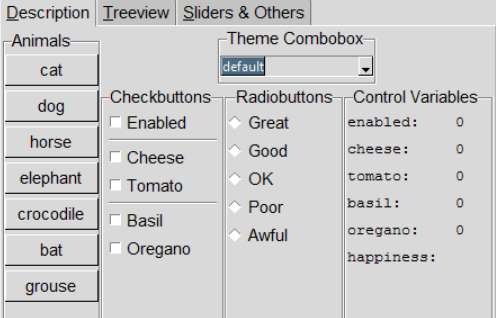

Themed notebook
===============

Let us refresh our memory of how a widget looks in the various themes, try 
06theme_notebook.py, which has most of the important widgets together with a 
theme selector. It has been set up to incorporate ttkthemes. The first tab 
contains most of the normally used widgets, the second tab has a treeview 
with scrollbars, in order to see the scroll bars work it may be necessary to 
adjust the height and width using the sizegrip, the third tab has the scale 
and progress bars. Try using the checkbutton *Enabled*, this will change the 
state to disabled and back again for most of the widgets.

There may be widgets that appeal in different themes, it should be 
possible to mix and match to your taste provided that you copy widget 
definitions together with any referenced images.

Also compare the difference an image format makes. Some of the ttkthemes use 
gif others png. The ones using png can use the RGBA format, with varying 
degrees of
transparency. Radiance uses gif whereas Ubuntu uses png, look closely where a
widget elements adjoin or overlap each other. 

.. figure:: ../figures/06radiance_slider.png
   :width: 136px
   :height: 107px
   :align: left
   
   This is the radiance Scale.
   Look where the triangular thumb overlaps the trough, top and bottom are pale
   grey areas corresponding to the empty thumb areas.

.. figure:: ../figures/06ubuntu_slider.png
   :width: 137px
   :height: 105px
   :align: right
   
   On the ubuntu Scale where the triangular thumb overlaps the trough we see
   the trough, so the transparent areas of the thumb have been recognised.

.. tip:: Don't Get Too Excited

   This works because the original scripts used in tcl, photo and style nailed
   it, Python might lose it on older versions of Photoimage. 
   When there is no transparency available choose the colour of the overlap 
   to blend in with the background or the element it overlaps, in most cases
   default colours should work.

.. raw:: html

   

   

   <b><i> Show/Hide Code </i> 06theme_notebook.py </b>

.. literalinclude:: ../examples/06theme_notebook.py

.. raw:: html

   

|

