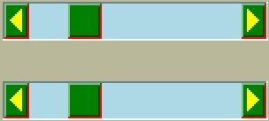

===============
Style.configure
===============

After all that we now know the class and element names for all widgets in 
our chosen theme. Using this information we can use Style.configure() to
change the widgets. 

As a first example let's change the button widget, we want to alter the text 
properties, foreground, background and/or font. Foreground and background are 
both colours which can be expressed as names or a six figure hexadecimal hash.
Use 02colour_codes.py to show the colour and the alternative code style. 

.. sidebar:: Colour Names

   Colour names in tkinter are based on those used by TCL/TK 
   `colors — symbolic color names recognized by Tk <https://tcl.tk/man/tcl8.6/TkCmd/colors.htm>`_, 
   note TCL is using RGB tuples that must first be converted to hash values 
   to be valid in tkinter. 

Haven't we got all the element names for the button already? No, then we'll 
have to use the right component name in our query (and it wasn't highlight). 
Use your interactive session, and if you were on the right track you should 
get the answer together with 11 other elements. Now you are no longer limited 
to just foreground, background and font. 

When using Style.configure we require a reference to the style change using 
the format *newStyleName.oldStyleName*, where oldStyleName corresponds to 
our class name, in this case TButton. Normally we choose a descriptive name 
for the newStyleName, so for the button widget we can write ::

	s.configure('green.TButton', foreground='green')
   
	b = ttk.Button(self, text='Friday', style='green.TButton')

The `style` property of Button references the style name set up in 
Style.configure. The configuration name can be built on a previously 
named style, so if we wanted a red background we could do this using
red.green.TButton say. If we need to configure another element (background)
just list the extra element after the handle name.::

	s.configure('green.TButton', foreground='green')
	s.configure('red.green.TButton', background='red') # our compound style
   
	b = ttk.Button(self, text='Friday', style='red.green.TButton') 
	# now try changing both style and configure from red.green.TButton to 
   # mix.TButton

We can modify /examples/01two_buttons.py to incorporate the colour changes, 
we should see something like /examples/02two_coloured_buttons.py. 

.. container:: toggle

   .. container:: header

       *Show/Hide Code* 02two_coloured_buttons.py

   .. literalinclude:: /examples/02two_coloured_buttons.py

Two Coloured Buttons
--------------------

.. figure:: /figures/02two_coloured.jpg
   :width: 154px
   :height: 185px
   :align: center

.. topic:: Button Background Colour

   Did you notice that the background colour on the second ttk button changed 
   as the mouse moved over it, also when the button was pressed. The widget 
   inherits all expressly styled properties not overwritten by our style 
   changes, in our case shades of grey from the parent theme (default). 

.. _02Scrollbar:

Horizontal Scrollbar - Style
----------------------------

.. figure:: /figures/02scrollbar.jpg
   :width: 171px
   :height: 83px
   :align: center
   
   Classic theme

.. sidebar:: Standalone Scrollbar

    Scrollbars are normally associated with another widget, so normally one 
    uses grid or pack for the layout manager. As this is a standalone scrollbar
    use the place layout manager.

Changing the button was easy wasn't it, feel like a challenge? 
Let's try modifying a 
horizontal scrollbar, use the layout and element_options to find all likely 
element candidates for the classic theme. We need to use **place** and **set** 
(instead of pack or grid) when displaying the widget or else the scrollbar 
remains squashed and you can't see your results. If we make the scrollbar 
green with a light blue trough the result should look like 02scrollbar.py. 

.. container:: toggle

   .. container:: header

       *Show/Hide Code* 02scrollbar.py

   .. literalinclude:: /examples/02scrollbar.py

Creat a second scrollbar where the borderwidth is the default value, 
otherwise configure background and troughcolor the same as the first 
scrollbar. Check the arrows. 

There was not a great deal of difference to the 
button example, just that we had to remember to add the orientation to the 
configuration name. 

If you try one of the other themes alt, clam or default 
we have the additional options of arrowcolor and bordercolor, try out 
arrowcolor with yellow say and bordercolor with red. 
Classic has no arrowcolor or bordercolor options but if included 
then there is no reaction, not even a warning.

============== ============== ==============
    |scdef|     |scalt|         |scclam|
   default      alt             clam     
============== ============== ==============

The default theme has no bordercolor, whilst alt only changes the right hand 
and lower border parts of arrow and thumb, whereas clam changes all the 
borders including the grip colour.

.. container:: toggle

   .. container:: header

       *Show/Hide Code* 02scrollbar_theme.py

   .. literalinclude:: /examples/02scrollbar_theme.py

LabelFrame - Style
------------------

.. figure:: /figures/02labelframe.jpg
   :width: 139px
   :height: 450px
   :align: center

The last type of widget are those with auxiliary parts. Taking LabelFrame as 
an example, we would normally wish to modify the label part rather than the 
Frame. We can fill the frame with a tkinter coloured frame to show off the 
widget. The second labelframe, by contrast, has a coloured frame. It is 
important to emphasise that Style.configure calls either TLabelframe or
TLabelframe.Label, depending whether we wish to alter the label or the frame, 
but in both cases the `style` property only refers to TLabelframe with no 
suffix. This is illustrated in /examples/02labelframe.py.

.. container:: toggle

   .. container:: header

       *Show/Hide Code* 02labelframe.py

   .. literalinclude:: /examples/02labelframe.py

Treeview - Style
----------------

.. figure:: /figures/02treeview.png
   :width: 321px
   :height: 536px
   :align: center

.. sidebar:: Not a Pretty Blue?

   Remember to change the theme.

The next example 02treeview.py shows how to select a theme then apply some 
colour changes to the widget, this has two sets of colours so we can confirm 
which works best by first testing, then try uncommenting 'Heading' in line 
110 so that Treeview `style` reads 'Custom.Treeview.Heading '. The 
first part of the script displays the widget layout in a form that is easy 
to read - there probably is an easier way to do this! To view the colour 
changes we use 2 treeview widgets, the first has not been customised.

.. container:: toggle

   .. container:: header

       *Show/Hide Code* 02treeview.py

   .. literalinclude:: /examples/02treeview.py
      :linenos:

To show the layout I used a function, this was then compared to 
Pretty Print::

   >>> import pprint
   >>> import ttk
   >>> s = ttk.Style()
   >>> s.theme_use('default')
   >>> lay = s.layout('Treeview')
   
   >>> pprint.pprint(lay)
   [('Treeview.field',
   {'border': '1',
   'children': [('Treeview.padding',
                 {'children': [('Treeview.treearea', {'sticky': 'nswe'})],
                  'sticky': 'nswe'})],
   'sticky': 'nswe'})]

:Well: 

   That was much easier!

Entry - Style
-------------

.. _02Entry.py:

.. figure:: /figures/02entry.png
   :width: 173px
   :height: 42px
   :align: center

   Entry style - using the clam theme

.. sidebar:: Load a ttk theme

	Load a common theme such as clam, remember that if working in a windows or 
	mac environment it will not work as straightforwardly if the theme is not 
	changed to a ttk theme.

Generally try to keep it simple, try looking for an element that looks as 
though it should work, test it and see. Look at 02Entry.py. 

.. container:: toggle

   .. container:: header

       *Show/Hide Code* 02entry.py

   .. literalinclude:: /examples/02entry.py

.. sidebar:: Just an Exercise 

   There should normally be no need to change widgets while they are 
   operating with a windows or mac OS theme, so view this as an exercise, 
   usually to be avoided.

If we use the clam theme it should create a blue background, 
however if the clam theme is not used and you are running with windows or 
mac OS, then the Entry widget has to change by adding an element_create and 
adding the newly created element to layout. To find the correct element option, 
either check out `Changing Widget Colors <http://wiki.tcl.tk/37973>`_ or 
use queries on the layout and element_options, then we see that Entry.field has 
('bordercolor', 'lightcolor', 'darkcolor', 'fieldbackground') whereas 
Entry.textarea has ('font', 'width'). If you had used the element name 
background, as we did for Button, the Entry widget would not have reacted.

We are now in a position to change the element colour and size of any widget, 
but whenever the state changes, such as pressing the widget, it will revert 
to a style inherited from the parent theme, so the interaction of states and 
style will be our next topic.

Summary of Options
------------------

Below are 2 tables to show what is generally available to change, the first 
lists by widget and the options available, the second takes the option and
shows what is being changed. These are based on 
`Tk/Tcl8.6.11 Documentation <https://www.tcl.tk/man/tcl/TkCmd/contents.html>`_
select the **ttk::widgetname** then select **STYLING OPTIONS**.

.. raw:: html

   

   
<a>Show/Hide <b> Table </b> 02style_options.csv </a>

.. csv-table::
   :file: /tables/02style_options.csv
   :header-rows: 1
   :delim: ;
   :widths: 20, 190

.. raw:: html

   

|

.. Note:: 

   Not all the options are available to every theme, in general use one of 
   the standard themes alt, clam, classic or default for the most options.

.. tip:: Font Change

    See which style options include font, Entry and its siblings Combobox
    and Spinbox changes the font directly from the widget property, 
    not by style.

.. raw:: html

   

   
<a>Show/Hide <b> Table </b> 02style_option_change.csv </a>

.. csv-table::
   :file: /tables/02style_option_change.csv
   :header-rows: 1
   :delim: ;
   :widths: 20, 10

.. raw:: html

   

|
