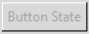
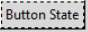

===========
Style.map()
===========

Every widget exists with a state that for some widgets can be directly 
changed by the user's actions, such as moving the mouse over the widget, or 
by selecting or pressing the widget. Whenever the state changes the widget 
changes in colour, relief and/or size thus providing the user feedback. Other 
states which are not being changed dynamically are changed by the program. 
States are a fundamental part of styles and themes.

.. seealso:: Buttons changing with state, remember :ref:`01two_buttons<Script 01two_buttons.py>` 
   at the end of the Basics chapter. 

03states.csv
^^^^^^^^^^^^

.. raw:: html

   

   
<a>Show/Hide <b> Table </b> 03states.csv </a>

.. csv-table:: 03states.csv
   :file: /tables/03states.csv
   :header-rows: 1
   :widths: 15, 150

.. raw:: html

   

|

All states also have an opposite condition in which the 
name is prefixed by an exclamation mark, so the opposite of ``disabled`` is 
``!disabled`` and not one of the other states, such as active.

Some widgets, such as Frame would hardly ever need a state other than the 
normal state, others such as Button are only really useful if they use several
different states. When programming with states be aware that a widget with 
no named state is in the "normal" state even though normal cannot be directly 
referenced, it is implicitly the state we have previously used when making simple changes 
to the widget with Style.configure. When we survey states some are never used, 
or as the captain of the Pinafore might say - hardly ever used.

.. |normal| image:: ../figures/normal.jpg
   :width: 89px
   :height: 33px

.. |active| image:: ../figures/active.jpg
   :width: 90px
   :height: 33px

.. |pressed| image:: ../figures/pressed.jpg
   :width: 88px
   :height: 34px

.. sidebar:: States for Default Button

   Other states such as alternate, background, invalid, readonly and selected
   look just the same as the normal state.

======== ============== 
 normal  |normal|
 active  |active|
disabled |disabled|
focus    |focus|
pressed  |pressed|
======== ============== 

We can determine what states are currently being used in a theme. Just as in 
the simple style change we need to know the class name and the element we 
are interested in.

.. topic:: Relief 

   Use your interactive session to check the Button components, we'll
   find relief lurking under Button.border - it's where we determine whether
   the widget will be displayed as flat, raised, sunken, groove or ridge.
   If we already knew that ``relief`` was the correct element name we can use it 
   directly.

.. figure:: /figures/03relief.jpg
   :width: 420px
   :height: 41px

   Relief Styles

So if we wished to find the situation for the relief element on a button we 
use Style.map() in the following manner::

   from tkinter.ttk import Style, Button
   >>>St = Style()
   >>>St.theme_use('default')
   >>>St.map('TButton', 'relief')
   [('!disabled', 'pressed', 'sunken')]

In this case the theme uses a compound state, in that the pressed state only 
applies when the button is not disabled, and the relief element becomes 'sunken'. 
These mapped states vary with both widget and theme. Within a theme we can 
have a common mapping::

	>>>St.theme_use('default')
	>>>St.map('TButton', 'background')
	[]

Weird it's showing nothing - but we know that the background, as used in text,
changed in our button examples, so how to find out what is going on.

.. sidebar:: "Background" is mapped with ``.`` 

   Ahha - now we can see that all widgets with a "background" element will 
   react in a similar way, so if you haven't done it see what happens when 
   you pass the cursor over our scrollbar example :ref:`02Scrollbar`.

Let's see if we have a common mapping working here::

   >>>St.theme_use('default')
   # '.' is the shorthand for common mapping
   >>>St.map('.', 'background') 
   # here we have two separate states being mapped 
   [('disabled', '#d9d9d9'), ('active', '#ececec')]

If we test for relief, which we looked at on button, with a common 
mapping we get an empty result::

	>>>St.map('.', 'relief')
	[]

Since the common and button mapping may have more than one state what happens 
if we query it without any elements::

   >>>St.map('.')
   {'background': [('disabled', '#d9d9d9'), ('active', '#ececec')],
   ^            ^
   'foreground': [('disabled', '#a3a3a3')]}
               ^                          ^
   >>>St.map('TButton')
   # added element name 
   {'relief': [('!disabled', 'pressed', 'sunken')]} 
   ^        ^                                     ^

.. Note:: The element name has been added with the extra curly brackets and 
   full colon. When we have 2 or more elements the parts are enclosed in 
   curly brackets.

Some of the behaviours and properties of ttk widgets are now a little more 
understandable when we use the common mapping system. If we are working with 
a widget such as label with no dynamic states, it makes no sense to send 
warning messages if a widget does not have that particular element or state. 
The other minor problem is that only widgets with the exact element name will 
react in a similar manner, so button has 'background', whereas entry has 
'fieldbackground' and must be programmed separately.

One way to change the properties of a widget is to expand upon our simple 
method, so the normal state is set by configure(), we can then set the other 
states using map(). This means that any single element could have several 
properties corresponding to more than one states. Related states should be 
listed with tuples. We can see this in the example above for common, we have 
an element called background with a list of two tuples, the first tuple is for 
the disabled state ('disabled', '#d9d9d9') and the second tuple 
('active', '#ececec') applies to the active state.

.. _03mapbutton:

Script Map Button
^^^^^^^^^^^^^^^^^^

.. figure:: /figures/03map_button.jpg
   :width: 154px
   :height: 92px
   :align: center

In the example 03map_button.py 

.. literalinclude:: /examples/03map_button.py
   :lines: 14-21

we have configure which sets up the general widget appearance then uses map 
to set the active state by changing the background colour. Both configure and 
map utilise the same reference found in Button's `style` property option. 

We randomly select from 6 colours, to set the active colour 
we first find the RGB colour using winfo_rgb(color) - color is the variable 
- then we change each of the RGB components and finally convert back to the 
hash value. Simple colour manipulations are straightforward in the RGB scheme. 
A further frill is that we use a white foreground for a dark background and 
a black foreground for a yellow background.

.. container:: toggle

   .. container:: header

       *Show/Hide Code* 03map_button.py

   .. literalinclude:: /examples/03map_button.py

Script Combobox in a Theme
^^^^^^^^^^^^^^^^^^^^^^^^^^

.. figure:: /figures/03map_combo.jpg
   :width: 171px
   :height: 41px
   :align: center

.. topic:: Remember 

   If you are running under windows or mac and the "theme_use" command is 
   commented out the combobox will be white, not green, even with 
   ``style.theme_settings("default"``.

When using Style.configure and Style.map you would normally run as 
separate clauses within the program, however if we use theme_settings the 
commands configure and map can be run together into a single clause. 

.. container:: toggle

   .. container:: header

       *Show/Hide Code* 03combobox.py

   .. literalinclude:: /examples/03combobox.py

.. note:: See how configure and map are used in theme_settings - with quotes 
   and followed by a full colon. 

Since we are running the program as a theme, combobox will react to our 
settings without the need for Combobox to have a property style setting. 

Punctuation in Map
^^^^^^^^^^^^^^^^^^

.. sidebar:: Brackets Galore

   If your Python GUI doesn't highlight bracket pairs, all is not lost, try
   using a text editor, such as Notepad++.

Now is a good time as ever to review the punctuation, in particular all the 
brackets being used. Theme_settings is a function so it has opening and closing 
round brackets, all those curly brackets look suspiciously like nested 
dictionaries, especially when we note the full colons following "Combobox", 
"configure" and "map" (our erstwhile functions), "background", "fieldbackground" 
and "foreground" are the relevant elements. The states and their relevant 
values (in these cases colours) are contained as pairs in tuples - round 
brackets. When we have two or more states used on a single element then we 
have a list of tuples - square brackets. But you probably already knew that. 

.. seealso:: 

   Just look at :ref:`03map_button.py<03mapbutton>` again and compare how the 
   programming differs when using style.configure or style.map as standalone 
   functions. 

When using a standalone theme, coming up soon, the method of theme_settings 
is the same as that used in theme_create. Theme_settings changes the style of 
the parent theme for a widget or two, all the other widgets still appear as 
normal - so theme_use still refers to the parent theme, whilst theme_create 
supplants the parent theme and we would instead refer to the newly created 
theme name in theme_use.

Keeping to the style system we can easily have two or more widgets with 
differing properties - this is useful when comparing appearances and state 
changes during the testing phase and help in choosing the most appropriate 
settings.

Mapping is primarily concerned with dynamic widgets and their states, but we 
know that there are states that need to be selected from the program, in 
this case use the following construct for ttk, (see 03states_themes.py,
coming soon)::

	checkbox.state(['selected'])  # ticks the checkbox
	checkbox.state(['!selected']) # clear the checkbox

whereas in tkinter we would use the following construct::

	listbox['state']='normal' 
	listbox['state']='disabled'

.. warning::

   The order of mapping states for the element is important. If the active 
   tuple is placed before the pressed tuple then when the button or scrollbar 
   is pressed the colour remains as the active colour without changing for 
   other states. As ever - test first.

It is useful to be able to see the individual widgets when changing their 
states. 03states_themes.py gives you the abilty to do just that see the 
following page.

